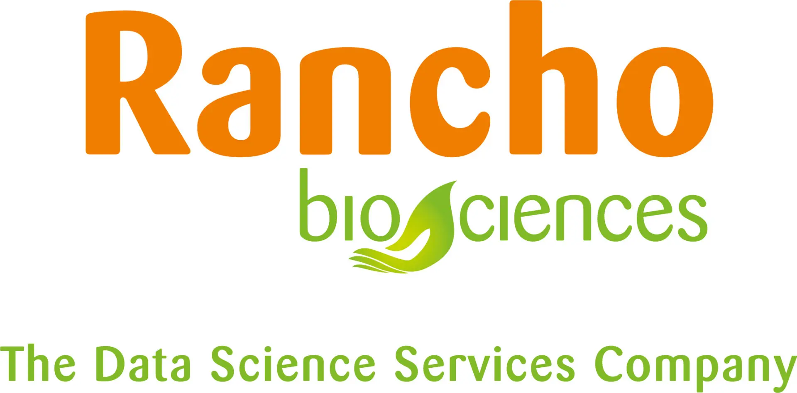

\pagebreak

# Welcome

We wish you a warm welcome to Padua for the 16th Annual International Biocuration Conference (Biocuration 2023): a forum
for curators, developers, and users of clinical and life sciences data, knowledge, and models to discuss their work,
promote collaboration, and foster the community around this active and growing area of research. We are delighted to see
participation from academia, government, and industry as well as diverse interest in the tools, methodology, and
philosophy of curation that will surely lead to memorable and forward-looking conversations and experiences at the
conference.

We would like to take this opportunity to thank our sponsors, who have been integral towards the execution of the
conference and many of its events. We thank the journal DATABASE for hosting a virtual issue corresponding to the
conference (https://academic.oup.com/database/pages/biocuration_virtual_issue). We thank F1000 researchers for providing
a platform for publishing posters and oral presentations (https://f1000research.com/collections/biocuration).

Finally, we would like to thank the International Society of Biocuration (ISB) for its support. The ISB is a non-profit
organization for curators, developers, and researchers with an interest in biocuration. The society promotes the field
of biocuration and provides a forum for information exchange through meetings and workshops.

We hope that by attending this meeting, you too will feel welcomed into our biocuration community.

Best wishes,
The Biocuration 2023 Organizing Committee

\pagebreak

# Organizers

Contact the organizers at any of:

- Email: <a href="mailto:biocuration2023@gmail.com">biocuration2023@gmail.com</a>
- Twitter: [@biocuration2023](https://twitter.com/biocuration2023)
- Mastodon: [@biocuration2023@genomic.social](https://genomic.social/@biocuration2023)

## Organizing Committee

<table>
<thead>
    <tr>
        <th>Name</th>
        <th>Affiliation</th>
        <th>ORCID</th>
        <th>Twitter</th>
    </tr>
</thead>
<tbody>
<tr>
<th role="rowheader">Federica Quaglia†</th>
<td>University of Padua</td>
<td>
<a href="https://bioregistry.io/orcid:0000-0002-0341-4888">
        0000-0002-0341-4888
    </a>
</td>
<td>
    <a href="https://twitter.com/FedeQuaglia89" style="margin: 0 0.5rem;">
        @FedeQuaglia89
    </a>
</td>
</tr>
<tr>
<th role="rowheader">Charles Tapley Hoyt†</th>
<td>Harvard Medical School</td>
<td>
<a href="https://bioregistry.io/orcid:0000-0003-4423-4370">
        0000-0003-4423-4370
    </a>
</td>
<td>
    <a href="https://twitter.com/cthoyt" style="margin: 0 0.5rem;">
        @cthoyt
    </a>
</td>
</tr>
<tr>
<th role="rowheader">Silvio Tosatto†</th>
<td>University of Padua</td>
<td>
<a href="https://bioregistry.io/orcid:0000-0003-4525-7793">
        0000-0003-4525-7793
    </a>
</td>
<td>
</td>
</tr>
<tr>
<th role="rowheader">Deepak R. Unni</th>
<td>SIB</td>
<td>
<a href="https://bioregistry.io/orcid:0000-0002-3583-7340">
        0000-0002-3583-7340
    </a>
</td>
<td>
    <a href="https://twitter.com/deepakunni3" style="margin: 0 0.5rem;">
        @deepakunni3
    </a>
</td>
</tr>
<tr>
<th role="rowheader">Maria Cristina Aspromonte</th>
<td>University of Padua</td>
<td>
<a href="https://bioregistry.io/orcid:0000-0002-4937-6952">
        0000-0002-4937-6952
    </a>
</td>
<td>
</td>
</tr>
<tr>
<th role="rowheader">Monica Munoz-Torres</th>
<td>University of Colorado</td>
<td>
<a href="https://bioregistry.io/orcid:0000-0001-8430-6039">
        0000-0001-8430-6039
    </a>
</td>
<td>
    <a href="https://twitter.com/monimunozto" style="margin: 0 0.5rem;">
        @monimunozto
    </a>
</td>
</tr>
<tr>
<th role="rowheader">Paola Roncaglia</th>
<td>Self-employed (SciBite consultant)</td>
<td>
<a href="https://bioregistry.io/orcid:0000-0002-2825-0621">
        0000-0002-2825-0621
    </a>
</td>
<td>
    <a href="https://twitter.com/paola_roncaglia" style="margin: 0 0.5rem;">
        @paola_roncaglia
    </a>
</td>
</tr>
<tr>
<th role="rowheader">Philippe Le Mercier</th>
<td>SIB</td>
<td>
<a href="https://bioregistry.io/orcid:0000-0001-8528-090X">
        0000-0001-8528-090X
    </a>
</td>
<td>
    <a href="https://twitter.com/ViralZone" style="margin: 0 0.5rem;">
        @ViralZone
    </a>
</td>
</tr>
<tr>
<th role="rowheader">Ruth Lovering</th>
<td>University College London</td>
<td>
<a href="https://bioregistry.io/orcid:0000-0002-9791-0064">
        0000-0002-9791-0064
    </a>
</td>
<td>
    <a href="https://twitter.com/RuthCLovering" style="margin: 0 0.5rem;">
        @RuthCLovering
    </a>
</td>
</tr>
<tr>
<th role="rowheader">Tiago Lubiana</th>
<td>Universidade de São Paulo</td>
<td>
<a href="https://bioregistry.io/orcid:0000-0003-2473-2313">
        0000-0003-2473-2313
    </a>
</td>
<td>
    <a href="https://twitter.com/lubianat" style="margin: 0 0.5rem;">
        @lubianat
    </a>
</td>
</tr>
</tbody>
</table>

† Committee Chair

## Scientific Program Committee

<table>
<thead>
    <tr>
        <th>Name</th>
        <th>Affiliation</th>
        <th>ORCID</th>
        <th>Twitter</th>
    </tr>
</thead>
<tbody>
<tr>
<th role="rowheader">Frédérique Lisacek†</th>
<td>University of Geneva</td>
<td>
<a href="https://bioregistry.io/orcid:0000-0002-0948-4537">
        0000-0002-0948-4537
    </a>
</td>
<td>
<a href="https://twitter.com/GlycomicsExpasy" style="margin: 0 0.5rem;">
    @GlycomicsExpasy
</a>
</td>
</tr>
<tr>
<th role="rowheader">Luana Licata†</th>
<td>Tor Vergata University of Rome</td>
<td>
<a href="https://bioregistry.io/orcid:0000-0001-5084-9000">
        0000-0001-5084-9000
    </a>
</td>
<td>
<a href="https://twitter.com/MINT_database" style="margin: 0 0.5rem;">
    @MINT_database
</a>
</td>
</tr>
<tr>
<th role="rowheader">Deepti J Kundu</th>
<td>European Bioinformatics Institute</td>
<td>
<a href="https://bioregistry.io/orcid:0000-0003-2989-5971">
        0000-0003-2989-5971
    </a>
</td>
<td>
<a href="https://twitter.com/DeeptiJaiswal" style="margin: 0 0.5rem;">
    @DeeptiJaiswal
</a>
</td>
</tr>
<tr>
<th role="rowheader">Jennifer Harrow</th>
<td>AstraZeneca</td>
<td>
<a href="https://bioregistry.io/orcid:0000-0003-0338-3070">
        0000-0003-0338-3070
    </a>
</td>
<td>
<a href="https://twitter.com/JenHarrow" style="margin: 0 0.5rem;">
    @JenHarrow
</a>
</td>
</tr>
<tr>
<th role="rowheader">Livia Perfetto</th>
<td>Tor Vergata University of Rome</td>
<td>
<a href="https://bioregistry.io/orcid:0000-0003-4392-8725">
        0000-0003-4392-8725
    </a>
</td>
<td>
<a href="https://twitter.com/PerfettoLivia" style="margin: 0 0.5rem;">
    @PerfettoLivia
</a>
</td>
</tr>
<tr>
<th role="rowheader">Marc Gillespie</th>
<td>St. John&#39;s University</td>
<td>
<a href="https://bioregistry.io/orcid:0000-0002-5766-1702">
        0000-0002-5766-1702
    </a>
</td>
<td>
<a href="https://twitter.com/marcgillespie" style="margin: 0 0.5rem;">
    @marcgillespie
</a>
</td>
</tr>
<tr>
<th role="rowheader">Michael Baudis</th>
<td>University of Zurich</td>
<td>
<a href="https://bioregistry.io/orcid:0000-0002-9903-4248">
        0000-0002-9903-4248
    </a>
</td>
<td>
<a href="https://twitter.com/mbaudis" style="margin: 0 0.5rem;">
    @mbaudis
</a>
</td>
</tr>
<tr>
<th role="rowheader">Peter Uetz</th>
<td>Virginia Commonwealth University</td>
<td>
<a href="https://bioregistry.io/orcid:0000-0001-6194-4927">
        0000-0001-6194-4927
    </a>
</td>
<td>
<a href="https://twitter.com/peteruetz" style="margin: 0 0.5rem;">
    @peteruetz
</a>
</td>
</tr>
<tr>
<th role="rowheader">Sabrina Toro</th>
<td>University of Colorado</td>
<td>
<a href="https://bioregistry.io/orcid:0000-0002-4142-7153">
        0000-0002-4142-7153
    </a>
</td>
<td>
<a href="https://twitter.com/curioussabrinat" style="margin: 0 0.5rem;">
    @curioussabrinat
</a>
</td>
</tr>
<tr>
<th role="rowheader">Varsha Khodiyar</th>
<td>Independent Data Curation Advisor</td>
<td>
<a href="https://bioregistry.io/orcid:0000-0002-2743-6918">
        0000-0002-2743-6918
    </a>
</td>
<td>
<a href="https://twitter.com/varsha_khodiyar" style="margin: 0 0.5rem;">
    @varsha_khodiyar
</a>
</td>
</tr>
</tbody>
</table>

† Committee Chair

\pagebreak

# General Information

## Conference Badges

Please wear your name badges at all times to promote networking and to assist staff in identifying you.

## Venue Wifi

The password for the venue's network `Biocuration2023` is `Conference2023!`.

## Social Media Policy

To encourage the open communication of science and biocuration, we would like to support the use of social media at this
year’s conference. Please use the conference hashtag #biocuration2023 either on Mastodon or Twitter. For poster
sessions, please check with the presenter to obtain permission for sharing their work.

## Poster Sessions

Two consecutive poster sessions will be held on Tuesday, April 25th. The first poster session from 16.00-17.00 will
feature even-numbered posters. The second poster session from 17.00-18.00 will feature odd-numbered posters. Abstracts
can be found at [https://biocuration2023.github.io/abstracts](https://biocuration2023.github.io/abstracts).

## Social Events

Please
visit [https://biocuration2023.github.io/social](https://biocuration2023.github.io/social) for more details.

## Ground Transportation

Please find a list of local taxi numbers below:

- RadioTaxi (+39 049.651333; https://www.taxipadova.it/services/radiotaxi/)
- AppTaxi (https://apptaxi.it/en/padua/)
- Padua Taxi (+39 049 4906001; https://padova-taxi.it/)

Note that Uber and Lyft are not available in Padua.

Bike riding is very common in Padua, and we recommend this bike sharing app:
[RideMovi](https://www.ridemovi.com/cities/)

Padua's tourism website has links to public transport info, as well as car sharing service and other bicycle
sharing/rental options. Please visit [Moving around Padua](https://www.turismopadova.it/en/getting-around-padua/) for
more details.

\pagebreak

# Sponsors

Biocuration 2023 is proudly sponsored by the following organizations. Additional information can be found
at https://biocuration2023.github.io/sponsors:

## International Society of Biocuration

[https://www.biocuration.org](https://www.biocuration.org)

## Swiss Institute of Bioinformatics

[https://www.sib.swiss](https://www.sib.swiss)

\pagebreak

## GigaScience

[https://academic.oup.com/gigascience](https://academic.oup.com/gigascience)

## SciBite

[https://www.scibite.com](https://www.scibite.com)

\pagebreak

## Rancho Biosciences

[https://ranchobiosciences.com/](https://ranchobiosciences.com/)

## Elixir

[https://elixir-europe.org](https://elixir-europe.org)

\pagebreak

## Chan Zuckerberg Initiative

[https://chanzuckerberg.com](https://chanzuckerberg.com)

\pagebreak

# Schedule

Additional information on the schedule can be found at https://biocuration2023.github.io/schedule.

## Day 1: Sunday, April 23rd

### 2nd Mapping Commons Workshop on Simple Standard for Sharing Ontological Mappings (14.30-17.30)
<dl>
</dl>

## Day 2: Monday, April 24th

### Aligning Open Biological and Biomedical Ontology Foundry Ontologies with Wikidata Workshop (9.00-11.00)
<dl>
</dl>

### Gaining Perspective Towards Enhancing the Intersection of Biocuration and Machine Learning Workshop (9.00-12.00)
<dl>
</dl>

### Functional Impact of Glycans and Their Curation Workshop (11.00-13.00)
<dl>
</dl>

### Lunch Break and Sponsors Exhibition (13.15-14.15)
<dl>
</dl>

### Conference Salutation from Charles Tapley Hoyt (14.30-14.45)
<dl>
    <dt><strong>Chairs</strong></dt>
    <dd>
    <a href="https://orcid.org/0000-0003-4423-4370">Charles Tapley Hoyt</a>,     <a href="https://orcid.org/0000-0003-4525-7793">Silvio Tosatto</a>    </dd>
</dl>

### ISB Greeting from Ruth Lovering (ISB EC Chair) (14.45-15.00)
<dl>
    <dt><strong>Chairs</strong></dt>
    <dd>
    <a href="https://orcid.org/0000-0003-4423-4370">Charles Tapley Hoyt</a>,     <a href="https://orcid.org/0000-0003-4525-7793">Silvio Tosatto</a>    </dd>
</dl>

### Keynote 1 - Paula Leitman (15.00-16.00)
<dl>
    <dt><strong>Chairs</strong></dt>
    <dd>
    <a href="https://orcid.org/0000-0003-4423-4370">Charles Tapley Hoyt</a>,     <a href="https://orcid.org/0000-0003-2989-5971">Deepti J Kundu</a>    </dd>
</dl>

### Coffee Break and Sponsors Exhibition (16.00-16.30)
<dl>
</dl>

### Standards 1 (16.30-18.00)
<dl>
    <dt><strong>Chairs</strong></dt>
    <dd>
    <a href="https://orcid.org/0000-0002-0948-4537">Frédérique Lisacek</a>,     <a href="https://orcid.org/0000-0003-2989-5971">Deepti J Kundu</a>    </dd>
<dt></dt>
<dt>16.30-16.50</dt>
<dd>
 <strong>
Human-pathogen interaction networks: IMEx’s approach on the contextual metadata of the experimental evidence.</strong> 
Kalpana Panneerselvam
</dd>
<dt></dt>
<dt>16.50-17.10</dt>
<dd>
 <strong>
Gene Ontology Causal Activity Models (GO-CAMs) for human biology</strong> 
Patrick Masson
</dd>
<dt></dt>
<dt>17.10-17.30</dt>
<dd>
 <strong>
The Knowledge Graph Development Kit</strong> 
David Osumi-Sutherland
</dd>
<dt></dt>
<dt>17.30-17.40</dt>
<dd>
 <strong>
ICGC-ARGO Data Submission Workflow - Integration of data validation and submission to accelerate the data curation and improve the data quality</strong> 
Qian Xiang
</dd>
<dt></dt>
<dt>17.40-17.50</dt>
<dd>
 <strong>
Developing Standards for Biocuration &amp; Interoperability of Genetic Variation Data in Agricultural Research</strong> 
Marcela Tello-Ruiz
</dd>
<dt></dt>
<dt>17.50-18.00</dt>
<dd>
 <strong>
Multiplexed scRNA-seq Experiments in Biocuration</strong> 
Yalan Bi
</dd>
</dl>

### Welcome cocktail (18.30-20.00)
<dl>
</dl>

\pagebreak

## Day 3: Tuesday, April 25th

### Keynote 2 - Marco Roos (9.00-10.00)
<dl>
    <dt><strong>Chairs</strong></dt>
    <dd>
    <a href="https://orcid.org/0000-0002-2825-0621">Paola Roncaglia</a>,     <a href="https://orcid.org/0000-0002-3583-7340">Deepak R. Unni</a>    </dd>
</dl>

### FAIR 1 (10.00-10.30)
<dl>
    <dt><strong>Chairs</strong></dt>
    <dd>
    <a href="https://orcid.org/0000-0002-3583-7340">Deepak R. Unni</a>,     <a href="https://orcid.org/0000-0002-2825-0621">Paola Roncaglia</a>    </dd>
<dt></dt>
<dt>10.00-10.10</dt>
<dd>
 <strong>
APICURON: standardizing attribution of biocuration activity to promote engagement</strong> 
Adel Bouhraoua
</dd>
<dt></dt>
<dt>10.10-10.20</dt>
<dd>
 <strong>
scFAIR: Standardization and stewardship of single-cell metadata</strong> 
Frederic B. Bastian
</dd>
<dt></dt>
<dt>10.20-10.30</dt>
<dd>
 <strong>
Resolving code names to structures from the medicinal chemistry literature: not as FAIR as it should be</strong> 
Christopher Southan
</dd>
</dl>

### Coffee Break and Sponsors Exhibition (10.30-11.00)
<dl>
</dl>

### FAIR 2 (11.00-12.30)
<dl>
    <dt><strong>Chairs</strong></dt>
    <dd>
    <a href="https://orcid.org/0000-0002-3583-7340">Deepak R. Unni</a>,     <a href="https://orcid.org/0000-0002-2825-0621">Paola Roncaglia</a>    </dd>
<dt></dt>
<dt>11.00-11.20</dt>
<dd>
 <strong>
GigaDB: Utilising ontologies to curate data publications</strong> 
Christopher Hunter
</dd>
<dt></dt>
<dt>11.20-11.40</dt>
<dd>
 <strong>
KG-IDG: A FAIR Knowledge Graph for Illuminating the Druggable Genome</strong> 
J. Harry Caufield
</dd>
<dt></dt>
<dt>11.40-12.00</dt>
<dd>
 <strong>
A 20 year perspective on FAIR and TRUST-worthy Human Disease Knowledge Representation.</strong> 
Lynn M Schriml
</dd>
<dt></dt>
<dt>12.00-12.10</dt>
<dd>
 <strong>
FAIR Wizard: Making the FAIRification process accessible</strong> 
Wei Kheng Teh
</dd>
<dt></dt>
<dt>12.10-12.20</dt>
<dd>
 <strong>
Providing Expanded Contextual Metadata for Biological Samples using Both Geographic and Taxonomic Factors</strong> 
Peter Woollard
</dd>
<dt></dt>
<dt>12.20-12.30</dt>
<dd>
 <strong>
Making expert curated knowledge graphs FAIR</strong> 
Jerven Bolleman
</dd>
</dl>

### Lunch Break and Sponsors Exhibition (12.30-13:30)
<dl>
</dl>

### Applications 1 (13.30-14.30)
<dl>
    <dt><strong>Chairs</strong></dt>
    <dd>
    <a href="https://orcid.org/0000-0001-8528-090X">Philippe Le Mercier</a>,     <a href="https://orcid.org/0000-0002-9903-4248">Michael Baudis</a>    </dd>
<dt></dt>
<dt>13.30-13.50</dt>
<dd>
 <strong>
Biocuration in DisProt, the manually curated database for intrinsically disordered proteins</strong> 
Silvio Tosatto
</dd>
<dt></dt>
<dt>13.50-14.10</dt>
<dd>
 <strong>
The Comprehensive Antibiotic Resistance Database - Curating the Global Resistome</strong> 
Brian Alcock
</dd>
<dt></dt>
<dt>14.10-14.30</dt>
<dd>
 <strong>
Annotation of biologically relevant ligands in UniProtKB using ChEBI</strong> 
Elisabeth Coudert
</dd>
</dl>

### AI and Text Mining 1 (13.30-14.30)
<dl>
    <dt><strong>Chairs</strong></dt>
    <dd>
    <a href="https://orcid.org/0000-0003-0338-3070">Jennifer Harrow</a>,     <a href="https://orcid.org/0000-0003-2473-2313">Tiago Lubiana</a>    </dd>
<dt></dt>
<dt>13.30-13.50</dt>
<dd>
 <strong>
ACKnowledge: expanding community curation to include fact extraction using artificial intelligence</strong> 
Kimberly Van Auken
</dd>
<dt></dt>
<dt>13.50-14.10</dt>
<dd>
 <strong>
Machine Learning for Scalable Biocuration</strong> 
Rebecca Foulger
</dd>
<dt></dt>
<dt>14.10-14.20</dt>
<dd>
 <strong>
BioKC: a collaborative platform for curation and annotation of molecular interactions</strong> 
Carlos Vega
</dd>
<dt></dt>
<dt>14.20-14.30</dt>
<dd>
 <strong>
Building a reference dataset of single-cell RNA-Seq data for training Machine-Learning algorithms</strong> 
Anne Niknejad
</dd>
</dl>

### Applications 2 (14.45-15.45)
<dl>
    <dt><strong>Chairs</strong></dt>
    <dd>
    <a href="https://orcid.org/0000-0002-9903-4248">Michael Baudis</a>,     <a href="https://orcid.org/0000-0001-8528-090X">Philippe Le Mercier</a>    </dd>
<dt></dt>
<dt>14.45-14.55</dt>
<dd>
 <strong>
The landscape of microRNA interactions annotation in IMEx: analysis of three rare disorders as case study</strong> 
Simona Panni
</dd>
<dt></dt>
<dt>14.55-15.05</dt>
<dd>
 <strong>
Medical Action Ontology (MAxO) development and tool implementation for the annotation of Rare Disease (RD)</strong> 
Leigh C Carmody
</dd>
<dt></dt>
<dt>15.05-15.15</dt>
<dd>
 <strong>
Improved Insights into the SABIO-RK Database via Visualization</strong> 
Ulrike Wittig
</dd>
<dt></dt>
<dt>15.15-15.25</dt>
<dd>
 <strong>
The Human Microbiome Drug Metabolism (HMDM) Database</strong> 
Amogelang Raphenya
</dd>
<dt></dt>
<dt>15.25-15.35</dt>
<dd>
 <strong>
Phenopackets for curated repository data over Beacon v2 Progenetix database</strong> 
Ziying Yang
</dd>
<dt></dt>
<dt>15.35-15.45</dt>
<dd>
 <strong>
Unifying Protein Complex Curation across the Diversity of Species</strong> 
Sandra Orchard
</dd>
</dl>

### AI and Text Mining 2 (14.45-15.45)
<dl>
    <dt><strong>Chairs</strong></dt>
    <dd>
    <a href="https://orcid.org/0000-0003-2473-2313">Tiago Lubiana</a>,     <a href="https://orcid.org/0000-0003-0338-3070">Jennifer Harrow</a>    </dd>
<dt></dt>
<dt>14.45-14.55</dt>
<dd>
 <strong>
Curating species descriptions for the digital age</strong> 
Peter Uetz
</dd>
<dt></dt>
<dt>14.55-15.05</dt>
<dd>
 <strong>
eMIND: Enabling automatic collection of protein variation impacts in Alzheimer’s disease from the literature</strong> 
Cecilia Arighi
</dd>
<dt></dt>
<dt>15.05-15.15</dt>
<dd>
 <strong>
Machine-assisted curation of molecular mechanisms using automated knowledge extraction and assembly</strong> 
Benjamin M. Gyori
</dd>
<dt></dt>
<dt>15.15-15.25</dt>
<dd>
 <strong>
Assessing the Use of Supplementary Materials to Improve Genomic Variant Discovery</strong> 
Emilie Pasche
</dd>
<dt></dt>
<dt>15.25-15.35</dt>
<dd>
 <strong>
A Framework for Assisting MeSH Vocabulary Development at the National Library of Medicine: Reliably Identifying Literature Containing New Chemical Substances</strong> 
Rezarta Islamaj
</dd>
<dt></dt>
<dt>15.35-15.45</dt>
<dd>
 <strong>
Predicting protein metal binding sites with artificial intelligence and machine learning in UniProt</strong> 
Rossana Zaru
</dd>
</dl>

### Poster Session 1 (Even Numbers) (16.00-17.00)
<dl>
</dl>

### Poster Session 2 (Odd Numbers) (17.00-18.00)
<dl>
</dl>

### Evening Networking or Social Dinner (20.00-23.30)
<dl>
</dl>

\pagebreak

## Day 4: Wednesday, April 26th

### Keynote 3 - Guy Cochrane (9.00-10.00)
<dl>
    <dt><strong>Chairs</strong></dt>
    <dd>
    <a href="https://orcid.org/0000-0001-5084-9000">Luana Licata</a>,     <a href="https://orcid.org/0000-0003-2989-5971">Deepti J Kundu</a>    </dd>
</dl>

### Community 1 (10.00-10.30)
<dl>
    <dt><strong>Chairs</strong></dt>
    <dd>
    <a href="https://orcid.org/0000-0001-5084-9000">Luana Licata</a>,     <a href="https://orcid.org/0000-0002-0948-4537">Frédérique Lisacek</a>    </dd>
<dt></dt>
<dt>10.00-10.10</dt>
<dd>
 <strong>
A complete draft human gene functionome from large-scale evolutionary modeling and experimental Gene Ontology annotations</strong> 
Marc Feuermann
</dd>
<dt></dt>
<dt>10.10-10.20</dt>
<dd>
 <strong>
Towards making sense of glycan-mediated protein-protein interactions</strong> 
Catherine Hayes
</dd>
<dt></dt>
<dt>10.20-10.30</dt>
<dd>
 <strong>
Wikidata as a tool for biocuration of cell types</strong> 
Tiago Lubiana
</dd>
</dl>

### Coffee Break and Sponsors Exhibition (10.30-11.00)
<dl>
</dl>

### Careers in Biocuration Panel/Workshop (11.00-12.00)Lead by Nicole Vasilevsky
<dl>
    <dt><strong>Chairs</strong></dt>
    <dd>
    <a href="https://orcid.org/0000-0003-2989-5971">Deepti J Kundu</a>,     <a href="https://orcid.org/0000-0001-8528-090X">Philippe Le Mercier</a>    </dd>
</dl>

### Lunch Break and Sponsors Exhibition (12.00-13.00)
<dl>
</dl>

### Community 2 (13.00-14.30)
<dl>
    <dt><strong>Chairs</strong></dt>
    <dd>
    <a href="https://orcid.org/0000-0002-0948-4537">Frédérique Lisacek</a>,     <a href="https://orcid.org/0000-0001-5084-9000">Luana Licata</a>    </dd>
<dt></dt>
<dt>13.00-13.20</dt>
<dd>
 <strong>
Promoting the longevity of curated scientific resources through open code, open data, and public infrastructure</strong> 
Charles Tapley Hoyt
</dd>
<dt></dt>
<dt>13.20-13.40</dt>
<dd>
 <strong>
Single Cell Expression Atlas and FlyBase - the Fly Cell Atlas Anatomograms – where data meets art</strong> 
Nancy George
</dd>
<dt></dt>
<dt>13.40-14.00</dt>
<dd>
 <strong>
Leveraging crowdsourcing and curation prioritisation for maintenance of clinical gene panels</strong> 
Arina Puzriakova
</dd>
<dt></dt>
<dt>14.00-14.10</dt>
<dd>
 <strong>
Community SARS-CoV-2 Curation Driven Emergent Experiences - Increased Curation Efficiency and Learned Lessons for the Future</strong> 
Henning Hermjakob
</dd>
<dt></dt>
<dt>14.10-14.20</dt>
<dd>
 <strong>
wwPDB Biocuration: Supporting Advances in Science and Technology</strong> 
Irina Persikova
</dd>
<dt></dt>
<dt>14.20-14.30</dt>
<dd>
 <strong>
Accessing UK Biobank-derived data through the AZ PheWAS portal, with reassigned phenotypic ICD10 codes.</strong> 
Jennifer Harrow
</dd>
</dl>

### Valediction and ISB Time (14.30-15.30)
<dl>
    <dt><strong>Chairs</strong></dt>
    <dd>
    <a href="https://orcid.org/0000-0003-4423-4370">Charles Tapley Hoyt</a>,     <a href="https://orcid.org/0000-0003-4525-7793">Silvio Tosatto</a>    </dd>
</dl>

\pagebreak

# Workshops

## 2nd Mapping Commons Workshop on Simple Standard for Sharing Ontological Mappings

<table>
<tr>
<td>Date</td>
<td>April 23th (Sunday)</td>
</tr>
<tr>
<td>Time</td>
<td>2:30PM - 5:30PM (3 Hours)</td>
</tr>
<tr>
<td>Organizer</td>
<td>
    <a href="https://orcid.org/0000-0002-7356-1779">Nicolas Matentzoglu</a>, Independent Consultant Semantic Technologies</td>
</tr>
</table>

Despite significant advances in standardisation and FAIRification of data, global interoperability remains an elusive goal. The decentralised nature of standardisation causes *semantic spaces* to emerge which are governed by diverse standards, in particular controlled vocabularies and semantic data models. To facilitate interoperability across standards, we need to curate and publish mappings.

The [Simple Standard for Sharing Ontological Mappings (SSSOM)](https://mapping-commons.github.io/sssom/home/) has been proposed as a standard model for sharing FAIR semantic entity mappings. While the core of the standard model has been solidified, certain issues remain; in particular, the representation of complex mappings (mappings that involve more than 2 entities)  and entity-literal mappings. Furthermore, certain use cases remain only partially supported, such as value set mappings and schema crosswalks. In this workshop, we aim to:

1. Develop a common understanding of the problem of non-simple mappings
 2. Determine if SSSOM is suitable to cover some or all of these non-simple mapping problems
 3. Potentially gather requirements on how SSSOM needs to be extended to cover more of them

This workshop is organised by members of the [Monarch Initiative](https://monarchinitiative.org/), the [SSSOM developer community](https://github.com/mapping-commons/), [FAIR Impact](https://fair-impact.eu/), and [FAIRCORE4EOSC](https://faircore4eosc.eu/). 

\pagebreak

## Aligning Open Biological and Biomedical Ontology Foundry ontologies with Wikidata

<table>
<tr>
<td>Date</td>
<td>April 24th (Monday)</td>
</tr>
<tr>
<td>Time</td>
<td>9:00AM - 12:00PM (3 Hours)</td>
</tr>
<tr>
<td>Organizer</td>
<td>
    <a href="https://orcid.org/0000-0001-9773-4008">Andra Waagmeester</a>, Micelio</td>
</tr>
</table>

[Wikidata](https://wikidata.org) is the general knowledge graph of Wikimedia and a sister project of Wikipedia. In this workshop, we will explore how to extend the coverage of OBO ontologies in Wikidata. Starting from lessons learned with for example the Disease Ontology and the [Gene Ontology](https://doi.org/10.7554/eLife.52614), which both are covered in Wikidata, the workshop will continue to work towards covering two additional OBO ontologies (ie. [ENVO](https://obofoundry.org/ontology/envo) and [GAZ](https://github.com/EnvironmentOntology/gaz)) in Wikidata.

During the workshop, we will also explore how licensing effects their usage. Ontologies in OBO use different licenses. The question is if this does not lead to [license stacking](https://mozillascience.github.io/open-data-primers/5.3-license-stacking.html) and to what extend this disqualifies certain combinations (due to license stacking).

The intended audience consists of Wikidata and OBO curators. The workshop is aimed ontology curators who want to align their ontologies with Wikidata. Familiarity with identifier mapping, legal frameworks, programming in python and SPARQL querying is not a hard requirement, but would be beneficial. 

\pagebreak

## Gaining perspective towards enhancing the intersection of biocuration and machine learning

<table>
<tr>
<td>Date</td>
<td>April 24th (Monday)</td>
</tr>
<tr>
<td>Time</td>
<td>9:00AM - 11:00AM (2 Hours)</td>
</tr>
<tr>
<td>Organizer</td>
<td>
    <a href="https://orcid.org/0000-0001-8910-9851">Lynn Schriml</a>, University of Maryland School of Medicine</td>
</tr>
<tr>
<td>Organizer</td>
<td>
    <a href="https://orcid.org/">Susan Bello</a></td>
</tr>
<tr>
<td>Organizer</td>
<td>
    <a href="https://orcid.org/">Cynthia Smith</a></td>
</tr>
</table>

This workshop is aimed at engaging resource biocurators, genomic resources, machine learning tool developers, members of the Alliance of Genome Resources and the OBO Foundry. In this workshop we will invite members of the Alliance of Genome Resources and the OBO Foundry to discuss:

1. The challenges and approaches used to automate curation activities through machine learning approaches
 2. Machine learning (ML) approaches utilized, lessons learned
 3. How the biocuration and ML communities can work more productively together.

Genomic resources and ontologies share the desire to figure out how we can implement ML approaches, share these tools and integrate the ML tools we need to augment our expert curation activities. Funding mechanisms increasingly request the automation of ML approaches, thus the impetus is on resource developers is to devise solutions. One approach is to identify tools that address our data driven needs, to identify solutions to challenges we face and to guide future development to address problems that tools do not yet work on. This workshop will facilitate discussions regarding how to enhance ML/AI data readiness from the perspective of ontologies and genomic resources. ML/AI approaches hold the promise of enhancing the capacity of genomic resources to mine, review and assess data for integration. However, the often transitory nature of ML/AI tool development along with the lack of specifications and planning for long term development support challenges the utility of these approaches for production level genomic resources.

Alternatively, many genomic resources must resort to building in-house approaches. In this workshop, we will address the challenges of integrating ML/AI-ready infrastructure and providing ML-ready datasets from the biocurators perspective. We propose for this first workshop, to be held at Biocuration 2023, to be followed by a second-online ISB workshop focused on learning about the ML perspective from ML developers, to further discussion on how we can work more productively together and asking what ML developers need from the biocuration community. This first 2-hour workshop will focus on (1) literature triage and (2) mapping data between resources cross with one hour dedicated to each topic area.

Following the workshop introduction (15 minutes), describing the history of efforts and attempts to bring ML into databases, the need for controls, GOLD standard (highly curated) datasets, and the need for ML projects long term support, will be followed by two-45 minute panel-driven discussions focused on successes, challenges and the pros and cons of alternative approaches. Panelists from the Alliance and the OBO Foundry community will be invited to share their success and challenges. Each (3-5 person) panel will engage workshop participants to share insights on their quality controlling perspective and to discuss their quality control process when reviewing ML generated datasets. One goal of the discussions is to outline the scope of biocuration problems that ML tools currently address and what biocuration tasks need ML development.

The panel discussion will touch on the following related topics:
 1. Where are we hoping to apply ML/AI
 2. The funding pitfall: how to get ML tools out of the prototype stage and into a functional product
 3. What are the language and jargon barriers, moving between groups, applying one tool to another dataset
 4. Not all tools work across different organisms and the idiosyncrasies of the literature across species
 5. Dependency: for ML/AI – the data absolutely needs to be highly, expertly curated. The necessity of highly curated data to empower ML/AI; pitfalls of lightly curated data
 6. Longitudinal aspect of data - for example, matching diseases or phenotypes, on names, synonyms over time and between resources
 7. The need for precision and recall metrics for the assessment metrics of ML tools
 8. Exploring the establishment of an ISB community ML/AI tool registry/list - where we can share what we use.

The goals of this workshop are to initiate dialog in order to gain a broader understanding of biocuration - ML needs,  to reveal challenges and limitations of ML approaches, to foster re-use of ML tools, and to facilitate a greater understanding of where ML tools are being applied successfully.

Output: We propose to author a whitepaper built from the biocurator comments and workshop discussions. The paper will include a list of ML tools and where the tools shine, highlighting the tools that have been used for literature curation and resource content mapping. 

\pagebreak

## Functional impact of glycans and their curation

<table>
<tr>
<td>Date</td>
<td>April 24th (Monday)</td>
</tr>
<tr>
<td>Time</td>
<td>11:00AM - 1:00PM (2 Hours)</td>
</tr>
<tr>
<td>Organizer</td>
<td>
    <a href="https://orcid.org/0000-0001-8823-9945">Raja Mazumder</a>, George Washington University</td>
</tr>
</table>

Dynamic changes in protein glycosylation impact human health and disease progression. However, current resources that capture disease and phenotype information such as MIM, Monarch Initiative, UniProt, Genomics England, and others focus primarily on the macromolecules within the central dogma of molecular biology (DNA, RNA, proteins). In order to gain a more complete understanding of human disease, there is a need to capture the functional impact of glycans and glycosylation on biological processes. While the aforementioned resources include glycan-related genes, such as biosynthetic and degradative enzymes, the function and disease annotations are usually associated with the gene product rather than with the relevant glycosylation and glycan structural changes. Expression of glycan-related genes represents only a subset of factors affecting protein glycosylation. The functional impact of a specific glycan structure may depend on the protein to which it is bound, site of attachment, truncation or loss of the entire glycan structure. A catalog of glycosylation combinations, their relationship with other biomolecules, and their functional implications will provide insight into the biological roles of glycans and the impact of genetic and environmental factors on their expression.

The purpose of this workshop is to bring together subject matter experts, tool developers and biocurators from resources that annotate content that is related to the functional impact of glycans. Each resource will do a short presentation on their data of interest, including  types of annotations, what impact glycan function might have on these annotations, and standards and ontologies they are using.

This will be followed by a jamboree/hackathon where we will discuss selected publications to identify commonalities and gaps in our current curation practices, and provide potential solutions. The attendees will help identify areas where curators, data wranglers, and text mining experts can collaborate to address gaps in glycan and glycosylation annotations, leverage each other’s work to improve their respective resources and encourage data sharing amongst resources.

There is a free pre-workshop on Sunday, April 23&lt;sup&gt;rd&lt;/sup&gt; from 9-5pm CEST. Lunch and coffee will be provided. For more information and registration link, please visit [here](https://wiki.glygen.org/BioCuration_Workshop_2023).

Organizers: Raja Mazumder (GlySpace, GlyGen), Mike Tiemeyer (GlySpace, GlyGen), Rene Ranzinger (GlyGen), Maria Martin (UniProt, GlyGen), Kiyoko Aoki-Kinoshita (GlySpace, GlyCosmos, GlyTouCan), Frederique Lisacek (GlySpace, GlyConnect), Cecilia Arighi (PIR, BioCreative, UniProt), Randi Vita (IEDB)

\pagebreak

## Careers in Biocuration

<table>
<tr>
<td>Date</td>
<td>April 26th (Wednesday)</td>
</tr>
<tr>
<td>Time</td>
<td>11:00AM - 12:00PM (1 Hour)</td>
</tr>
<tr>
<td>Organizer</td>
<td>
    <a href="https://orcid.org/0000-0001-5208-3432">Nicole Vasilevsky</a>, Critical Path Institute</td>
</tr>
<tr>
<td>Organizer</td>
<td>
    <a href="https://orcid.org/0000-0001-8957-7612">Randi Vita</a>, La Jolla Institute for Allergy and Immunology</td>
</tr>
<tr>
<td>Organizer</td>
<td>
    <a href="https://orcid.org/0000-0002-4667-9528">Mary Ann Tuli</a>, GigaScience</td>
</tr>
</table>

The [International Society for Biocuration (ISB)](https://www.biocuration.org/) was formed to promote the field of biocuration and to provide a professional society to support curators and aid in career growth and development. The path to a career in biocuration is varied, and we play various roles in our professional positions. This workshop aims to address some of the following questions through structured brainstorming sessions:

1. Discussion of how do you get a job as a curator?
 2. How do you write your resume/CV?
 3. What skill sets can someone learn to enhance their career growth?

As an outcome of this workshop, we will disseminate the key discussion points and takeaways via the ISB website to further the growth of curators in our community.
Please fill out a pre-conference [survey here](https://docs.google.com/forms/d/e/1FAIpQLSd3tJM-I61v8n_mQJKUzFwdSMsVszdo5ZiwgLzVkAVeK-1E1w/viewform). The survey will be open until March 20th. 

\pagebreak

# Keynotes

## FAIR and Open Data at the Rio de Janeiro Botanical Garden

Paula Leitman, Rio de Janeiro Botanical Garden

### About

Paula Leitman has been working for over 10 years in the Reflora project, coordinated by the Rio de Janeiro Botanical Garden, participating in the development and management of the two largest data platforms on Brazilian flora, the Reflora Virtual Herbarium and Flora &amp; Funga of Brazil.

### Abstract

With the initial objective of meeting the goals set by the Global Strategy for Plant
Conservation (GSPC), which is a program within the Convention on Biological Diversity,
Brazil has developed bioinformatics systems capable of gathering large volumes of data
from a significant number of algae, fungi, and plant experts working in a network and
adopting the concept of &#34;crowdsourcing&#34;. Thus, since 2008 to the present, a species-
oriented platform - currently called Flora e Funga do Brasil - and a specimen-oriented
platform - Reflora Virtual Herbarium - have been improved and structured according to the
&#34;FAIR&#34; principles and following the institutional mission of open data at the Rio de Janeiro
Botanical   Garden,   which   coordinates   these   initiatives   and   hosts   the   necessary
infrastructure for receiving, storing and publishing the datasets produced.

The   Brazilian   Flora   and   Funga   system   provides   information   on   nomenclature
(accepted names vs. synonyms), herbarium samples (with specimen’s images) and/or
bibliographic   references,   life   form   and   substrate,   data   on   geographical   distribution
(occurrence in the Biomes, States and/or Watersheds, types of vegetation and endemism),
field images and/or scientific illustrations for the more than 50,300 species of algae, fungi
and   plants   that   occur   in   Brazil,   including   native,   naturalized   and   cultivated   species.
Moreover, also as a result of the collaborative work of about 1,000 taxonomists, this
system   provides   morphological   descriptions   and   identification   keys   for   all   species   of
Bryophytes, Lycophytes, Ferns and Gymnosperms, as well as for 90% of the Brazilian
Angiosperms. The Reflora Virtual Herbarium system was initially developed to house high
resolution images of samples collected in Brazil, in the 18th and 19th centuries, gathering
an expressive number of nomenclatural types and deposited in their entirety in European
herbaria. Since its release in 2013, new partnerships have been established to expand
repatriation   with   foreign   institutions   and   also   to   digitize   collections   from   Brazilian
institutions, resulting in approximately 3.9 million images from 75 herbaria.

Since botanical nomenclature is associated with herbarium specimens, access to
this rich database for specimens has made it possible to understand the geographic
distribution and morphological descriptions of the species, enabling the preparation of
monographs and Brazil&#39;s achievement of the 2020 target set by the GSPC. The results for
both projects are available, in a broad and unrestricted manner, through the webpage
http://reflora.jbrj.gov.br.&#39;

\pagebreak

## What if I were a machine?: a plea for FAIR curation &#39;at source&#39; based on our research journey into the implementation of FAIR principles.

Marco Roos, Leiden University Medical Center

### About

Marco Roos is a long term advocate of principles of FAIR and Linked Data to enhance biomedical research.

### Abstract

In my talk I attempt to look back at our journey towards implementing the FAIR principles from a data curation perspective. In 2014 the FAIR principles were conceived at a &#39;Lorentz workshop&#39; in Leiden initiated by our group&#39;s professor Barend Mons, motivated by the inefficiency associated with preparing &#39;other people&#39;s data and services&#39; for reuse. The overall cost to society has later been calculated to be enormous, but is at least clearly unacceptable for people living with a disease. The workshop participants concluded that data should be findable, accessible, interoperable, and reusable for humans and for machines. &#39;For machines&#39; is obligatory and the basis for the 15 principles published in 2016. As co-founders of the principles we embarked on a journey investigating the implementation of FAIR principles. I will share some highlights of our journey, often together with many collaborators. It encompasses the process of FAIRification, FAIR data stewardship, project management, training, developing ontological models to make data and metadata machine understandable, and software specifications to work with FAIR (meta)data. I will highlight the rare disease domain that has been especially instrumental in our journey, with an inspiring role for patient organisations. Surveys in this domain showed that central repositories contain a fraction of global health-relevant data: most valuable data stay &#39;at source&#39; or in specialised repositories. These can also be sensitive, such that FAIRification will need to be applied &#39;at source&#39; to enable efficient analysis under defined conditions, which can also be machine understandable. Moreover, many central repositories implement FAIR too lightly to recommend data deposition as a FAIRification step. Based on our experiences and observations, I propose that curation of health data should take place &#39;at source&#39;  and that curation of ontological representations that make data, workflows and access conditions machine understandable should be a top priority. I propose that at least as much effort should be put into curating FAIRness for machines at source, as we put into curating the quality of the data.

\pagebreak

## Global Biodata Coalition: towards biodata infrastructure sustainability

Guy Cochrane, Executive Director at Global Biodata Coalition

### About

Guy Cochrane has been the Executive Director of the Global Biodata Coalition (GBC) since March, 2022. He is concurrently Team Leader for Data Coordination and Archiving and Head of the European Nucleotide Archive at EMBL&#39;s European Bioinformatics Institute (EMBL-EBI).

### Abstract

Life scientists have for decades shared research data through open-access data resources that now form a globally distributed infrastructure of thousands of interlinked resources, providing access to deposited and curated data across many data types and life science domains. These biodata resources are critical to biological, life science, and biomedical research across academia and industry; they have substantial impacts both in fundamental and applied research, and they underpin and amplify the research investments made by funders. Researchers, clinicians, and private sector scientists depend on the existence of biodata resources and the health of the infrastructure as a whole.

Despite their importance, individual biodata resources - and hence the infrastructure as a whole - show limited sustainability; unlike other scientific infrastructures, there is no overall coordination and new biodata resources emerge in organic fashion as the scientific community responds to its data needs. Resulting in uncoordinated and often misaligned funding - typically through short-term and competitive grants - the ability of resources to plan strategically, to secure appropriate technical and scientific expertise, to procure infrastructure and to develop fully according to the needs of the user community are limited. Furthermore, there is risk for many data resources important to the scientific community that funding will be reduced or become unavailable.

The Global Biodata Coalition (GBC) brings together organisations from around the world that fund life science research. Recognising the fragility of biodata resources, GBC members commit to work together to better coordinate support for the life science data infrastructure and to address the challenges of sustainability. Current work between GBC members includes the development of principles that will help to structure future models for biodata resource sustainability.

Amongst GBC’s current priorities is the profiling of the biodata resource infrastructure: Which/where are the data resources? Where lies the greatest fragility? What are the greatest risks and where should GBC prioritise? Two lines of work are helping us to address these questions. First, we have compiled an inventory, including where possible funding and further information, of some 3,112 unique and globally distributed biodata resources supported by many hundreds of funders. Second, we have identified 37 Global Core Biodata Resources (GCBRs) through an independent peer-review process. GCBRs, like keystone species in an ecosystem, are crucial for the functioning of the entire ecosystem, and their identification allows GBC, and the funders who support biodata resources, to understand which resources are most crucial for the infrastructure and by inference whose funding should be most carefully monitored. We have established a forum for the leaders of the GCBRs that will share expertise and work with funders to develop and implement mechanisms for sustainability.
In the talk, I will introduce GBC and issues around the sustainability of biodata resources. I will present the global inventory and Global Core Biodata Resource projects and highlight upcoming opportunities for the biocuration community to engage in the development of models that support greater sustainability for biodata resources.&#39;

\pagebreak

# Oral Presentations

## Long Talks

### Gene Ontology Causal Activity Models (GO-CAMs) for human biology

Patrick Masson, Cristina Casals-Casas, Lionel Breuza, Marc Feuermann, Sylvain Poux, Pascale Gaudet, Alan Bridge, Paul D. Thomas, Uniprot Consortium 

The Gene Ontology (GO) (http://geneontology.org/) provides a human and machine readable synthesis of knowledge of the molecular functions of gene products and the cellular components and biological processes in which those functions occur. Gene Ontology Causal Activity Models (GO-CAMs) (https://geneontology.cloud/home) assemble genes and their functions into causally linked activity flow models. GO-CAMs provide a human readable description of biological systems and a framework for computational systems biology approaches such as network-based ‘omics integration and analysis and graph-based machine learning.  
In this presentation, we describe efforts to capture knowledge of human biology using GO-CAMs, including human gene functions, microbiome gene functions, and the regulation and roles of small molecules in human systems. These efforts build on a number of foundational pillars - a large corpus of existing GO annotations for human proteins, a draft human functionome that incorporates annotations for human proteins and orthologs using phylogenetic approaches (see poster from Feuermann et al.), small molecule annotation in UniProt from the Rhea knowledgebase of biochemical reactions (www.rhea-db.org) and the mapping of Rhea and the GO in Rhea2GO, and the creation of draft GO-CAM models of human biology from human Reactome pathway models (www.reactome.org).  Our approach to synthesize this knowledge in GO-CAM and enrich it with emerging knowledge from the literature has created over 250 GO-CAM models for human biology. These and other GO-CAM models from the Gene Ontology Consortium are freely available at http://noctua.geneontology.org/.

\pagebreak

### Annotation of biologically relevant ligands in UniProtKB using ChEBI

Elisabeth Coudert, Sebastien Gehant, Nicole Redaschi, Alan Bridge, The Uniprot Consortium 

The UniProt Knowledgebase (UniProtKB, at www.uniprot.org) is a reference resource of protein sequences and functional annotation that covers over 200 million protein sequences from all branches of the tree of life. 
UniProtKB provides a wealth of information on protein sequences and their functions, including descriptions of the nature of biologically relevant ligands (also known as cognate ligands) such as substrates/products of enzymes, cofactors, activators and inhibitors, as well as their binding sites. UniProtKB captures this information through expert literature curation and from experimentally resolved protein structures in the Protein Data Bank (PDB/PDBe).
Here we describe improvements to the representation of cognate ligands in binding site annotations in UniProtKB using the chemical ontology ChEBI (www.ebi.ac.uk/chebi/). In 2022, we performed a complete reannotation of all cognate ligand binding sites in UniProtKB, replacing textual descriptions of defined ligands with stable unique identifiers from the ChEBI ontology, which we now use as the reference vocabulary for all new ligand annotations. The last UniProt release includes about 800 unique cognate ligands from ChEBI, which feature in over 65 million binding site annotations and over 15 million protein sequence records. This work continues the standardization of small molecule annotation in UniProtKB, which also covers the use of Rhea (www.rhea-db.org) and ChEBI for the annotation of enzymes, transporters, and cofactors. This enhanced dataset will provide improved support for efforts to study and predict functionally relevant interactions between proteins and their cognate ligands using computational approaches. Users can access the dataset via the UniProt website, REST API, and SPARQL endpoint, which have been modified to support ligand searches using the chemical ontology and chemical structure data of ChEBI.

\pagebreak

### Single Cell Expression Atlas and FlyBase - the Fly Cell Atlas Anatomograms – where data meets art

Nancy George, Irene Papatheodorou, Anja Fullgrabe, Yalan Bi, Pedro Madrigal 

The Single Cell Expression Atlas knowledge base analyses curated, high quality gene expression data at the level of single cells. Data are then displayed through dimensionality reduction plots and heatmaps to show how cells cluster based on their expression profiles.  However, in order to truly understand how expression profiles define cell populations and are altered by perturbations, expression profiles need to be linked to cell types and novel subpopulations identified.  Thus, the single cell anatomogram project was born. Its aim is to display cell types realistically within their parent structures alongside cell types provided by the data submitter. Anatomograms are now available representing adult tissues for lung; placenta; kidney; pancreas and liver. 
 
The single cell anatomogram project is a diverse collaboration between scientific experts, curators, ontologists, artists, bioinformaticians and web developers to derive interactive images which show cells at single cell resolution within the wider context of the tissue. These images allow users to delve into lifelike representations of organ structures from macro-structures down to single cells within the tissue.
 
Initially, artists work with curators and scientific experts, creating true to life shapes from real data, such as immunohistochemistry and immunofluorescence images to create structures and cell types &#39;in situ&#39;. Cell shapes and detailed structures are layered on top of the tissue structure like a cake. Each shape is mapped either to an existing ontology term or a new term and relationships are created, in collaboration with ontologists from UBERON and Cell Ontology. This allows us to recreate the existing biological hierarchy from structure to cell type e.g. kidney &gt; nephron &gt; loop of Henle &gt; epithelial cell of loop of Henle.
 
Once illustrations have been created, mapped to their ontology identifiers and the appropriate hierarchy defined, these constructs are then incorporated into the Single Cell Expression Atlas by our web development team. Developers ensure that the resulting images are interactive and users can select regions within a tissue to ‘zoom into’ down to the level of individual cells within sub-structures of that tissue. This is enabled by the standardised bioinformatics analysis pipelines that adequately merge data with curated metadata.

Last, but not least, is the data and cell types inferred from expression profiles. Author-defined inferred cell types are mapped where possible to ontology terms allowing us to identify the same cell types across multiple datasets. Once a user lands on these datasets, the anatomograms are displayed alongside a heatmap showing the top 5 genes per cell type associated with that dataset. When a cell type ‘shape’ is selected this then lights up showing that population, giving context to the data. Thus anatomograms provide a new perspective on visualisation of multi-layered biological information at the single cell level.

\pagebreak

### A 20 year perspective on FAIR and TRUST-worthy Human Disease Knowledge Representation

Lynn M Schriml, J. Allen Baron, Dustin Olley, Mike Schor, Lance Nickel 

Making human disease knowledge FAIR and TRUST-worthy are the hallmarks of the Human Disease Ontology (DO) project. Strengthening the biocuration of human disease related data has driven development of this resource. Coordination of key biomedical data across large-scale biomedical resources strengthens the foundation of knowledge, supports the development of new resources and provides a venue for evolving data models to meet the demands of knowledge generation and discovery.  The Human Disease Ontology began, as most ontology projects do, as a community resource to coordinate data within one or two research groups. Growing over two decades into a highly utilized, international genomic resource. Serving as the nomenclature and classification standard for human diseases, the DO provides a stable, etiology-based structure integrating mechanistic drivers of human disease. In the past two decades the DO has grown from a collection of clinical vocabularies, into an expertly curated resource of over 11,000 common and rare diseases linking disease concepts through more than 35,000 vocabulary cross mappings. 
The responsibility of becoming a community resource serving hundreds of biomedical, clinical, ontology and software resources involves the development of rigorous quality control protocols, a structured release cycle, while building trust and demonstrating reliability through expert curation of each disease term, definition and disease annotation. Expanding an ontology resource to meet evolving needs and coordinating the ever expanding disease knowledge corpus necessitates periodic reassessment and expansion of the DO’s data model hand-in-hand with the commitment for coordinated knowledge development. Here, we report on the significant changes in content, data modeling, infrastructure development, utilization of ML tools, usage and community outreach for the DO project.

\pagebreak

### Leveraging crowdsourcing and curation prioritisation for maintenance of clinical gene panels

Arina Puzriakova, Catherine Snow, Eleanor Williams, Sarah Leigh, Ivone U.S. Leong, Achchuthan Shanmugasundram, Mafalda Gomes 

Genomics England’s PanelApp (https://panelapp.genomicsengland.co.uk/) is a knowledgebase which stores virtual gene panels relating to human conditions including rare diseases and cancer. It supports England’s NHS Genomic Medicine Service (GMS) by defining focused panels of genes with convincing evidence of disease causation. Such genes are deemed suitable for clinical genome interpretation, in turn enhancing diagnostic ability in a clinical setting.
Support for gene involvement in a human disorder is derived from a combination of sources including published scientific literature and evidence from experts in the scientific and clinical communities, submitted as PanelApp gene reviews – a powerful integrated feature of the web interface. However, with the large volume of data relating to gene-disease relationships, maximising impact on scientific or clinical decision-making has become increasingly challenging.
Manual curation remains integral for making final decisions on gene panel content, but due to the demands of maintaining nearly 200 panels, PanelApp curators have developed methods for prioritising gene-disease associations for assessment. External reviewer activity is extracted weekly, and reviews are automatically assigned categories of priority based on current and suggested gene rating classifications, ensuring evidence that may lead to changes to diagnostic-grade genes is assessed in a timely manner. Tracking tickets are created and assigned to curators based on disease specialities, enabling curators to become familiar with disease areas and specific panels. Tracking of reviews also enables concerted curation effort on the most frequently used panels, facilitating focused investigation with maximal downstream patient benefit. In parallel this highlights panels with minimal activity allowing curators to attribute this to limitations in disease knowledge or unmet community engagement needs. Active engagement of the PanelApp team with reviewer communities increases the valuable contributions from clinical specialists and aids delivery of results that are aligned with current clinical expertise.
High quality panels have been shown to increase diagnostic yield in the NHS GMS, driving improved clinical utility for patients with rare diseases and cancer, and further emphasising the importance of a strategic approach for effective panel maintenance by curators.

\pagebreak

### Biocuration in DisProt, the manually curated database for intrinsically disordered proteins

Silvio Tosatto, Maria Victoria Nugnes, Federica Quaglia, Luiggi Tenorio Ku, Maria Cristina Aspromonte, Damiano Piovesan 

DisProt (https://disprot.org/) is the major repository of manually curated annotations of intrinsically disordered proteins and regions from the literature.
DisProt relies on both professional and community curators who are provided with a variety of material to support their curation process. These include a curation manual, interactive exercises and training sessions that evolved from virtual training sessions to eLearning courses available in English and Spanish, along with in person training sessions.
To provide comprehensive and standardized annotations, DisProt relies on the Gene Ontology (GO) and Evidence and Conclusion Ontology (ECO) and on the adoption of the Minimum Information About Disorder (MIADE) standard.
Higher quality and consistency of annotations is provided by a robust reviewing process - entries are reviewed and validated by expert curators that support other curators during the whole process. 
DisProt curators - both community and professional ones - continuously check the literature for novel experimental evidence for proteins belonging to eukaryota, bacteria, viruses and archaea, including also the model organisms represented in the DisProt home page.
Finally, DisProt also focuses on thematic datasets, collections describing biological areas where IDPs play a crucial role, e.g. autophagy-related proteins and viral proteins.
A new release of DisProt, pertaining technical and/or scientific content, is available every six months.

\pagebreak

### GigaDB: Utilising ontologies to curate data publications

Christopher Hunter, Chris Armit, Mary Ann Tuli, Yannan Fan 

GigaScience journal celebrated its 10th birthday last year, and GigaDB is technically 1 yr older than the journal. In that time we have led the way in Open data sharing and FAIRification of data. We aim to ensure every article published by GigaScience Press is fully reproducible and transparent. In order to do that, it is essential that all data units are openly available along with the manuscript. 
GigaDB provide a manually curated dataset to accompany each manuscript published in both GigaScience and GigaByte (launched in 2020) journals, we collate the data files required for transparency and reproducibility and ensure data are deposited in appropriate public repositories with links included in both the manuscript and the dataset.
In addition, we provide assistance to authors in; (a) the curation of sample metadata, making use of ontologies where appropriate (e.g. ENVO, PATO, OBI, BTO, UBERON, etc.); (b) the curation of files being made available to ensure they are complete, appropriately formatted, well described, and tagged with both a file format and a data-type chosen from a controlled vocabulary based on the EDAM ontology; and (c) the inclusion of specific Subject tags to each dataset which are chosen from a slim set of SRAO terms.
Moving forwards, we hope to enable better integration of our datasets with other external resources by exposing the ontology term usage in GigaDB as metatags on each dataset webpage to assist researchers creating knowledge graphs.

\pagebreak

### Join the International Society for Biocuration Community

Ruth Lovering, Rama Balakrishnan, Susan Bello, Parul Gupta, Robin Haw, Tarcisio Mendes de Farias, Sushma Naithani, Federica Quaglia, Raul Rodriguez-Esteban, Mary Ann Tuli, Nicole Vasilevsky 

When the International Society for Biocuration (ISB) was established in 2009, it set out to promote the field of biocuration and provide a forum for information exchange and networking through meetings and workshops. Our members are not only the data curators but also ontologists, data and software developers and are distributed across the globe, representing a wide range of geographical, national, linguistic, and cultural backgrounds. The ISB executive committee is composed of 11 members and is now registered as a non-profit organisation. 

Over the past 13 years, the ISB has supported several workshops, recognised excellence in biocurators by awarding 8 career and 3 life-time achievement awards and supported 12 conferences, with online conferences for 2 years. While the ISB&#39;s support for professional networking and building collaboration is still relevant and of ongoing importance, we have broadened its scope by addressing issues concerning Equity, Diversity and Inclusion, training the workforce, career support and outreach to our community and users of curated data. More recently, we have introduced new awards and grants to support and encourage biocurators belonging to all stages of their professional career. 

We invite the biocuration community to join our efforts by registering with our mailing list and becoming an ISB member. At the 16th International Biocuration Conference, we will explain how you can benefit from ISB activities. Please visit our poster to find out more, ask questions and suggest new areas for the ISB to prioritise.

\pagebreak

### Human-pathogen interaction networks: IMEx’s approach on the contextual metadata of the experimental evidence

Kalpana Panneerselvam, Pablo Porras, Noemi del-Toro, Margaret Duesbury, Livia Perfetto, Luana Licata, Anjali Shrivastava, Eliot Ragueneau, Juan Jose Medina Reyes, Sandra Orchard, Henning Hermjakob 

Host-pathogen interaction maps offer the scaffold to understand the biological processes behind the pathogenicity of the microbe and also helps in identifying potential drug targets. Access to the experimental evidence and contextual metadata which influence the interaction outcome are critical for accurate interpretation of molecular mechanisms.
The IMEx consortium (www.imexconsortium.org) is an international database collaboration that exists to record molecular interaction data from scientific literature and direct depositions and make it freely accessible to the public, using an Open Access, Open-Source model.
IMEx curators use a detailed representation of experimental evidence in the scientific literature: details of the affinity tags used, the mutations influencing the interaction outcome, variable experimental conditions, chemical and biological inhibitors, agonists and antagonists and required post-translational modifications, all using standard ontologies and controlled vocabularies to add more value towards the interpretation of scientific experiments and the biology behind.
In the context of host-pathogen interactions, more than 33K binary interactions of Human proteins with bacterial and viral proteins are captured in IMEx. Interactions with SARS-CoV-2 and SARS Coronavirus with human count more than 7500 binaries; and ~6300 binary interactions have been curated in IMEx for Influenza-human PPIs. More than 4200 protein interactions of humans proteins with plague-causing Yersinia pestis bacterium are available at IMEx and 3000 interactions between humans and the anthrax bacterium Bacillus anthracis have been curated. 8300 human-viral protein interactions with members of  Herpesvirus, Hepatitis and Papillomavirus family are also documented. Experimentally proven binding regions are available for more than 5000 interactions. More than 1000 interactions are shown to be affected by mutated protein sequence, compared to the wild-type protein. The IMEx’s MI scoring system for the molecular interactions based on the available experimental data are available to access the confidence behind every interacting pair.
The IMEx consortium has been generating contextual molecular networks to reflect the type of relationship between the partners and over-laying metadata for the users to analyse those factors influencing the interaction outcome. This openly available resource is an invaluable tool with immediate applications in the study of variation impact on the interactome, sub-networks generated by mutated partners, small molecules affecting the networks, interaction interfaces as drug targets, among other key questions.

\pagebreak

### The Comprehensive Antibiotic Resistance Database - Curating the Global Resistome

Brian Alcock, Amogelang Raphenya, Arman Edalatmand, Andrew McArthur 

The Comprehensive Antibiotic Resistance Database (CARD; card.mcmaster.ca) is an ontologically-driven knowledgebase and bioinformatics resource on the molecular biology and chemical components of antimicrobial resistance (AMR). This is achieved by integrating the Antibiotic Resistance Ontology (ARO) with the CARD Model Ontology (MO), which is used to organize AMR gene (ARG) sequences, resistance-conferring mutation data and bioinformatic parameters for in silico ARG detection by CARD’s Resistance Gene Identifier (RGI) software. To preserve integrity over time, the ARO is routinely updated by a biocuration team through, for example, the addition of novel AMR genes or gene variants or the revision of existing ontology branches for clarity, accuracy and/or computational efficiency. While manual curation of the literature and sequences is a cornerstone of CARD’s curation philosophy, the volume of AMR scientific literature renders this approach time-consuming and impractical. We therefore developed CARD*Shark, an algorithm and software for computer-assisted AMR literature triage. The current iteration, CARD*Shark 3, identifies and prioritizes literature for review through a machine-learning methodology, which is then reviewed by a CARD biocurator. CARD thereby integrates continuous curation from multiple approaches: computer-assisted literature triage, identification of errors and oversights through public feedback such as our GitHub repository (https://github.com/arpcard/amr_curation), and targeted curation within collaborative projects or other efforts of specific foci. To date, the ARO includes over 6500 terms which combine with 5000 ARG reference sequences and almost 2000 resistance-associated variants sourced from over 3000 publications to produce the current version of CARD. This manually curated data is used as a baseline for in silico prediction of resistomes and ARG prevalence for over 300 pathogens. Here we provide an overview of CARD’s design, curation methodology and overall content scope, and illustrate how a computer-assisted curation approach improves our efficacy and accuracy.

\pagebreak

### Promoting the longevity of curated scientific resources through open code, open data, and public infrastructure

Charles Tapley Hoyt, Benjamin M. Gyori 

Many model organism databases, pathway databases, ontologies, and other curated resources that support research in the life and natural sciences combine expert-curated data with surrounding software code and services. However, such resources are often maintained internally by members of a single institution and are therefore susceptible to fluctuations in funding, personnel, and institutional priorities. Too often, resources go out of date, are abandoned, or become inaccessible, for example, when a grant runs out or a key person moves on. Therefore, we need better solutions for creating resources that are less susceptible to such external factors and can continue to be used and maintained by the community that they serve.

We propose a new model for the creation and maintenance of curated resources that promotes longevity through a combination of technical and social workflows, and a progressive governance model that supports and encourages community-driven curation. 1) The technical aspect of our model necessitates open data, open code, and open infrastructure. Both code and data are permissively licensed and kept together under public version control. This enables anyone to directly suggest improvements and updates. Further, automation is used for continuous integration (e.g., semi-automated curation, quality assurance) and continuous delivery (e.g., static website generation, export in multiple formats). 2) The social aspect of our model first prescribes the composition of training material, curation guidelines, contribution guidelines, and a community code of conduct that encourage and support potential community curators. Second, it requires the use of public tools for suggestions, questions, discussion as well as social workflows like pull requests for the submission and review of changes. 3) The governance aspect of our model necessitates the division of responsibilities and authority (e.g., for reviewing/merging changes to the code/data) across multiple institutions such that it is more robust to fluctuation in funding and personnel that can also be updated over time. It prescribes liberal attribution and acknowledgement of the individuals and institutions (both internal and external to the project) who contribute on a variety of levels (e.g., code, data, discussion, funding). More generally, our model requires that a minimal governance model is codified and instituted as early as possible in a project&#39;s lifetime.

This talk will provide a perspective on how existing resources relate to our model, describe each of our model’s aspects in more detail (illustrated through the Bioregistry resource), and provide a practical path towards both creating new sustainable resources as well as revitalizing existing ones.

\pagebreak

### ACKnowledge: expanding community curation to include fact extraction using artificial intelligence

Kimberly Van Auken, Valerio Arnaboldi, Daniela Raciti, Paul Sternberg 

Biological knowledgebases are a critical resource for researchers and accelerate scientific discoveries by providing manually curated, machine-readable data collections. However, the aggregation and manual curation of biological data is a labor-intensive process that relies almost entirely on professional biocurators. Two approaches have been advanced to help with this problem: i) a computational approach that is based on natural language processing (NLP), text mining (TM) and machine learning (ML)); and ii) the engagement of researchers (community curation). However, neither of these approaches alone is sufficient to address the critical need for increased efficiency in the biocuration process. Our solution to these challenges is an NLP-enhanced community curation portal, Author Curation to Knowledgebase (ACKnowledge). The ACKnowledge system, currently implemented for the C. elegans literature, couples statistical methods and text mining algorithms to enhance community curation of research articles. 

Currently, the ACKnowledge system asks authors to verify five different types of entities (e.g. genes, variations) and fourteen different data types (e.g. phenotype, physical interaction) identified by our TM and ML approaches.  We are now expanding the ACKnowledge system to incorporate ML models to identify sentences that describe specific types of experiments and then extract entities and concepts for more detailed author curation.  Specifically, we are training classifiers to identify sentences that describe two types of experiments: 1) anatomical expression patterns and 2) protein kinase activity.

To develop these models, we began by manually extracting and labeling sentences in previously curated papers.  For each sentence, we note the presence or absence of specific features, e.g. gene names or synonyms, anatomy terms, or keywords such as ‘phosphorylation’, and label each sentence as ‘positive’ or ‘negative’ depending on whether they contain the specific data types analyzed, e.g. the sentence directly reports an experimental result or the sentence describes an experimental set up related to anatomical expression pattern or protein kinase activity.  In addition, we note metadata such as the paper section in which a sentence is found.  

Using these sentences as training data, we will build a set of models to classify sentences based on their text similarity with sentences in the initial training set. We will transform each sentence into a vector using a pre-trained embedding model (BioSentVec - https://github.com/ncbi-nlp/BioSentVec) and will calculate their cosine similarity as a proxy of the semantic similarity of the sentences. We will then train a binary classifier based on a similarity threshold: if a sentence has cosine similarity with the average sentence in our training set that is higher than a certain threshold we classify the sentence as positive, otherwise as negative. 

If the performance of the sentence-level classifiers is satisfactory, we will apply the sentence classifier to papers and display the identified sentences, along with extracted entities and concepts, to authors in a table-like format where they can verify the suggested curatorial statement. Author validated statements will then be vetted by curators and integrated in knowledgebases including the Alliance of Genome Resources (https://www.alliancegenome.org).

\pagebreak

### KG-IDG: A FAIR Knowledge Graph for Illuminating the Druggable Genome

J. Harry Caufield, Justin Reese, Tudor Oprea, Jeremy Yang, Chris Mungall 

Knowledge graphs (KGs) are representations of heterogeneous entities and their diverse relationships. Though KGs combine intuitive data models with massive data collections, their application to domain-spanning questions in biomedicine is constrained by the effort required to consistently bridge gaps between a massive array of frequently-updating resources. We sought to develop a KG in the context of the NIH-sponsored Illuminating the Druggable Genome (IDG) project with this challenge in mind. IDG research is focused on improving our understanding of the properties and functions of proteins that are currently unannotated within three commonly drug-targeted protein families: G-protein coupled receptors, ion channels, and protein kinases. Accordingly, we designed KG-IDG to integrate otherwise uncoordinated sources of drug vs. target information, e.g., drug properties and target interactions from the DrugCentral resource; protein target details from the Target Central Resource Database; diseases/phenotypes from MONDO, OMIM, Orphanet, and the HPO; along with several other data sources and ontologies. The KG-IDG graph supports intensive graph-based machine learning methods for inference of novel relationships between drugs, proteins, and diseases.

KG-IDG incorporates several concrete design elements to ease its application to specific research questions. All contents are built upon the Biolink Model, a data model purpose-built for flexible representation of biological associations in property graphs. All graph versions are assembled using the Knowledge Graph Exchange (KGX) platform, with all components following a highly modular and configurable data ingest and transformation pipeline. The greatest contribution KG-IDG makes to data FAIRness, however, is its adherence to reproducibility and open-source principles: all code, transformed data, and graphs are publicly available. All graph products are distributed in easily human-readable KGX TSV format. We feel that this overall approach allows KG-IDG to serve as the foundation for future KG construction efforts while also yielding interoperable, machine readable data resources. All code for assembling KG-IDG is available at https://github.com/Knowledge-Graph-Hub/kg-idg.

\pagebreak

### The Knowledge Graph Development Kit

David Osumi-Sutherland, Robert Court, Huseyin Kir, Ismail Ugur Bayindir, Clare Pilgrim, Shawn Zheng Kai Tan, Nicolas Matentzoglu 

The use of common biomedical ontologies to annotate data improves data findability, integration and reusability. Ontologies do this not only by providing a standard set of terms for annotation, but via the use of ontology structure to group data in biologically meaningful ways.  One way to take advantage of this is via a knowledge graph in which ontologies and ontology semantics provide the glue that links content annotated knowledge and data in well documented and transparently queryable ways, providing an extensible base for building a APIs and applications and a potential input to machine learning.

One barrier to fulfilling this potential is the lack of easily-usable standardised infrastructure for using ontologies and standard semantics to build and structure Knowledge Graphs in a form suitable for driving web applications.  Triple stores can theoretically fulfil this role, but remain a niche technology and their standard query language (SPARQL) is not ideal to use for querying ontologies in OWL.  Ensuring that web applications and APIs driven by knowledge graphs are easily usable by the biomedical community requires mechanisms to harness the power of semantics to label and categorise content in ways that are tailored to the application and the community.

To overcome these barriers we built the Knowledge Graph Development Kit - a highly configurable containerised pipeline for integrating ontologies and curated information into easily queryable knowledge graphs.  The pipeline consists of a triple-store integration layer that loads and integrates ontologies and curated content (TSV templates that the pipeline converts to RDF), and 3 front end servers: An OWLERY server supporting OWL-EL queries across ontologies and knowledge graphs; A Neo4j server that supports graph queries and visualisations and provides an accessible knowledge graph representation;  A SOLR server that supports tuneable autosuggest with default settings that are optimised for ontology search and stores cached query results.

A standard interconversion between OWL and Neo4J is central to this pipeline. It is optimised for human readable cypher queries and supports a highly configurable semantic tagging system built on the Neo4J label system.  Semantic tagging is designed to harness the power of ontology and knowledge-graph semantics to add short, easily understandable, application-specific, human readable tags to ontology terms and annotated content. These semantic tags can be used as badges to efficiently communicate with users in terms that make sense to them, as a mechanism for configuring autosuggest search, for faceted browsing and even for configuring a web application 

We will present details of the pipelines and examples of their application in 3 different applications:  Virtual Fly Brain, the Allen Brain Atlas Cell Type Explorer and The Cell Annotation Platform.

\pagebreak

### Machine Learning for Scalable Biocuration

Rebecca Foulger, Jane Lomax, Rachael Huntley, Shirin Saverimuttu, Paola Roncaglia 

High-quality manual curation - the process of reviewing and annotating data manually - is critical for ensuring the reliability and validity of scientific data. However, manual curation is also time-consuming and expensive so is unlikely to be scalable to the large volume of data the life-sciences generate. 

We have been experimenting with using machine learning models, such as BioBERT, to perform some biocuration tasks using a &#39;human-in-the-loop&#39; approach. One task we commonly perform is the identification of entities of a particular type in a corpus of text, and we will discuss in this talk the benefits and limitations of ML for this task. In addition, we will expand on our work using ML models for de-novo ontology building, synonym suggestion and relationship extraction.

We propose that in the future biocurators time might be well-spent training, validating and retraining ML models to allow their valuable scientific input to be applied in a scalable way.

\pagebreak

## Lightning Talks

### Making expert curated knowledge graphs FAIR

Jerven Bolleman, Alan Bridge, Nicole Redaschi 

To address the users&#39; need to combine knowledge from different expert curated resources, the biocuration community is heavily invested in the standardization of knowledge with shared ontologies and, more recently, in the representation of data in the form of knowledge graphs (KGs). To easily integrate data from, or query data across, different KGs it is necessary to also standardize the form in which they are published. The W3C standards RDF/OWL and SPARQL were created to address this need and enable the creation of a Semantic Web. Here we describe the use of these standards to publish public SPARQL endpoints for resources such as UniProt (sparql.uniprot.org/sparql), Rhea (sparql.rhea-db.org) and SwissLipids (beta.sparql.swisslipids.org) and RDF allowing private SPARQL endpoints on premise and in clouds (e.g. AWS, Oracle). At more than 110 distinct billion triples - RDF statements - UniProt is the largest freely available KG. UniProt and other SPARQL endpoints support complex analytical queries and inferences that go beyond queries through graph-based machine learning and other approaches. They integrate - federate - expert curated knowledge of protein function with biological and biochemical data from other KGs available in RDF or OWL like the Gene Ontology (functions), Bgee (expression patterns), OMA (orthology), and IDSM (chemical structures). They also serve as APIs to enhance website data display and data mining capabilities - for example to select and enrich SwissBioPics images to visualize subcellular location data, or to perform chemical similarity and chemical substructure search with IDSM directly in Rhea.

\pagebreak

### BioKC: a collaborative platform for curation and annotation of molecular interactions

Carlos Vega, Marek Ostaszewski, Valentin Grouès, Marcio Acencio, Reinhard Schneider, Venkata Satagopam 

Curation of biomedical knowledge into standardised and inter-operable format is essential for studying complex biological processes. However, curation of relationships and interactions between biomolecules is a laborious manual process, especially when facing ever increasing growth of domain literature. The demand for systems biology knowledge increases with new findings demonstrating elaborate relationships between multiple molecules, pathways and cells. This calls for novel collaborative tools and platforms allowing to improve the quality and the output of the curation process. In particular, in the current systems biology environment, curation tools lack reviewing features and are not well suited for open, community-based curation workflows. An important concern is the complexity of the curation process and the limitations of the tools supporting it. Here, we present BioKC (Biological Knowledge Curation, https://biokc.pages.uni.lu), a web-based collaborative platform for the curation and annotation of biomedical knowledge following the standard data model from Systems Biology Markup Language (SBML). BioKC allows building multi-molecular interactions from scratch, or based on text mining results and their annotation, supported by an intuitive and lightweight Graphical User Interface. Curated interactions, with their annotations and grounding evidences, called facts, can be versioned, reviewed by other curators and published under a stable identifier. Underlying SBML model ensures interoperability, allowing export of entire collections of such facts for later import into databases, or used as a source material in systems biology diagram construction. We believe BioKC is a useful tool for extracting and standardising biomedical knowledge.

\pagebreak

### A complete draft human gene functionome from large-scale evolutionary modeling and experimental Gene Ontology annotations

Marc Feuermann, Pascale Gaudet, Huaiyu Mi, Anushya Muruganujan, Dustin Ebert, Paul Denis Thomas, The Go Consortium 

Understanding the human functionome – the set of functions performed by the protein-coding genes of the human genome – has been a longstanding goal of biomedical research. The last two decades has seen substantial progress towards achieving this goal, with continued improvements in the annotation of the human genome sequence, and dramatic advances in the experimental characterization of human genes and their homologs from well-studied model organisms. Here, we describe the first attempt to create a complete, draft human functionome through a comprehensive synthesis of functional data obtained for human genes and their homologs in non-human model organisms. All relevant function information in the Gene Ontology knowledgebase has been synthesized using an evolutionary framework based on phylogenetic trees, creating curated models of function evolution for thousands of gene families, which are updated as new knowledge accumulates. Our draft human functionome specifies at least one functional characteristic for 80% of human protein-coding genes, each of which can be individually traced to experimental evidence in human and/or non-human model systems. Our analyses of these models and annotations provide insights into the nature of function evolution and the importance of gene duplication in this process, as well as a quantitative estimate of the contribution of studies in model organisms to our current understanding of human gene function. We expect that the evolutionary models and resulting GO annotations will be useful in numerous applications from gene set enrichment analysis to understanding genetic evolution.

\pagebreak

### Predicting protein metal binding sites with artificial intelligence and machine learning in UniProt

Rossana Zaru, Vishal Joshi, Sandra Orchard, Maria Martin 

Metal binding is essential for many protein functions. Metals can stabilise protein structure, be part of enzyme catalytic sites or regulate protein function in response to extra- or intracellular signals. Mutations affecting metal-binding residues often result in disease, highlighting the importance of identifying the amino acids involved in metal coordination in order to understand disease etiology and to design therapy drugs.
The UniProt Knowledgebase (UniProtKB) collects and centralises functional information on proteins across a wide range of species. For each protein, we provide extensive annotation of sequence features. For example, for metal-binding proteins, UniProtKB specifies the specific amino acid residues that participate in metal binding sites and which metal is bound.
Currently, around 16% of reviewed/Swiss-Prot proteins have annotations of metal binding site residues, which are identified from the literature or known structures from PDB. However, only 3% of unreviewed/TrEMBL entries have annotated metal binding sites, which are created by a variety of automated annotation methods. The difference in coverage between the reviewed/Swiss-Prot and unreviewed/TrEMBL entries suggests that there are many millions of missing metal binding site annotation predictions.
To increase the coverage of unreviewed/TrEMBL entries, we decided to take the opportunity offered by the huge advances made by artificial intelligence and machine learning (AI/ML) in addressing protein biology such as the prediction of 3D structures by AlphaFold or the prediction of names for uncharacterised proteins by Google’s ProtNLM. We set a challenge for the AI/ML community to generate models to predict metal binding sites with the aim of identifying one or more software tools that are both accurate and scalable and that we can apply within the UniProt production environment.
Here, we will provide an overview on how metal binding sites are identified and annotated in UniProtKB, discuss the challenges in annotating and predicting them and how we will evaluate the proposed AI/ML models.

\pagebreak

### APICURON: standardizing attribution of biocuration activity to promote engagement

Adel Bouhraoua, Federica Quaglia, Damiano Piovesan, Silvio Tosatto 

Biocuration plays a key role in making research data available to the scientific community in a standardized way. Despite its importance, the contribution and effort of biocurators is extremely difficult to attribute and quantify. APICURON (https://apicuron.org) is a web server that provides biological databases and organizations with a real-time automatic tracking system of biocuration activities.
APICURON stores biocuration activities and calculates achievements (medals, badges) and leaderboards on the fly to allows an objective evaluation of the volume and quality of the contributions. Results are served through a public API and available through the APICURON website. The API and the website have been recently redesigned to improve database performance and user experience. A large amount of documentation and guidelines have been published aiming at helping the connecting resources to improve their interoperability and expose curation activities respecting the FAIR principles.
APICURON is already supported by ELIXIR and well connected with the International Society for Biocuration. A core of early adopters’ curation databases (DisProt, PED, Pfam, Rfam, IntAct, SABIO-RK, Reactome, PomBase, SILVA, BioModels) are connecting to APICURON. APICURON aims at promoting engagement and certifying biocuration CVs, to this end it is already integrated into ORCID automatically propagating badges and achievements to ORCID user profiles.

\pagebreak

### Wikidata as a tool for biocuration of cell types

Tiago Lubiana, Helder Nakaya 

The Human Cell Atlas and the boom of single-cell omics have put cell types at the center of modern biology. Various databases have become central to bioinformaticians, providing information about cell features (especially markers), which are core for labeling new datasets. 
Despite the centrality of cell types, the organization of information about these biological entities is still in its infancy. Unlike species and genes, there is no standard nomenclatural scheme for cell types nor clear boundaries for cell type assignment. 

Though most datasets use only ambiguous natural language, the Cell Ontology has provided unique identifiers for cell types for the past two decades. It is re-used in large efforts such as the Human Cell Atlas and HuBMAP. The Cell Ontology, however, is relatively cumbersome to contribute, requiring advanced skills in GitHub and ontology development. It currently provides identifiers for less than 2700 cell types.

Wikidata - the all-purpose, open knowledge graph of the Wikimedia Foundation, gathering more than 100 million entities - is increasingly being used to integrate biomedical knowledge. It enables navigation and editing both from a visual interface and well-documented APIs. After efforts integrating data from Gene Ontology, Cellosaurus, Complex Portal, and beyond, its web-based SPARQL Query Service is mighty for biomedical discovery. 

In this work, we describe a 3-year effort to explore Wikidata as a platform to represent information about cell types. Wikidata currently hosts identifiers for over 4600 cell types, with over 1000 cross-references to CL, 8400 markers genes, 500 links to Wikipedia pages, and 150 links to openly-licensed images, all queryable via SPARQL. Its simple, anyone-can-contribute infrastructure enables fast biocuration, improving coverage and providing a field laboratory for large-scale organization of information about cell types. Wikidata is at a mature stage for cell type information and ready to be harnessed by Cell Ontology and bioinformatics workflows.

\pagebreak

### eMIND: Enabling automatic collection of protein variation impacts in Alzheimer’s disease from the literature

Cecilia Arighi, Samir Gupta, Xihan Qin, Qinghua Wang, Krithika Umesh, Spandan Pandya, Paulinus Nwabia, Julie Cowart, Hongzhan Huang, Cathy Wu, K Vijay-Shanker 

Alzheimer’s disease and related dementias (AD/ADRDs) are among the most common forms of dementia, and yet no effective treatments have been developed. To gain insight into the disease mechanism, capturing the connection of genetic variations to their impacts, at the disease and molecular levels, is essential. The scientific literature continues to be a main source for reporting experimental information about the impact of variants. Thus, the development of automatic methods to identify publications and extract the information from the unstructured text would facilitate collecting and organizing information for reuse. We developed eMIND, a deep learning-based text mining system that supports the automatic extraction of annotations of variants and their impacts in AD/ADRDs. In particular, we use this method to capture the impacts of protein-coding variants affecting a selected set of protein properties, such as protein activity/function, structure and post-translational modifications. A major hypothesis we are testing is that the structure and words used in statements that describe the impact of one entity on another entity or event/process are not specific to the two objects under consideration. Thus, a BERT model was fine-tuned using a training dataset with 8,245 positive and 11,496 negative impact relations derived from impact relations involving microRNAs. We conducted a preliminary evaluation on the efficacy of eMIND on a small manually annotated corpus (60 abstracts) consisting of  variant impact relations from AD/ADRDs literature, and obtained a recall of 0.84 and a precision of 0.94. The publications and extracted information by eMIND are integrated into the UniProtKB computationally mapped bibliography to expand annotations on protein entries. eMIND’s text-mined output are presented using controlled vocabularies and ontologies for variant, disease and impact along with the evidence sentences. Evaluation of eMIND on a larger test dataset is ongoing. A sample of annotated abstracts can be accessed at URL: https://research.bioinformatics.udel.edu/itextmine/emind.

Funding: This work has been funded by NIA supplement grant to UniProt 3U24HG007822-07S1, NIH/NHGRI: UniProt - Enhancing functional genomics data access for the Alzheimer&#39;s Disease (AD) and dementia-related protein research communities.

Acknowledgements: We would like to acknowledge the UniProt Consortium (https://www.uniprot.org/help/uniprot_staff).

\pagebreak

### Assessing the Use of Supplementary Materials to Improve Genomic Variant Discovery

Emilie Pasche, Anaïs Mottaz, Julien Gobeill, Pierre-André Michel, Déborah Caucheteur, Nona Naderi, Patrick Ruch 

The curation of genomic variants requires collecting evidence in variant knowledge bases, but also in the literature. However, some variants result in no match when searched in the scientific literature. Indeed, it has been reported that a significant subset of information related to genomic variants are not reported in the full text, but only in the supplementary material associated with a publication. In the study, we present an evaluation of the use of supplementary data to improve the retrieval of relevant scientific publications for variant curation. Our experiments show that searching supplementary data enables to significantly increase the volume of documents retrieved for a variant, thus reducing by about 63% the number of variants for which no match is found in the scientific literature. Supplementary data thus represents a paramount source of information for curating variants of unknown significance and should receive more attention by global research infrastructures, which maintain literature search engines.

\pagebreak

### wwPDB Biocuration: Supporting Advances in Science and Technology

Irina Persikova, Jasmine Y. Young, Ezra Peisach, Chenghua Shao, Zukang Feng, John D. Westbrook, Yuhe Liang, Wwpdb Biocuration Team, Stephen K. Burley 

The Protein Data Bank (PDB) was established in 1971 as the first open-access digital data resource in biology with just seven X-ray crystallographic structures of proteins. Today, the single global PDB archive houses more than 200,000 experimentally determined three-dimensional (3D) structures of biological macromolecules that are made freely available to millions of users worldwide with no limitations on usage. This information facilitates basic and applied research and education across the sciences, impacting fundamental biology, biomedicine, biotechnology, bioengineering, and energy sciences. The Worldwide Protein Data Bank (wwPDB, wwpdb.org) jointly manages the PDB, EMDB, and BMRB Core Archives and is committed to making data Findable, Accessible, Interoperable, and Reusable (FAIR).  
As the PDB grows, developments in structure determination methods and technologies can challenge how structures are represented and evaluated. wwPDB Biocurators work together with community experts to ensure the standards for deposition, biocuration and data quality assessment align with advances in this rapidly evolving field. 
The wwPDB deposition-biocuration-validation system, OneDep, is constantly enhanced with extended metadata, enumeration lists, and improved data checking. PDBx/mmCIF dictionary at the core of the wwPDB data deposition, biocuration, and archiving, is regularly updated to provide controlled vocabulary and boundary ranges that reflect the current state of various experimental techniques and ensure accuracy and completeness of deposited metadata. wwPDB Biocurators promote community-driven development and usage of the PDBx/mmCIF dictionary. 
wwPDB continuously incorporates new and improved data assessment metrics to maintain state-of-the-art validation tools. wwPDB engages working groups of community experts to provide recommendations for improving the wwPDB data validation protocols.
In this presentation we provide an overview of the wwPDB Biocurators efforts in promoting enriched data dictionary development, improving data validation standards, and fostering community engagement in data standard setting to support advances in science.

\pagebreak

### Improved Insights into the SABIO-RK Database via Visualization

Ulrike Wittig, Dorotea Dudaš, Maja Rey, Andreas Weidemann, Wolfgang Müller 

SABIO-RK is a manually curated database for biochemical reactions and their kinetics.
After more than 15 years of data insertion into SABIO-RK with more than 300,000 kinetic parameters extracted from about 7,500 publications, the database has now reached a qualitative and quantitative level which makes a visualization of the data interesting and worthwhile.
The complex relationships between the multidimensional data are often difficult to follow or even not represented when using standard tabular views. Visualization is a natural and user-friendly way to quickly get an overview of the data and to detect clusters and outliers.
Since the data entered in SABIO-RK is extracted from their original publications without evaluation concerning correctness of the measurement or quality of the biological or experimental setup there exists occasionally a high discrepancy in measured kinetic values from different publications.
To help database users identifying and filtering the most prominent or probable values within the correct context easily the visualization was implemented. 
For that purpose we use a heat map, parallel coordinates and scatter plots to allow the interactive visual exploration of general entry-based information of biochemical reactions and specific kinetic parameter values.
The usability and functionality of the visualization was reviewed by users whose comments and requests were considered or implemented. The user feedback was generally positive with a high learning curve.

\pagebreak

### Multiplexed scRNA-seq Experiments in Biocuration

Yalan Bi, Nancy George, Irene Papatheodorou, Anja Fullgrabe, Silvie Fexova, Natassja Bush 

The ability to investigate the transcriptomes of cells at a single cell resolution has been a major advance in genome sequencing. Since the emergence of commercial single-cell RNA sequencing (scRNA-seq) platforms, this technology has been well developed and widely accepted by the researchers. Thereafter, it has continued to evolve, becoming more prevalent and more complex, for example, allowing researchers to generate multiple library types from a single cell. Accordingly, in order to represent these advances during data archival, we are required to change our curation practices in order to describe these multiplexed scRNA-seq experiments accurately.

One advance is the concept of spatial transcriptomic data, in which the gene expression profiles are linked to the location of the biological material from which the samples are collected. The most commonly used technology is having a gridded ‘capture area’ on a slide onto which tissues are placed. Each point has a unique spatial barcode, which maps RNA transcriptomes back to that location. Prior to sequencing, an image is acquired to capture the biological sample. Later, the material is extracted, point by point, and sequenced including the ‘spatial barcode’ within the reads. This allows researchers to map of the transcriptome from each point back to the original image of the tissue. Capturing these additional information therefore becomes essential for the accurate representation and reuse of these data.

Another type of multiplexing methodology enables pooled samples per sequencing run by labelling individual samples with a molecular tag, a technology called feature barcoding. Here multiple library types, depending on the additional ‘feature’, are generated from individual cells. Therefore, to capture these data, we need to accurately represent these differential library constructions whilst maintaining the mapping back to the individual cells and biological sample(s).

With the development of these scRNA-seq technologies, the functional genomics team at EMBL-EBI are continuously improving our curation standards to provide a well-structured and comprehensive sample annotation for our users and the wider scientific community. Here we share our experience in curating multiplexed scRNA-seq experiments and looking forward to suggestions from the community how to better support these and upcoming new technologies in the future.

\pagebreak

### The landscape of microRNA interactions annotation in IMEx: analysis of three rare disorders as case study

Simona Panni, Kalpana Panneerselvam, Pablo Porras, Margaret Duesbury, Livia Perfetto, Luana Licata, Henning Hermjakob, Sandra Orchard 

Mammalian cells express thousands of ncRNA molecules that play a key role in the regulation of genes. In recent years, a huge amount of data on ncRNA interactions has been described in scientific papers and databases. Although a considerable effort has been made to annotate the available knowledge in public repositories and in a standardized representation, to support subsequent data integration, there is still a significant discrepancy in how different resources capture and interpret data on ncRNAs functional and physical associations.
Since 2002, the HUPO Proteomic Standard Initiative has provided a standardized annotation system for molecular interactions, and has defined the minimal information requirements and the syntax of terms used to describe an interaction experiment. The IntAct team has now focused on the development of similar standards for the capture and annotation of microRNAs networks (https://www.ebi.ac.uk/intact/documentation/user-guide#curation_manual, section 4.4.3). In the present project, we have focused on microRNAs which regulate genes associated with rare diseases. In particular, we have selected three disorders, among those listed in the Genomics England PanelApp knowledgebase (https://panelapp.genomicsengland.co.uk/), which are: early onset dementia, growth failure in early childhood, and mitochondrial disorders. All of them are associated with genes regulated by microRNAs. The knowledge about RNA, proteins or genes involved in the interaction was extracted from the literature and integrated with a detailed description of the cell types, tissues, experimental conditions and effects of mutagenesis, providing a computer-interpretable summary of the published data integrated with the huge amount of protein interactions already gathered in the database. Furthermore, for each interaction, the binding sites of the microRNA are precisely mapped on a well-defined mRNA transcript of the target gene, possibly in line with the main transcript as indicated by GIFTS (https://www.ebi.ac.uk/gifts/ ).
This information is crucial to conceive and design optimal microRNA mimics or inhibitors, to interfere in vivo with a deregulated process. In the last years, several microRNA-based therapeutics have been developed, and some have entered phase II or III of clinical trials. As these approaches become more feasible, high-quality, reliable networks of microRNA interactions are needed, for instance to help in the selection of the best target to be inhibited or manipulated and to predict potential secondary effects on off targets.

\pagebreak

### FAIR Wizard: Making the FAIRification process accessible

Wei Kheng Teh, Fuqi Xu 

FAIR principles are abstract in nature, and harbour contextual complexities such as country-specific data protection laws and highly technical but broad guidelines. As such, FAIR principles are useful for creating guidelines for data providers and managers, but do not provide guidance on how to improve the ‘level of FAIRness’ of a project.

The FAIR Wizard is an accessible and freely available tool that breaks down the abstract nature of FAIR principles into specific practical actions, each supported with examples and value. The FAIR Wizard understands the contextual nature of applying FAIR principles, and utilises a case-by-case approach. First, by assessing the project via questionnaire to understand the current and desired level of FAIRness, then  creating a pathway of actionable steps to move from the current to the desired level. The FAIR Wizard also supports by linking to other FAIR resources, such as the FAIR Cookbook, a collection of examples and detailed ‘recipes’ for each specific step. 

This tool was developed collaboratively by the EMBL-EBI and the FAIRplus consortium, to assist data generators and data managers in increasing the overall level of FAIR of their data. By reducing the technical complexity and abstract nature of applying FAIR principles, the FAIR Wizard aims to make FAIRificiation process accessible to the wider community. The FAIR Wizard has additional plans for development based on community feedback, and has been used with the IMI and eLwazi projects in Spain and South Africa, respectively.

\pagebreak

### Phenopackets for curated repository data over Beacon v2 Progenetix database

Ziying Yang, Rahel Paloots, Hangjia Zhao, Michael Baudis 

Many data repositories such as NCBI GEO contain a vast amount of annotations and metadata from human &#34;omics&#34; experiments, frequently in semi-structured documents accessible through the resource&#39;s API. Here, the use of phenopackets, a flexible schema which can represent clinical data for any kind of human disease, over a standardized API such as Beacon v2 will provide major improvements for data harmonization, FAIRification and empowering of federated data analysis strategies. 

Progenetix (progenetix.org) is a curated oncogenomic resource with a focus on copy number variation (CNV) profiling. It presently contains data for more than 140,000 hybridization or NGS based experiments derived from a over 1000 publications as well as resources and projects such as GEO, TCGA or cBioportal. All samples are annotated for biological and procedural metadata, e.g. their corresponding resource identifiers, publication ids, NCIt, UBERON and ICD-O codes and cellosaurus ids, where applicable, and additionally for a core set of biological and clinical data. This curated data with its reasonably large content of data from identifier-tagged, public repository linked samples provides an interesting test case for representation of common &#34;omics&#34; metadata as phenopackets documents delivered over the Beacon v2 API.
 
The Progenetix Beacon+ API recently introduced a &#34;phenopackets&#34; response format (PXF) in expansion of the Beacon v2 default model&#39;s entry types. For &#34;record&#34;-level granularity (i.e. document delivery upon a Beacon request) phenopackets are generated ad hoc from Beacon defaults using through the bycon package driving the Progenetix API. Since Beacon v2 schemas for biosamples and individuals have been designed to closely align with the Phenopackets v2 specifications, necessary remappings are of limited complexity. Here, current efforts are aimed at the integration of emerging tools from the Phenopackets ecosystem especially for compliance testing.

We have selected example usage scenarios involving common data repositories with curated data represented in Progentix. Based on these use cases, we tested and compared the Beacon+ Phenopackets prototype towards Phenopackets v2 compliance. For this purpose, we iteratively adjust the Beacon+ PXF implementation towards increasing compliance, implement a prototype of a service to extract Phenopackets from Beacon+ Phenopackets responses, and evaluate the implementation of alternative (i.e. non-Beacon) REST APIs for such Phenopackets responses. Based on our implementation of a Beacon API based, PXF formatted representation of repository-derived, curated genomic and metadata we propose a more general adoption of such a scenario. Here, an extensive (multi-10k) demonstrator project which would extend the scope beyond Progenetix data types could showcase usages scenarios and directly support diverse analysis projects, with direct value for the wider &#34;-omics&#34; communities. A future scenario would include direct GA4GH standards integration (Phenopackets, Beacon, service info etc.) to resource providers using the demonstrated benefit from the demonstrator cases.

\pagebreak

### Resolving code names to structures from the medicinal chemistry literature: not as FAIR as it should be

Christopher Southan, Miguel Amaral 

The practice of assigning code names (CNs) as the publicly declared identifiers for distinct lead compound in drug discovery is widespread but remains problematic for biocuration. They are are typically used on company web sites, press releases, abstracts, posters, slides, clinical trials and journal articles. The most common approximate form is “XXX-123456”,  with letter prefixes for the organization of origin and numbering from an implicit internal registration system. However, they are effectively non-standardized and may include, single letter codes, spaces, commas, suffixes, multiple hyphens and CNs too short to have any useful searching specificity. It can also be challenging to resolve and extract the name-to-structure (n2s) from the journal article, especially for image-only representations.  Further challenges arise when some CNs are blinded in press releases and clinical trial entries (i.e. there is no open n2s). This work had an initial focus on detecting and curating CNs from the Journal of Medicinal Chemistry. From ~2000 PubMed abstracts ~ 300 codes were identified which could be manually mapped to structures. We also developed an extended regular expression syntax to identify as many CNs as possible automatically from just the abstract text. However extensive specificity tweaking was needed including the compilation of false-positive blacklists corresponding to in many cases to gene and cell line names in the abstracts. While many CNs had n2s matches in PubChem from various submitting sources such as Guide to Pharmacology, BindingDB and ChEMBL others were novel. However, many lead structures remained difficult to map into databases because of trivial non-coded naming (e.g. compound 22b). Causes and amelioration of these curation and FAIRness issues for medicinal chemistry lead compounds will be outlined.

\pagebreak

### The Human Microbiome Drug Metabolism (HMDM) Database

Amogelang Raphenya, Michael Surette, Gerard Wright, Andrew McArthur 

Human gastrointestinal (gut) bacteria have been shown to contribute to the metabolism of drugs in the gut as far back as the 1900s. Since oral drug administration is the preferred method, drugs taken orally have many limitations, such as the inability to reach their target due to variable absorption rates, variable concentrations, high acid content, and the action of many digestive enzymes. The latter is most important as the gut microbiome can modify drugs enzymatically. Drug metabolism is not limited to orally administered drugs, and the microbiome also converts drug metabolites destined for excretion via the gut, including drug conjugates from the liver. The microbiome can regulate host gene expression and modulate xenobiotic absorption. On the other hand, xenobiotics can affect microbiome viability.

To date, no resources systematically catalog all enzymes involved in gut microbiome drug metabolism. Yet, there is a need to understand drug metabolism as it can reduce time and resources during the drug development process by avoiding adverse reactions or treatment failure by way of the gut microbiome. In addition, there is no easy way to understand the prevalence of drug-metabolizing enzymes in the human gut. Knowing the frequency of drug-metabolizing genes, we can better prioritize enzymes that will contribute to poor drug efficacy during drug development.

We developed an ontology-centric database to catalog all enzymes systematically, and their encoding gene sequences involved in microbiome drug metabolism termed the Human Microbiome Drug Metabolism (HMDM) database. The HMDM database is manually curated with bacterial enzymes reported in the literature with experimental data showing drug metabolism. We developed a prevalence module for the HMDM database to assess the frequency of the drug-metabolizing enzymes from the species commonly found in the human gut microbiome. The gut microbiome genomic data were obtained from the National Center for Biotechnology Information (NCBI) Datasets. The genomes were analyzed using a newly developed enzyme detection software called the Drug Metabolising Enzyme (DME). The DME predicts potential drug-metabolizing enzymes based on curated enzymes in the HMDM database.

The β-glucuronidase genes are more common in this dataset, suggesting they are more prevalent. Some enzymes are only present in a few strains of the same species, such as tyrosine decarboxylase and cardiac glycoside reductase operon. Since different gut microbes colonize everyone, resulting in a heterogeneous response to therapeutics among individuals. The prevalent dataset is an important resource for identifying drug-metabolizing enzymes for different demographics, which will help personalize treatments and improve drug efficacy.

\pagebreak

### Building a reference dataset of single-cell RNA-Seq data for training Machine-Learning algorithms

Anne Niknejad, Vincent Gardeux, Fabrice David, David Wissel, Bart Deplancke, Marc Robinson-Rechavi, Mark Robinson, Frederic B. Bastian 

Single-cell RNA-Seq (scRNA-Seq) data are being massively produced in many conditions and species. They allow the study of hundreds of cell types, in widely different contexts regarding, e.g., anatomical localization, developmental stage, or disease state. The characterization of the cell type of each cell is highly labor intensive and error prone, especially when annotating results from bead-based or nanowell technologies, where the a priori cell type is unknown. This characterization usually involves a clustering of the cells based on their gene expression, the identification of marker genes for each cluster, and manual identification by an expert of the cell type corresponding to these marker genes.
Additionally, data accessibility for reanalyzing scRNA-Seq data is often sparse, with e.g. missing barcode information, missing explicit relation between each cell and their annotated cluster, or free text format for cell type annotation.
Machine-Learning (ML) methods are being used to annotate single-cell data, to facilitate the characterization of cell types. However, because of the lack of standardization of these data, it is challenging to train and evaluate algorithms for a variety of tissue and species contextes.
This project aims at providing a reference dataset in D. melanogaster, and to train and benchmark several ML algorithms thanks to it. It is a collaboration between Bgee (https://bgee.org/), specialized in transcriptomics data annotation, ASAP (https://asap.epfl.ch/), specialized in scRNA-Seq analysis pipeline standardization, and the Robinson Statistical Bioinformatics Group (https://robinsonlabuzh.github.io/), specialized in genomics statistical methods. Several experiments have been re-annotated and standardized: the Fly Cell Atlas, plus all publicly available experiments using the “10x Genomics” technology.
Cluster annotations are all standardized using reference ontologies (e.g., Cell Ontology, Uberon), using ontology post-composition methods, as well as the a priori information known before the clustering step. Cell barcode information, and link to their cluster allowing cell type assignment, are checked and integrated. Information for all integrated experiments is released in a common format, as H5AD files. 
Several systematic challenges have been already identified in metadata: uncertainties about cell type assignment, incorrect cell type assignments, or differences in annotations depending on the clustering method used. We report and correct these errors and uncertainties, in order to provide a gold standard reference dataset of FAIR and annotated scRNA-Seq data.
We will present this reference dataset and the lessons learned, to address open questions about, e.g., the validity of using a same ML classifier in different tissues and conditions, or even in different species; or about how to handle cell type assignment uncertainties. This dataset will allow researchers to evaluate and improve their own ML classification methods, and will provide a foundation for defining a common standard for scRNA-Seq FAIR data exchange.

\pagebreak

### scFAIR: Standardization and stewardship of single-cell metadata

Frederic B. Bastian, Vincent Gardeux, Bart Deplancke, Marc Robinson-Rechavi 

Single-cell functional genomics is bringing major insight into the life sciences. Single-cell data are rapidly increasing both in quantity and in diversity, but lack method and metadata standardization. While some large projects have clear standards of reporting, most publicly available datasets have partial or non standardized metadata. This leads to multiple non-compatible “standards” across datasets, and limits reusability, which in turn presents challenges to make these data useful to an increasing community of specialists and non-specialists. Therefore, there is a need for a centralized, standardized repository where researchers can collaboratively upload, annotate, or access single-cell metadata.
There is also a need for standards in the way single-cell data are stored and annotated, especially for cell type and other associated information. Indeed, metadata is critical to the capacity to use these large and potentially very informative datasets. It includes protocols, which constrain which transcripts were accessible or which normalizations are relevant, the association between barcodes and annotations, or the methods used to identify cell types. Existing ontologies and controlled vocabularies are not used systematically, even when information is reported.

The project scFAIR has the aim of building a collaborative platform supporting and disseminating Open Research Data practices for the single-cell genomics community, including data stewardship, both for sharing datasets and their metadata. scFAIR is funded by the Swiss Confederation with the aim of anchoring existing Open Research Data practices and taking them to the next level. It is a collaboration between the labs developing Bgee (https://bgee.org/) and ASAP (https://asap.epfl.ch/). An important aspect is to provide data stewardship to help researchers make their data FAIR, rather than adding a new layer of under-used “standards”.
In the first part of the project, we are gathering feedback, and learning from existing practices, in order to define a standard for single-cell data that can be widely adopted by researchers. The challenges identified include, e.g., for single-cell RNA-Seq data, the requirement to have access to barcode information, in relation to cluster information; or to have access to the pipeline analysis parameters allowing to reproduce the clustering step. 
The second part of this project will be to develop a collaborative platform, implementing this standard, to improve single-cell data availability and reusability. An essential aspect is to obtain the involvement of the research community, to support them in the data submission process, notably by providing helpful information about errors identified in their metadata, and to disseminate the use of this single-cell FAIR practice.

At this Biocuration 2023 conference, we would like to make researchers aware of this funded Open Research Data initiative, and obtain a large involvement of the biocuration community. We believe scFAIR has strong potential to become a tool for biocurators. We will present the limitations already identified in existing metadata, and the solutions so far.

\pagebreak

### Unifying Protein Complex Curation across the Diversity of Species

Sandra Orchard, Birgit Meldal, Helen Attrill, Giulia Antonazzo, Edith Wong, Henning Hermjakob 

Proteins are essential for building cellular structures and as the tools that make the cell function. However, proteins do not operate in isolation and often form molecular machines in which several proteins bind together and with other biomolecules to act as a single entity called a molecular complex. This provides tremendous versatility and regulatory capacities, since by changing a single component of the complex, its function can be dramatically altered. Protein complexes often also form more stable structures than isolated proteins, and their formation creates new active sites as protein chains from different molecules assemble in close proximity. It is therefore of crucial importance to know the composition of complexes and study them as discrete functional entities in order to truly understand how cellular processes work. The Complex Portal (www.ebi.ac.uk/complexportal) is an encyclopaedic database that collates and summarizes information on stable, macromolecular complexes of known function from the scientific literature through manual curation. Complex Portal curators have now completed a first draft of all the stable molecular complexes from the gut bacteria Escherichia coli and through collaboration with the Saccharomyces Genome Database, also of the complexome of Saccharomyces cerevisiae. Work is ongoing to produce a reference set of human protein complexes and also, in association with FlyBase, for the model organism Drosophila melanogaster. Protein complex evolution can now be shown to occur through the gain and loss of subunits and a better understanding of this process could improve predictions of, for example, the phenotypic effects of mutations and variants causative of change of function or susceptibility to disease.  We invite other data resources, active in the biocuration of other organisms or biological processes to contribute to this collaborative effort and further increase the biodiversity of molecular machines described in the Complex Portal and, via import to UniProt and other resources, enhance our understanding of the inter-dependence of proteins within an organism.

\pagebreak

### Providing Expanded Contextual Metadata for Biological Samples using Both Geographic and Taxonomic Factors

Peter Woollard, Stephane Pesant, Josephine Burgin, Guy Cochrane 

The European Nucleotide Archive (ENA; https://www.ebi.ac.uk/ena) is a long-standing database of record for nucleotide sequence data and associated metadata. The ENA has minimal required metadata standards for submitted records to balance the needs of the data generators/submitters and making the metadata as FAIR as possible for downstream users though recommended standards are not always utilised to their full potential and details can be left out. 

There are nearly 200,000 marine samples alone within ENA and as part of the BlueCloud project (https://blue-cloud.org/) it was identified that there was a need to enhance the available specific metadata for marine and freshwater samples. By utilising user-provided geographic metadata, we can assert additional contextual metadata to enhance the existing sample records. Approximately 17% of all ENA samples have GPS coordinates. We have used the GPS coordinates to determine additional metadata, for example, the geographic political regions (e.g. countries and EEZs) and environment types (e.g. land and sea), via computational geometry. These were compared to existing submitter metadata provided with these samples. Additionally organism taxonomies were categorised with their likely marine or freshwater environment. The submitter, GPS and taxonomy insights were merged and compared. As expected much of the time there is clear cut metadata agreement, sometimes explainable differences and occasionally harder to explain or understand differences. 

For the ENA and similar archives, submitter entered data is the record and so metadata cannot be changed substantively on the primary record without the approval of data owners. The extra contextual metadata is being added to the ELIXIR Contextual Data Clearinghouse see
 https://elixir-europe.org/internal-projects/commissioned-services/establishment-data-clearinghouse; the metadata will be programmatically available from https://www.ebi.ac.uk/ena/clearinghouse/api/. It will thus be straightforward to programmatically query the clearinghouse and the ENA portal APIs to more easily find, access and re-use marine and freshwater sample data.  

We outline our approaches and discuss our findings in more detail.

Affiliation: European Molecular Biology Laboratory, European Bioinformatics Institute, Wellcome Genome Campus, Hinxton. CB10 1SD. United Kingdom

\pagebreak

### ICGC-ARGO Data Submission Workflow - Integration of data validation and submission to accelerate the data curation and improve the data quality

Qian Xiang, Edmund Su, Hardeep Nahal-Bose, Robin Haw, Melanie Courtot 

The International Cancer Genome Consortium Accelerating Research in Genomic Oncology (ICGC-ARGO) aims to uniformly analyze specimens from 100,000 patients with high-quality clinical data to address outstanding questions vital to the quest to defeat cancer. 

In order to achieve this ambitious goal, a critical task of the Data Coordination Center (DCC) is to enforce various data validation rules during data submission. This ensures the received raw molecular data files and associated metadata are of high quality and conform to genomic data standards, which are extremely important to perform uniform data processing by a Regional Data Process Center (RDPC) and data release through the ICGC-ARGO data platform (https://platform.icgc-argo.org/) to the research community.

ICGC-ARGO has established a robust metadata management and storage system (SONG) to easily track and manage genomic data files in a secure and validated environment against a flexible data model defined in JSON schema. The schema consists of a core module to track primary patient identifiers, and dynamic modules for specific parts of the model which are defined based on any desired business rules.

With great flexibility, comes great responsibility. Since genomic and clinical data are usually submitted to different databases by different submitters according to their different schedules, system sanity checks are applied early to avoid potential discrepancies between the genomic metadata in SONG and records in the clinical database. To ensure critical metrics of the genomic data files are adequately reflected in their associated metadata, a stand-alone command line tool is implemented to conduct different levels of validations. Ultimately, an ICGC-ARGO Data Submission Workflow is designed by integrating the above sanity checks and validations, metadata generation, and streamlining genomic data/metadata submission processes. The workflow is implemented in Nextflow and currently supports submissions for both local and remote data stored in EGA archives for FASTQ, BAM and CRAM type files. 

Here we share our experience of designing and integrating this workflow in the ICGC-ARGO platform. We expect it will play a critical role in helping to ease the data submission, accelerate the data curation process and improve the data quality, which significantly impacts all the downstream genome data analysis pipelines.

\pagebreak

### Towards making sense of glycan-mediated protein-protein interactions

Catherine Hayes, Masaaki Shiota, Akihiro Fujita, Kiyoko Aoki-Kinoshita, Frédérique Lisacek 

Research into glycobiology is fast becoming recognised as important in all fields of biology, having implications in inflammation, digestion and protection of the mucosal layer and structural integrity of proteins, among others. With the increase in publications dedicated to the solving of carbohydrate structures there is a need for well curated, annotated and searchable databases to disseminate this work. Several groups now work in fulfilling this role, and among them, Glyco@Expasy (glycoproteome.expasy.org) GlyCosmos (www.glycosomos.org) and GlyGen (www.glygen.org) have come together to create the GlySpace Alliance (www.glyspace.org), a cross-country/continent alliance to aid the glycobiology community by sharing and collaborating on glycobioinformatic resources on a FAIR basis. Each resource brings its own expertise to the collaboration with global or pairwise initiatives. 
Lately, the Glyco@Expasy and GlyCosmos groups have been investing efforts in linking data, through the adoption of the resource description framework and the establishment of RDF endpoints. In particular, the Glyco@Expasy side provides among others, the GlySTreeM triple store of glycan structures (glyconnect.expasy.org/glystreem/sparql) described by the GlySTreeM ontology (Daponte et al., 2021). The GlyCosmos side has its own endpoint (ts.glycosmos.org/sparql) through which the GlyTouCan glycan structure repository (www.glytoucan.org) can be accessed, among others. A key aspect to unifying resources is to make the journey between a glycoprotein (that presents one or more glycan structures) and a glycan-binding protein/lectin (that recognises one or more glycan structures) transparent and easily accessible. This sets the basis of functional glycobiology. To this end, the first step is to connect a glycan structure with its known ligand parts. This is done using a GlycoQL, a GlySTreeM-based translator tool for substructure searching (Hayes et al., 2022). It allows the creation of glycan structure queries in SPARQL and was initially tested with federated queries across UniProt and GlyConnect, the curated and annotated resource of glycoproteins of Glyco@Expasy (thousands of structures). To test the robustness of the model, it was necessary to adapt the procedure to larger data sets, such as GlyTouCan (hundred thousand entries). Collaborative work is geared towards integrating the GlySTreeM model with the rest of the GlyCosmos family of tools. By setting this up on the GlyTouCan repository the glycan structures can be identified by their GlyTouCan ID (a unique identifier) which will also facilitate the linking of multiple resources with those in the Linked Open Data universe (https://lod-cloud.net/). Examples of federated queries will be presented.

Daponte, V., Hayes, C., Mariethoz, J., &amp; Lisacek, F. (2021). Dealing with the Ambiguity of Glycan Substructure Search. Molecules, 27(1), 65. https://doi.org/10.3390/molecules27010065
Hayes, C., Daponte, V., Mariethoz, J., &amp; Lisacek, F. (2022). This is GlycoQL. Bioinformatics, 38(Issue Supplement_2), ii162–ii167. https://doi.org/10.1093/bioinformatics/btac500

\pagebreak

### Machine-assisted curation of molecular mechanisms using automated knowledge extraction and assembly

Benjamin M. Gyori, Charles Tapley Hoyt 

Curated resources such as protein-protein interaction databases and pathway databases require substantial human effort to maintain. An important bottleneck is the large body of published literature containing such information and the rate at which new publications appear. We present an approach that combines text mining and knowledge assembly to extend existing curated resources automatically using the INDRA system [1,2]. INDRA is an open-source Python library that integrates multiple text mining systems that can extract relations representing molecular mechanisms such as binding, phosphorylation and transcriptional regulation from publications at scale. Individual extractions providing evidence for each mechanism are then assembled from different text mining systems and publications. Assembly involves finding overlaps and redundancies in mechanisms extracted from published papers (using an ontology-guided approach) and using probability models to assess confidence and reduce machine reading errors. Beyond automated extraction, assembly and confidence assessment, INDRA also makes available a web-based interface to review assembled mechanisms along with supporting evidence and mark any errors to improve downstream usage. 

Automatically assembled knowledge extends and enriches curated resources in several ways: by (1) finding new relationships that have not yet been manually curated, (2) adding additional mechanistic detail to existing curated relationships and (3) finding additional evidence for existing curated relationships in new experimental contexts. We demonstrate all forms of extensions (1-3) using INDRA on human protein-protein interactions in BioGRID [3] and kinase-substrate annotations in PhosphoSitePlus [4]. We discuss characteristics of this machine-assisted curation workflow in terms of the number of assembled mechanisms that need to be reviewed to find correct new relationships (i.e., the curation yield) from text mining. Finally, we quantify the effect of these extensions on downstream data analysis [5]. Overall, this constitutes a reusable workflow for machine-assisted curation that can be applied to a broad range of resources to extend and enrich their content.

[1] Gyori BM, Bachman JA, Subramanian K, Muhlich JL, Galescu L, Sorger PK. From word models to executable models of signaling networks using automated assembly. Molecular Systems Biology, 2017 13(11):954. https://doi.org/10.15252/msb.20177651
[2] Bachman JA, Gyori BM, Sorger PK Automated assembly of molecular mechanisms at scale from text mining and curated databases bioRxiv, 2022. https://doi.org/10.1101/2022.08.30.505688
[3] Oughtred R, Rust J, Chang C, Breitkreutz BJ, Stark C, Willems A, Boucher L, Leung G, Kolas N, Zhang F, Dolma S, Coulombe-Huntington J, Chatr-Aryamontri A, Dolinski K, Tyers M. The BioGRID database: A comprehensive biomedical resource of curated protein, genetic, and chemical interactions. Protein Sci. 2021;30(1):187-200. https://doi.org/10.1002/pro.3978
[4] Hornbeck PV, Kornhauser JM, Latham V, Murray B, Nandhikonda V, Nord A, Skrzypek E, Wheeler T, Zhang B, Gnad F. 15 years of PhosphoSitePlus®: integrating post-translationally modified sites, disease variants and isoforms. Nucleic Acids Res. 2019;47(D1):D433-D441. https://doi.org/10.1093/nar/gky1159
[5] Bachman JA, Sorger PK, Gyori BM. Assembling a corpus of phosphoproteomic annotations using ProtMapper to normalize site information from databases and text mining bioRxiv, 2022. https://doi.org/10.1101/822668

\pagebreak

### A Framework for Assisting MeSH Vocabulary Development at the National Library of Medicine: Reliably Identifying Literature Containing New Chemical Substances

Rezarta Islamaj, Nicholas Miliaras, Olga Printseva, Zhiyong Lu 

Medical Subject Headings (MeSH) is a controlled and hierarchically-organized vocabulary produced by the National Library of Medicine (NLM), used for indexing, cataloging, and searching of biomedical and health-related information in PubMed. It consists of more than 30,000 MeSH Headings (descriptors) organized hierarchically in 16 main branches of the MeSH tree, and more than 320,000 supplementary concept records (SCRs) which map to various headings, or branches of the tree. Due to daily advances in biomedicine and related areas, an important goal of the biocuration scientists at NLM is to keep MeSH current. 

The Chemicals and Drugs tree is the largest main branch in the MeSH tree. It is also one of the most active vocabulary development areas. New chemicals, new synonym terms for existing concepts, and new chemical groups, comprised 62% of the new MeSH requests in 2022. Consequently, from May-December 2022, NLM curators identified 1,140 chemical and protein terms that were not included in MeSH, and after review, created 592 new SCRs, and added 129 new terms/synonyms. 

To respond to NLMs curators’ need for a tool to assist with rapid identification of new articles containing new chemical names, and relying on our previous success in accurately identifying chemicals in biomedical literature, we developed a framework for assisting the MeSH vocabulary development efforts for chemicals. In March 2022, we started with a selected set of 200 PubMed articles in TeamTat, annotated with the NLM-Chem algorithm for chemicals, which five curators reviewed. Of those, 174 articles contained new chemical terminology, not included in MeSH. These articles were used as the seed for classification training in LitSuggest, which considered all articles published since January 1, 2022, and identified 1,416 that contained chemicals, which were tested for our topic of interest (new chemicals). From this set, 39 articles marked positive from LitSuggest were then ported to TeamTat for manual review.  Since March 2022, we have run this framework several times. Each time we re-populate the training set in LitSuggest with articles of interest verified by TeamTat and retrain the classifier. We run the classifier and test the newly published articles in PubMed. We use the NLM-Chem algorithm to mark all chemicals in the LitSuggest identified articles and review them on TeamTat. As a result of this work, we have identified 453 new chemical entries submitted as chemical flags or MeSH requests. Of these, 333 were new chemical substances, 71 terms were new synonyms for existing terms, and 49 were new chemical groups.  We find this framework will significantly improve our productivity, and aim to fully integrate it in the indexing production pipeline for new terminology suggestion.

\pagebreak

### Medical Action Ontology (MAxO) development and tool implementation for the annotation of Rare Disease (RD)

Leigh C Carmody, Michael Gargano, Nicole A Vasilevsky, Sabrina Toro, Lauren Chan, Hannah Blau, Xingmin A. Zhang, Monica C Munoz-Torres, Chris Mungall, Nicolas Matentzoglu, Melissa Haendel, Peter Robinson 

A rare disease (RD) affects fewer than one in 2000 individuals. Finding relevant clinical literature about strategies to manage RD patients is often difficult. Responding to this need, the Medical Action Ontology (MAxO) was developed to provide structured vocabulary for medical procedures, interventions, therapies, and treatments for disease. While MAxO’s initial use case is to annotate RD, it can be broadly applied to common and infectious diseases. Currently, MAxO contains over 1387 terms added by manual curation using the Protégé OWL editor and ROBOT templates or by semi-automated curation using Dead Simple Design Patterns (DOSDP).  Ontologies from the Open Biological and Biomedical Ontology Foundry (OBO Foundry) were used to axiomatize many terms and help give MAxO structure. Ontologies imported include Uber-anatomy Ontology (UBERON), Ontology for Biomedical Investigations (OBI), Chemical Entities of Biological Interest (ChEBI), Food Ontology (FOODON), Human Phenotype Ontology (HP), and Protein Ontology (PRO). 

An annotation database is currently under development to capture the medical actions and treatments used for RD.  Three types of annotations are being curated (1) diagnosis annotations (MAxO-HP); these annotations are diagnostic terms, such as laboratory tests or diagnostic imaging procedures, that are used to observe or measure phenotypic abnormalities. These annotations are disease agnostic since the modality for assessing an abnormal phenotypic feature such as ‘Agenesis of the corpus callosum’ (HP:0001274)  or ‘Hypertelerosm’ (HP:0000316)does not depend on the underlying disease. (2) RD-associated phenotypes are also annotated withmedical actions to capture how symptoms are treated in the context of a particular disease. For example, in Tumor Predisposition Syndrome where patients are prone to lung adenocarcinomas, the medical recommendation is to avoid radiation, including avoiding chest X-rays and computerized tomography (CT) so as not to exacerbate the condition. Therefore, medical recommendation annotations (e.g. ‘avoid CT scans’’  (MAXO:0010321)  and ‘radiographic imaging avoidance’ (MAXO:0001127) are specific to the phenotypes (e.g ‘lung adenocarcinoma’ (HP:0030078) associated with that particular disease (e.g ‘BAP1-related tumor predisposition syndrome
’, MONDO:0013692). (3) Disease-specific annotations (MAxO-RD): these are either curative treatments or treatments that alleviate disease-associated phenotypes by directly affecting the disease cause.  For example, gene therapy (MAXO:0001001) directly targets the gene variant causing the RD and thereby affects all phenotypes associated with the disease. 

The POET website (https://poet.jax.org/) houses MAxO annotations. Once fully established, the medical and research community will be invited to contribute to MAxO annotation database. While our initial efforts are focused on annotating RD, future annotations could be collected for common diseases. All community-added annotations will be verified before being published. All annotations will be available on the Human Phenotype Ontology website (hpo.jax.org). MAxO is open-source and freely available under a Creative Commons Attribution license (CC-BY 4.0) (https://github.com/monarch-initiative/MAxO; https://obofoundry.org/ontology/maxo).

\pagebreak

### Community SARS-CoV-2 Curation Driven Emergent Experiences - Increased Curation Efficiency and Learned Lessons for the Future

Henning Hermjakob, Marc Gillespie, Peter D&#39;Eustachio, Robin Haw, Lisa Matthews, Andrea Senff-Ribeiro, Lincoln Stein, Guanming Wu, Cristoffer Sevilla, Marija Milacic, Veronica Shamovsky, Karen Rothfels, Ralf Stephan, Justin Cook 

In April 2019 Reactome began a COVID-19 curation project. This project differed in multiple ways from Reactome&#39;s standard curation practices, but ultimately provided critical procedural insights. Reactome is an open-source, open access, manually curated and peer-reviewed pathway database. Our goal is to provide intuitive bioinformatics tools for the visualization, interpretation and analysis of pathway knowledge to support basic and clinical research, genome analysis, modeling, systems biology and education. At the beginning of the COVID-19 pandemic the Reactome group joined the COVID-19 Disease Map community, a broad community-driven effort developing a COVID-19 Disease Map. This group combined the biocuration practices and philosophies of Reactome, Cell Designer, and WikiPathways communities. The parallell curation of of the the viral lifecycle and host cell interactions provided each curation community with a unique opportunity to learn, compare, and adopt best curation practices. Shared data repositories, weekly meetings, chat and knowledge exchange software was present from the very beginning of this communal effort, and the software and mechanisms to compare each communities work only grew as the effort proceeded.
Curation of a molecular pathway often starts with a set of expert assertions found in literature reviews covering a wide range of experiments and knowledge. For SARS-CoV-2 no such literature existed. Reactome used an orthoprojection approach, first curating the well supported SARS-CoV-1 viral lifecycle, and then using Reactomes orthologous projection tools to create the associated pathways for SARS-CoV-2. This approach produced a logical scaffolding for SARS-CoV-2 curation, rapidly accelerating the curation of an emerging pathogen. The process of adding SARS-CoV-2 experimental support was accelerated, allowing curators and other researchers with a global view of each new facts impact on the model.
Assessing the literature support for those curatorial assertions posed another challenge. The experimental work around SARS-CoV-2 was growing far quicker than any one curator or community could manage. Pre-prints, which were never part of Reactome or most other molecular pathway curation efforts, were critical to this endeavor. What emerged was a pipeline that combined human expertise with automated computational paper identification. A literature triage system grew that connected curators and editors across the community all building a central repository of papers tagged to specific molecular entities and steps in the pathway.
As annotated modeles emerged the communities provided rapid review and revision. Groups of curators provided an additional layer of review. These review groups were precisely positioned, building similar networks, using similar sets of literature support, and could understand the nuances of the different data models that each each community worked with. 
This process identified four areas: Use of orthoprojection, literature triage, alignment of curatorial communities working in the same area but using different tools, and a new layer of curatorial community review. All of these steps would be enhanced using current computational approaches. Rather than look to replace manual curation, we should focus on using the best aspects of curation across communties and approaches.

\pagebreak

### Curating species descriptions for the digital age

Peter Uetz 

About 2 million species of animals, plants, and microbes have been described. Excluding microbes, the vast majority of them has been described using plain text and some illustrations. While there are about 150 global species databases, now organized under the umbrella of the Catalogue of Life project (https://www.catalogueoflife.org), only some of them have compiled comprehensive data on species descriptions. Using the Reptile Database as an example (http://www.reptile-database.org), we present an attempt to collect historical and recent species descriptions, developing dictionaries and an ontology of morphological terms, and initial results from text-mining this corpus. The database currently contains descriptions of about 8,000 (out of ~12,000) species, curated from ca. 5,000 papers and books, plus photos for 6,200 species. This dataset is complemented by links to various other data sources such as NCBI Taxonomy and thus Genbank, IUCN conservation data, range data, and via DOIs to their source publications.

The goal of this project is to extract information into tables which can be used for downstream applications and analyses, such as identification tools or phylogenetic and macro-ecological studies.

The state of species descriptions across databases is summarized and related projects are presented, such as those by Plazi and the Biodiversity Community Integrated Knowledge Library (BiCikl).

\pagebreak

### Accessing UK Biobank-derived data through the AZ PheWAS portal, with reassigned phenotypic ICD10 codes

Jennifer Harrow, Karyn Mégy, Amanda O&#39;Neil, Keren Carss, Quanli Wang, Gulum Alamgir, Shikta Das, Sebastian Wasilewski, Eleanor Wheeler, Katherine Smith, Slavé Petrovski 

Early-stage incorporation of human genomic data into the assessment of drug targets has been shown to significantly increase drug pipeline success rates [1],[2]. Genome-wide association studies have uncovered thousands of common variants associated with human disease, but the contribution of rare variants to common disease remains relatively unexplored. The UK Biobank (UKB) contains detailed phenotypic data linked to medical records for approximately 500,000 participants, offering an unprecedented opportunity to evaluate the effect of rare variation on a broad collection of traits. We have studied the relationships between rare protein-coding variants and 17,361 binary and 1,419 quantitative phenotypes using exome sequencing data from 269,171 UK Biobank participants of European ancestry; we have performed an ancestry-specific and pan-ancestry collapsing analyses using exome sequencing data from 11,933 UKB participants of African, East Asian or South Asian ancestry. The results highlight a significant contribution of rare variants to common disease [3], and the summary statistics have been made publicly available through the AZ PheWAS interactive portal (http://azphewas.com/).  Phenotypes originate from multiple sources and are encoded with different classifications, or different versions of the same classification. We have manually validated the existing NLP-derived ICD9-ICD10 mapping [4] and assigned ICD10 codes to the updated ICD10 codes and unclassified UKB fields. This mapping will be integrated to the upcoming release of the AZ PheWAS Portal. We would like to engage with ontologists and the ISB community around remapping of phenotypes and discuss availability of community-data dictionaries to facilitate re-mapping of further datasets.

\pagebreak

# Posters

## 1. Enhanced integration of UniProtKB/Swiss-Prot, ClinVar and PubMed

Maria Livia Famiglietti, Anne Estreicher, Lionel Breuza, Alan Bridge, The Uniprot Consortium 

UniProtKB/Swiss-Prot is a reference resource of protein sequences enriched with expert curated information on protein functions, interactions, variation and disease. It describes over 6,200 human diseases linked to over 4,800 protein coding genes and 32,000 disease-associated human variants. Information on variants is annotated by expert curators based on peer-reviewed published articles, identified either manually or thanks to text mining tools such as LitSuggest, a web-based system for identification and triage of relevant articles in PubMed. Our current work focuses on the annotation of clinical significance of variants using the ACMG guidelines and ClinGen tools, submission of interpretations to ClinVar, and annotation of their functional characterization, if available. Functional annotations are standardized using controlled terms from a range of ontologies, including Gene Ontology and VariO to provide UniProt users with machine-readable data. Taken together, this work will increase the coverage and usability of curated variant data in UniProtKB, and the utility of UniProt as a platform to integrate genome and variation data with the knowledge of protein function and disease.

\pagebreak

## 2. SciBite: A bespoke approach to facilitating FAIR practice in the Life Sciences Industry

Rachael Huntley 

Pharmaceutical and Biotechnology companies have multiple information-rich documents in various formats and locations, making it difficult to find relevant information using simple search techniques and hampering efforts to make their data FAIR (Findable, Accessible, Interoperable and Reusable). 
We present an overview of the solutions that the technology company SciBite provides to our customers in the life science space to assist in their journey for FAIR data.
SciBite’s technology is reliant on the use of expertly curated ontologies and vocabularies. In addition to creating and updating these ontologies and vocabularies, our curators work with all teams within SciBite, to contribute to product development and software testing, as well as with customers to provide a bespoke solution to their data management. 
Hopefully this overview will provide biocurators with an insight into a curators’ role in an industry setting.

\pagebreak

## 3. Enzyme and transporter annotation in UniProtKB using Rhea and ChEBI

Cristina Casals-Casas, Uniprot Consortium 

The UniProt Knowledgebase (UniProtKB, at www.uniprot.org) is a reference resource of protein sequences and functional annotation. Here we describe a broad ranging biocuration effort, supported by state-of-the-art machine learning methods for literature triage, to describe enzyme and transporter chemistry in UniProtKB using Rhea, an expert curated knowledgebase of biochemical reactions (www.rhea-db.org) based on the ChEBI ontology of small molecules (www.ebi.ac.uk/chebi/). This work covers proteins from a broad range of taxonomic groups, including proteins from human, plants, fungi, and microbes, and both primary and secondary metabolites. It provides enhanced links and interoperability with other biological knowledge resources that use the ChEBI ontology and standard chemical structure descriptors, and improved support for applications such as metabolic modeling, metabolomics data analysis and integration, and efforts to predict enzyme function and biosynthetic and bioremediation pathways using advanced machine learning and other approaches.

\pagebreak

## 4. Assessing Resource Use: A Case Study with the Human Disease Ontology

J. Allen Baron, Lynn Schriml 

As a genomic resource provider, grappling with getting a handle on how your resource is utilized and being able to document the plethora of use cases is vital to demonstrate sustainability. Herein we describe a flexible workflow built on readily available software, that the Disease Ontology (DO) project has utilized to transition to semi-automated methods to identify uses of the ontology in published literature. The novel R package DO.utils has been devised with a small set of key functions to support our usage workflow in combination with Google Sheets. Use of this workflow has resulted in a three-fold increase in the number of identified publications that use the DO and has provided novel usage insights that offer new research directions and reveal a clearer picture of the DO’s use and scientific impact. Our resource use assessment workflow and the supporting software are designed to be utilized by other genomic resources to achieve similar results.

\pagebreak

## 5. Genomic Standards Consortium tools for genomic data biocuration - 2023 update

Lynn Schriml, Chris Hunter, Ramona Walls, Pier Luigi Buttigieg, Anjanette Johnston, Tanja Barrett, Josie Burgin, Jasper Koehorst, Peter Woollard, Montana Smith, Bill Duncan, Mark Miller, Jimena Linares, Sujay Sanjeev Patil 

The Genomic Standards Consortium’s (GSC, www.gensc.org) successful development and implementation of the Minimum Information about any (x) Sequence (MIxS) genomic metadata standards have established a community-based mechanism for sharing genomic and other sequence data through a common framework. The GSC, an international open-membership working body of over 500 researchers from 15 countries, promotes community-driven efforts for the reuse and analysis of contextual metadata describing the collected sample, the environment and/or the host and sequencing methodologies and technologies. Since 2005, the GSC has deployed genome, metagenome, marker gene, single amplified genome, metagenome-assembled genome and uncultivated virus genome checklists and a library of 23 MIxS environmental packages to enable standardized capture of environmental, human and host-associated study data.  In 2022, the GSC relaunched its website using GitHub pages, allowing us to have a shared and distributed approach to website maintenance. We also have made our standards available in the GSC’s GitHub repository (https://github.com/GenomicsStandardsConsortium/mixs/tree/main/mixs). The latest release, MIxS v6.0, includes six new environmental checklists: Agriculture Microbiome, Host-Parasite Microbiome, Food-animal and animal feed, Food-farm environment, Food-food production facility and Food-human foods. These and other specifications are managed using GitHub releases and LinkML schema tooling and are assigned globally unique URIs and unique MIxS IDs. MIxS is released in excel, JSON-LD, OWL, and SHEX serializations.  These standards capture expert knowledge, enable data reuse and integration and foster cross-study data comparisons, thus addressing the critical need for consistent (meta)data representation, data sharing and the promotion of interoperability.  The GSC’s suite of MIxS reporting guidelines have been supported for over a decade by the International Nucleotide Sequence Database Collaboration (INSDC) databases, namely NCBI GenBank and BioSample, EMBL-EBI ENA and Biosamples and DDBJ, thus allowing for an enriched environmental and epidemiological description of sequenced samples.  To date, over 1,793,966 NCBI BioSample records (compared to 450,000 in 2019) have been annotated with the GSC’s MIxS standards. In the last year, GSC has established two significant collaborations with the National Microbiome data collaborative (NMDC) and Biodiversity Information Standards (TDWG). Upon its launch, NMDC used MIxS v5 for metadata terms that describe and identify biosamples. The NMDC and GSC actively collaborate to improve the MIxS representation. Feedback gathered from the NMDC Data Portal (https://data.microbiomedata.org/), users and subject matter experts has identified new metadata terms, updates to improve the MIxS schema and introduced LinkML as a method for managing MIxS, converting the use of MIxS Google Sheets to LinkML’s schemasheets representation, in order to make future versions of MIxS more computable and easier to maintain.   To sustainably bridge the GSC standards to recent, biomolecular-focused extensions of TDWG&#39;s Darwin Core standard (https://dwc.tdwg.org), we have implemented technical semantic and syntactic mappings in the Simple Standard for Sharing Ontology Mappings (SSSOM). A memorandum of understanding has been formalized to govern this mapping&#39;s maintenance, providing users with an authoritative resource for interoperation.

\pagebreak

## 6. Biocuration at Rhea, the reaction knowledgebase

Kristian B. Axelsen, Anne Morgat, Elisabeth Coudert, Lucila Aimo, Nevila Hyka-Nouspikel, Parit Bansal, Elisabeth Gasteiger, Arnaud Kerhornou, Teresa Batista Neto, Monica Pozzato, Marie-Claude Blatter, Nicole Redaschi, Alan Bridge 

Rhea (www.rhea-db.org) is a FAIR resource of expert curated biochemical and transport reactions described using the ChEBI ontology of small molecules (www.ebi.ac.uk/chebi/) and evidenced by peer-reviewed literature (https://pubmed.ncbi.nlm.nih.gov/). Since 2018, Rhea is used for explicit annotation of enzymatic activities in UniProtKB (www.uniprot.org). It is also used as a reference for enzyme and transporter activity by the GO ontology (http://geneontology.org/) and Reactome (https://reactome.org/). Rhea covers biochemically characterized reactions from primary and secondary metabolism of a broad range of taxa involving small molecules and the reactive groups of macromolecules. Curation priorities are for a large part driven by reaction requests that mainly comes from UniProtKB. We also create reactions included in the IUBMB Enzyme nomenclature, resulting in Rhea providing full coverage of reactions described by EC numbers. In addition, we also try to create newly characterized reactions of general interest, identified with the help of ML approaches like LitSuggest. To enable the creation of reactions in Rhea, it is very often necessary for Rhea curators to submit the needed compounds to ChEBI, making Rhea one of the primary sources of new compounds. This poster describes the current content of Rhea resource and demonstrates how chemicals, reactions and proteins can be linked between these complementary knowledge resources.

\pagebreak

## 7. Protein tunnels database

Anna Špačková, Karel Berka, Václav Bazgier 

Channels in proteins plays significant role in developing new drugs, because of this is important to study these structures. MOLEonline (https://mole.upol.cz/ ) is available tool for discovering tunnels in proteins structure. Algorithm can find out tunnels, pores and channels on the protein surface. Obtained information can be stored in ChannelsDB database (https://channelsdb.ncbr.muni.cz/). Because of the results from algorithm don’t say anything about biological importance, we would like to develop new tool which can recognize it. We are planning based this tool on artificial intelligence together with knowledge of biologically useful channels, and thus create new ontology. This improvement can help with docking molecules into buried active sites and overall in drug discovery.

\pagebreak

## 8. Machine learning for extraction of biochemical reactions from the scientific literature

Blanca Cabrera Gil, Anne Morgat, Venkatesh Muthukrishnan, Elisabeth Coudert, Kristian Axelsen, Nicole Redaschi, Lucila Aimo, Alan Bridge 

Rhea (www.rhea-db.org) is an expert curated knowledgebase of biochemical reactions built on the chemical ontology ChEBI (www.ebi.ac.uk/chebi), the reference vocabulary for enzyme and transporter annotation in UniProtKB (www.uniprot.org) and an ELIXIR Core Data Resource. Rhea currently describes over 15,000 unique reactions and provides annotations for over 23 million proteins in UniProtKB in forms that are FAIR – but most knowledge of enzymes remains locked in literature and is inaccessible to researchers. Machine learning methods provide a powerful tool to address this problem. Here we present work designed to accelerate the expert curation of Rhea - by using Rhea itself to teach large language models the rules of chemistry, and to thereby learn to extract putative enzymatic reactions automatically from the literature. This showcases the power of expert-curated knowledgebases like Rhea to enable the development of machine learning applications.

\pagebreak

## 9. Application profile based RDF generation for FAIR data publishing

Nishad Thalhath, Mitsuharu Nagamori, Tetsuo Sakaguchi 

The Resource Description Framework (RDF) is a format for representing information on the Semantic Web, which allows for the publication of data that follows the FAIR (Findable, Accessible, Interoperable, Reusable) principles and can be encoded and expressed with interoperable metadata. RDF has the advantages of being flexible, extensible, and interoperable. 

Application profiles, also known as metadata application profiles, are a way of modeling and profiling data in RDF. These profiles combine terms from different namespaces and define how they should be used and optimized for a particular local application, along with constraints on their use to ensure the data is valid. Application profiles can promote interoperability between different metadata models and harmonize metadata practices among communities.

To ensure the data is FAIR, it is important to define the semantic model of the data, which describes the meaning of entities and relationships in a clear, accurate, and actionable way for a computer to understand. Developing a proper semantic model can be challenging, even for experienced data modellers, and it is important to consider the specific domain and purpose for which the model is being created. Application profiles help ensure the semantic interoperability of the data they represent by providing an explanation of the data and its constraints, and can help FAIRify the data and improve its quality by providing validation schemas.

The authors have developed the YAMA Mapping Language (YAMAML) as a tool for creating RDF from non-RDF data. It is based on the Yet Another Metadata Application Profiles (YAMA) format, which is derived from the Description Set Profiles (DSP) language for constructing application profiles. YAMAML is implemented using YAML, a popular data serialization format known for its human readability and compatibility with programming languages. As a variant of JSON, YAML can easily be converted to and from other data formats. YAMAML presents the elements of YAMA&#39;s application profiles in a streamlined markup language for mapping non-RDF data to RDF. While YAMAML is intended to generate RDF, it is not itself an RDF representation syntax. The authors have developed a specification and tooling to demonstrate its capabilities as a method for generating RDF. YAMAML can generate RDF from non-RDF data, generate application profiles for the data, and generate RDF validation scripts in Shape Expression Language (ShEx). The authors developed YAMAML with the idea that a proper semantic model can help transform non-FAIR data into linkable data, provide more 5-star open data, and improve its reusability and interoperability.

\pagebreak

## 10. SwissBioPics – an interactive library of cell images for the visualization of subcellular location data

Philippe Le Mercier, Jerven Bolleman, Edouard de Castro, Elisabeth Gasteiger, Andrea Auchincloss, Emmanuel Boutet, Lionel Breuza, Cristina Casals Casas, Anne Estreicher, Marc Feuermann, Damien Lieberherr, Catherine Rivoire, Ivo Pedruzzi, Nicole Redaschi, Alan Bridge 

SwissBioPics is a freely available library of interactive high-resolution cell images designed for the visualization of subcellular location data that covers subcellular locations and cell types from all kingdoms of life. The images can be explored on the SwissBioPics website (www.swissbiopics.org) and   used to display subcellular location annotations on other websites with our reusable web component (www.npmjs.com/package/%40swissprot/swissbiopics-visualizer). This web component, when provided with an NCBI taxonomy identifier and a list of subcellular location identifiers (UniProt or GO terms), will automatically select the appropriate image and highlight the given subcellular locations. Resources such as UniProt (www.uniprot.org) and Open Targets (www.opentargets.org/) have adopted SwissBioPics for visualization, and we regularly update the image library as knowledge in UniProt evolves. We hope other developers will adopt the SwissBioPics web component, and would welcome requests to expand the SwissBioPics image library and enhance programmatic access to it. SwissBioPics is freely available under a Creative Commons Attribution 4.0 license (CC BY 4.0).

\pagebreak

## 11. Glycan biomarker curation for integration with publicly available biomarker and glycobiology resources

Karina Martinez, Daniel Lyman, Jeet Vora, Nathan Edwards, Rene Ranzinger, Mike Tiemeyer, Raja Mazumder 

Altered glycosylation is associated with almost all major human diseases and reflects changes in cellular status, making glycans a promising target in the search for accessible biomarkers that can indicate disease with high sensitivity and specificity. Despite the translational importance of glycans as biomarkers, there currently appears to be no curation effort which specifically attempts to consolidate and standardize this knowledge. The complexity of glycan structures and heterogeneity of data presents unique challenges for curation efforts. In this exploratory study, we curated 30 glycan, and glycosylation-related, biomarkers from the literature. The curation effort captured glycoconjugates, panels and free glycans, which were then mapped to GlyTouCan, UniProtKB and GlycoMotif accessions. Motifs identified in this study include Type 2 LacNAc, sialyl Lewis x, and Tn antigen, all of which exhibit altered levels of expression associated with disease. Within the context of a larger curation effort including genes, proteins, metabolites, and cells, we developed a data model that accounts for the complex and nuanced nature of glycan biomarkers. The harmonization of glycan biomarker data facilitates integration with an existing biomarker data model and with the glycoinformatic resource, GlyGen. The availability of a curated glycan biomarker dataset will present new opportunities for data mining and disease prediction modeling.

\pagebreak

## 12. Curating Somatic Variants in Haematological Cancers in COSMIC

Rachel Lyne, Joanna Argasinska, Denise Carvalho-Silva, Charlotte Cole, Leonie Hodges, Alex Holmes, Amaia Sangrador-Vegas, Sari Ward 

COSMIC, the Catalogue of Somatic Mutations In Cancer (http://cancer.sanger.ac.uk), is the world’s largest source of expert manually curated somatic mutation information relating to human cancers. The most recent release of COSMIC (v97) has focussed on curation of haematological cancers and includes data from whole genome studies, large next generation sequencing panels and case reports of individual cases. Haematological cancers are the fifth most common type of cancer in the world and account for 7% of all cancer deaths. They make up a broad range of cancer types including leukaemias, lymphomas, myelomas and myeloproliferative neoplasms.

The haematological cancer focus in COSMIC v97 involved the curation of 76 publications, comprising 43 case studies, 21 research papers and 12 whole exome/genome sequencing studies, which resulted in 2,687 tumour samples with 24,356 novel variants added to the database. Nine new blood tumour types were also added to COSMIC, with seven of these being newly proposed for the National Cancer Institute cancer classification system. This brings the total number of unique forms of haematopoietic &amp; lymphoid neoplasms in COSMIC to over 340. Furthermore, 16 COSMIC tumour types were re-mapped to more specific NCIT tumour types, increasing the precision and interoperability of the data. 

Research into blood cancers has escalated in recent years and survival rates are much higher than they were thirty years ago. The development of targeted therapies based on mutations in specific genes has played a large part in this success. However, poor publishing practices are hindering data aggregation and sharing, and ultimately are slowing down further development of personalised treatments in this field. From our PubMed search results, 28 publications were not curated because of poor quality or missing data. Haematological cancer publications often publish large sample sets, however it is often difficult or impossible to extract key data points. Such data should be presented in a format that renders itself to computational curation and re-use easily.

\pagebreak

## 13. Addressing the data challenge of emerging viral diseases: COVID and MPOX resources in ViralZone

Edouard de Castro, Patrick Masson, Cristina Casals Casas, Arnaud Kerhornou, Chantal Hulo, Ivo Pedruzzi, Sylvain Poux, Nicole Redaschi, Alan Bridge, Philippe Le Mercier 

The emergence of viruses in humans has accelerated, as has the need to monitor and control the resulting new viral diseases. Research and medicine must have access to knowledge and data to develop accurate research, diagnostics, vaccines, and therapeutics. To address this need, dedicated resources for SARS-CoV-2 and monkeypox viruses have been developed in ViralZone.
  The resources provide curated data on the biology of the virus: genome, transcriptome, proteome, and replication cycle; known antiviral drugs; vaccines; and links to epidemiological data (Nextstrain). For SARS-CoV-2, there is a variant resource with all major circulating variants. Reference sequences are important to the scientific community because they facilitate genome-based diagnostics, bioinformatics, and research by ensuring that all groups use a common sequence. These strains are selected in collaboration with NCBI, Nextstrain, and ViPR to harmonize key viral databases. Modulation of host biology by viruses is a major factor in viral disease. The major host-virus interactions are curated with evidences in the ViralZone resources. For monkeypox virus, 13 of these interactions have been curated into GO-CAM models that can better describe the interactions and their impact on cell biology.
We plan to continue to provide specific resources for any emerging or re-emerging viruses in the future.

\pagebreak

## 14. Rapid Development of Knowledge Bases using Prompt Engineering and GitHub CoPilot Abstract ISB 2023

Sierra Moxon, Chris Mungall, Harshad Hegde, Mark A. Miller, Nomi Harris, Sujay Patil, Tim Putman, Kevin Schaper, Justin Reese, J. Harry Caufield, Patrick Kalita, Harold Solbrig 

Development of knowledge bases (KBs) and ontologies is a time-consuming and largely manual process, requiring a combination of subject matter expertise and professional curation training. Despite recent advances in fields such as natural language processing and deep learning, most trusted knowledge in such repositories is either manually entered, or generated by deductive reasoning or rule-based processes.  There are a number of reasons why AI techniques are not yet mainstream in KB construction[5,6]. One of the main obstacles is the trustworthiness of predicted facts. While these tools often do well against common ranking metrics, a significant portion of predicted facts are wrong[3], and incorporating them would pollute the KB and result in the erosion of trust in that resource.  Instead of using AI in isolation and forcing a review of its predicted facts by a subject matter expert, a better approach would be to draw from the strengths of each member of the partnership working in tandem.  The expert has wide-ranging and deep domain knowledge, the ability to understand at a fundamental level natural language descriptions of phenomena (e.g. as described in the scientific literature), and the ability to reason about representations of these phenomena. In contrast, the AI has no such knowledge or understanding but does possess a phenomenal ability to pattern-match and consume vast troves of information at a superficial level.  Increasingly, AIs can also generate plausible and potentially correct content.
Here we present initial findings on content generation assistance via prompt engineering. We call this approach Knowledge Base Prompt Engineering (KBPE).  In this approach, large foundational language models intended for assisting in software development are adapted to KB curation workflows through the use of schemas structured using the Linked Data Modeling Language (LinkML) framework[9].  We find that software-based prompt engineering tools (specifically PyCharm[7] and GitHub Copilot[8]) work surprisingly well for a subset of knowledge acquisition tasks, in particular for rote tasks involving the structuring of common knowledge. A particularly relevant finding is that this approach readily adapts to custom domain-specific schemas, and is easily primed by previously stated facts. Results are highly variable and dependent on multiple dynamic factors, but in some cases, a single prompt can generate hundreds of largely accurate and useful facts, representing speedups of orders of magnitude.  The challenge here is to identify and discard true-looking facts that are inaccurate.
Due to the wide range of knowledge bases, the time that is taken to construct them, and the challenges in evaluating them, we performed a qualitative assessment in order to broadly inform us of the general feasibility of knowledge-based prompt engineering.  Our tests include a variety of assessments including lexical definition completion, fact completion, fact negation and validity checking, logical definition completion, classification of facts, and the auto-generation of data properties.  Using gene ontology curation[1,2,4] as an example, we walk through our findings in this presentation.

\pagebreak

## 15. Capturing the experimental research history of signalling pathways in Drosophila melanogaster

Giulia Antonazzo, Helen Attrill, Nicholas H. Brown, Flybase Consortium 

FlyBase, the knowledgebase for Drosophila melanogaster, introduced a new signalling pathways resource in 2018. This resource systematically assembles the experimental knowledge on key signalling pathways, providing research evidence-based lists of core members and regulators, network visualizations of pathway component physical interactions, as well as integrating tools and data to aid bench research. Since its introduction, this resource has been continuously updated to integrate more pathways as well as new features, including thumbnail images that show a textbook pathway representation, and a graphical comparison of member gene functions. We describe the growth of the resource and demonstrate its potential and utility to the research community. We use the corpus of highly curated pathway data to analyse the knowledge landscape of Drosophila signalling pathway research and ask questions such as, which genes are most studied? How has the volume of research on certain pathways changed over the years? We also present analyses that make use of the curated pathway members lists, together with functional genomics data available elsewhere in FlyBase, to exemplify how the resource can contribute to characterizing the biological properties of signalling pathways in Drosophila.

\pagebreak

## 16. GlyGen: Computational and Informatics Resources for Glycoscience

Rene Ranzinger, Karina Martinez, Jeet Vora, Sujeet Kulkarni, Robel Kahsay, Nathan Edwards, Raja Mazumder, Michael Tiemeyer 

Advancing our understanding of the roles that glycosylation plays in development and disease is frequently hindered by the diversity of the data that must be integrated to gain insight into these complex phenomena. GlyGen is an initiative with the goal of democratizing glycoscience research by developing and implementing a data repository that integrates diverse types of information, including glycan structures, glycan biosynthesis enzymes, glycoproteins, genomic and proteomic knowledge. To achieve this integration, GlyGen has established international collaborations with database providers from different domains (including but not limited to EBI, NCBI, PDB, and GlyTouCan) and glycoscience researchers. Information from these resources and groups are standardized and cross-linked to allow queries across multiple domains. To facilitate easy access to this information, an intuitive, web-based interface (https://glygen.org) has been developed to visually represent the data. In addition to the browser-based interface GlyGen also offers RESTful webservice-based APIs and a SPARQL endpoint, allowing programmatic access to integrated datasets.   

For each glycan and glycoprotein in the dataset, GlyGen provides a details page that displays information from the integrated resources in a concise representation. Individual details pages are interlinked with each other allowing easy data exploration across multiple domains. For example, users can browse from the webpage of a glycosylated protein to the glycan structures, that have been described to be attached to this protein, and from there, to other proteins that carry the same glycan. All information accessed through GlyGen is linked back to original data sources, allowing users to easily access and browse through information pages in these resources as well. The GlyGen portal itself provides multiple different search interfaces for users to find glycans and proteins based on their properties or annotations. The most advanced version of these searches is the GlyGen Super Search that visualizes the entire data model in one graph and enables users to find glycans and proteins by adding constrains to this graph. Beyond the data on glycans and proteins, GlyGen also provides multiple tools for studying glycosylation pathways, investigating relationships between glycans based on incomplete structures or mapping of different ID namespace.  

Our goal is to provide scientists with an easy way to access the complex information that describes the biology of glycans and glycoproteins. To schedule an individual demo of GlyGen or add your data to GlyGen contact Rene Ranzinger (rene@ccrc.uga.edu).

\pagebreak

## 17. Using Disease Focused Curation to Enhance Cross Species Translation of Phenotype Data

Susan M. Bello, Yvonne M. Bradford, Monte Westerfield, Cynthia L Smith, The Mgi And Zfin Curation Teams 

Using model organism phenotype data to improve human disease diagnosis and treatment is limited by difficulties in translating model organism phenotypes to patient signs and symptoms  and by incomplete curation of model organism data. Ontologies, like the Human Phenotype (HPO) ontology which is used to annotate KidsFirst data, Mammalian Phenotype (MP) ontology used for mouse phenotypes, and the Phenotype and Trait Ontology (PATO) with the Zebrafish Anatomy ontology (ZFA) used for zebrafish phenotypes, have been developed to standardize reporting of phenotype data in each species, but translating the data among species is not always straightforward without defined relations between these ontologies. Mouse Genome Informatics (MGI, www.informatics.jax.org) and the Zebrafish Information Network (ZFIN, www.zfin.org) have established a joint effort to help bridge the translation gap through focused curation of model organism research on diseases from the KidsFirst (kidsfirstdrc.org) data resource. Both groups identified relevant publications for models of Scoliosis and Cleft Palate and annotated all phenotypes reported for these models. As part of phenotype curation workflows, terms missing from the relevant ontologies were identified and added. After annotation, the set of mouse model phenotypes were extracted from MGI and mapped to HPO terms using the Simple Standard for Sharing Ontology Mappings (SSSOM). These mappings are available from the Mouse-Human Ontology Mapping Initiative GitHub repository (github.com/mapping-commons/mh_mapping_initiative). Mapped MP and HPO terms are also used to improve alignment with ZFIN annotations. We are collaborating with the KidsFirst team to incorporate these data into the KidsFirst data portal. The expanded annotations and curated mappings will both enrich data available for model to patient translations and support development of new methods to improve phenotype translations in general. Supported by NIH grant OD033657.

\pagebreak

## 18. Toward a curated glyco-interactome knowledgebase for the biology community using CarbArrayART

Yukie Akune, Sena Arpinar, René Ranzinger, Ten Feizi, Yan Liu 

Glycans are chains of variously linked monosaccharides biosynthesized by glycosyltransferases. They occur as oligosaccharides, and parts of glycoconjugates, such as polysaccharides, glycoproteins and glycolipids. They participate in innumerable recognition systems in health (development, cell differentiation, signalling and immunomodulation) and in disease states (inflammatory, infectious and non-infectious including neoplasia). Glycan microarray technologies for sequence-defined glycans, first introduced in 2002 by Feizi and colleagues, have revolutionized the molecular dissection of specificities of glycan-protein interactions [1-3].

Many datasets have been published in almost 1700 scientific publications from groups using different glycan array platforms. However, the data interpretation is not always straightforward as there are differences in array platforms which may give differing results with the same glycan binding system. The glycans are variously derivatized using numerous linkers and chemistries so that they can be immobilized on microarray surfaces covalently or noncovalently. These parameters can have a pronounced effect on the microarray readouts, hence the need for curation and annotation in the interpretation of glycan array data. Software tools have facilitated data handling [4,5] and we have recently released an advanced and distributable software called Carbohydrate micro-Array Analysis and Reporting Tool (CarbArrayART, http://carbarrayart.org) for glycan array data processing, storage and management [6]. As part of GlyGen (https://www.glygen.org) [7], a data integration and dissemination project for carbohydrate- and glycoconjugate-related data, we have been involved in the planning and design of a much-needed public glycan array data repository. An extension of CarbArrayART is being developed to allow uploading and downloading data to and from the repository. A critical component of this submission system is the definition and implementation of a common format for glycan array data and associated metadata in accordance with the glycan array minimum information guidelines developed by the MIRAGE commission [8].

In this communication, we will share our progress in defining criteria for glycan microarray data curation. These include establishing glycan microarray metadata standards for describing glycan binding samples, experimental conditions, glycan probes arrayed, and microarray data processed. Using these standards, we have curated published array data from the Glycosciences Laboratory for submission to the GlyGen glycan microarray repository. 

In the future, CarbArrayART will serve as the vehicle for data transfer between local databases and the public glycan array repository, not only for newly generated data but also for datasets from existing research publications. We will extend our criteria to define glycan ‘recognition motif(s) for each glycan binding system. This will fill knowledge gaps in glycan-mediated molecular interactions in the wider biological landscape. 
 
1. Fukui S, Feizi T, et al. Nat.Biotechnol. 20:1011-7 (2002)
2. Rillahan CD, Paulson JC. Annu.Rev.Biochem. 80:797-823 (2011)
3. Palma AS, Feizi T, et al. Curr.Opin.Chem.Biol, 18:87-94 (2014)
4. Stoll M, Feizi T. Proceedings of the Beilstein Symposium on Glyco-Bioinformatics. 123-140 (2009)
5. Mehta AY, Heimburg-Molinaro J, et al. Beilstein J.Org.Chem. 16:2260-2271 (2020)
6. Akune Y, Arpinar S, et al. Glycobiology. 32:552-555 (2022)
7. York WS, Mazumder R, et al. Glycobiology. 30:72-73 (2020)
8. Liu Y, McBride R, et al. Glycobiology. 27:280-284 (2017)

\pagebreak

## 19. Exploiting single-cell RNA sequencing data on FlyBase

Damien Goutte-Gattat, Nancy George, Irene Papatheodorou, Nick Brown 

Single-cell RNA sequencing has proved an invaluable tool in biomedical research. The ability to survey the transcriptome of individual cells offers many opportunities and has already paved the way to many discoveries in both basic and clinical research. For the fruit fly alone, nearly a hundred of single-cell RNA sequencing datasets have already been published since the first reported use of the technique in fly laboratories in 2017, a number that is only expected to grow quickly in the coming years. This increasing amount of single-cell transcriptomic data available, including whole-organism single-cell transcriptomic atlases, creates a challenge for biological databases to integrate these data and make them easily accessible to their users.
FlyBase is the Model Organism Database (MOD) for all data related to Drosophila melanogaster. It provides access to a wide range of scientific information either manually curated from the published literature or from high-throughput research projects. For single-cell RNA sequencing data, we aim to help fly researchers to: (i) discover the available Drosophila datasets; (ii) learn the most important informations about a dataset of interest; and (iii) get a quick overview of the expression data from those datasets.
To that end, we have set up a collaboration with the Single Cell Expression Atlas (SCEA), the EMBL-EBI resource for gene expression at the single cell level. FlyBase curators assist the EMBL-EBI’s data scientists in obtaining and annotating Drosophila single-cell RNA sequencing datasets; in return, the SCEA provides FlyBase with the processed data in a standardized format, allowing for easier ingestion into our database. We then exploit the ingested data to enrich our gene report pages with specific displays for single cell expression data, giving our users an immediate view of the cell types in which a given has been found to be expressed.

\pagebreak

## 20. Biocuration meets Deep Learning

Gregory Butler 

Machine learning (ML) for protein sequence analysis relies on well-curated sources such as Swiss-Prot to provide ``gold standard&#39;&#39; datasets to train, test and evaluate tools that classify unknown proteins. Most tools use supervised learning where the labels (annotations) from curators are essential. The trained classifiers may become basic tools in regular use by curators, thus completing the circle from curation to ML to curation.

The bias in our understanding of cell molecular biology is reflected in the resources, through no fault of the curators. The accumulation of knowledge is driven by many factors, including ease of lab work, available instruments, availability of funding, historical focus on model organisms, and an emphasis on the publication of ``positive&#39;&#39; results rather than ``negative&#39;&#39; results.

A lack of negative results effectively means that ML is not performing the expected positive-negative discrimination of samples but rather positive-unknown discrimination. Furthermore, most proteins are not fully annotated, that is, not all roles of the protein are known, only those reported in the literature. This means that multi-label ML --- the ideal where each of the roles is predicted --- is rarely attempted. Indeed proteins annotated with multiple roles are often removed from the gold standard datasets for binary or multi-class learning.

Classical ML is highly dependent on feature engineering (FE) to determine a good set of features (attributes)
on which to base the classifier. FE is difficult as the feature space is virtually limitless.

Deep learning (DL) offers tools to bypass FE. The models themselves learn (sub)features at each level of the DL architecture. The trade-off requires substantial computational resources to train the DL models,
and also large datasets. DL models, like many classical ML models, lack interpretability, so predictions cannot be explained to the end-user scientists.

AlphaFold attracted wide coverage in the literature for its success in the CASP challenge in 2018. Training required 170,000 proteins with structures and required a few weeks using 100-200 GPUs. Significantly this led to the AlphaFold Protein Structure Database, with predicted structures for the proteomes of model organisms.

Beyond structure, computational biologists are utilizing protein language models (PLM) from deep learning. A PLM is constructed by self-supervised learning which requires no labels, though they do require training on a very large number of sequences, which does require substantial computing resources. The ProtBERT-BFD PLM was trained on BFD with 2.5 billion sequences, which took days using 1024 TPUs (tensor processing units). Initial results are promising for subcellular localization. We are also having state-of-the-art results applying PLM to a broad range of classification tasks for membrane proteins.

While interpretability remains a major obstacle, DL representations address the positive-unknown problem. Furthermore, so-called few-shot learning, which uses mappings between DL representation from different sources such as sequence, structure, annotations, and text descriptions, allows predictions in situations where there is a small number of labelled examples (even zero examples). How DL will impact the work of curators remains to be seen.

\pagebreak

## 21. AlphaFold structure predictions help improve Pfam models and annotations - Usage in curation

Sara Chuguransky, Typhaine Paysan-Lafosse, Alex Bateman 

AlphaFold DB is an online resource developed by DeepMind in collaboration with the EMBL-EBI, based on results of AlphaFold 2.0, an AI system that predicts highly accurate 3D protein structures from the amino acid sequence. The latest version of AlphaFold DB contains structure predictions of the human proteome and 47 other key organisms, covering most of the representative sequences from the UniRef90 data. The availability of experimental 3D structures is limited, therefore, AlphaFold predictions are really helpful in curation to provide more informative and accurate annotations, especially for poorly characterised sequences. In Pfam, a protein classification database based at the EMBL-EBI widely used by the scientific community, we have historically used experimentally determined, when available, to refine domain boundaries, improve our models, protein coverage and annotations. In addition, we are able to find relationships with other Pfam entries and group them in superfamilies, that we call clans, given structural similarities that may imply a common origin. We have now started to use AlphaFold predictions to revisit existing families that have never had an experimentally determined structure to correct their domain boundaries and find their evolutionary relationships. We also build new domains currently missing in Pfam based on these highly accurate structure predictions. This curation effort is supported by AlphaFold colab and Foldseek tools, which assist us in determining clan memberships. Here, we present some examples of improved annotations generated using these tools.
The human protein ZSWIM3 currently has two domain annotations, a zinc finger domain (SWIM-type, residues 531-572) and a domain of unknown function (579-660). AlphaFold predicts the presence of 5 domains, which according to the pLDDT score, are highly accurate. Therefore, we built new domains: PF21599, N-terminal domain (1-104, CL0274), PF21056, a RNaseH-like domain (179-304, CL0219) and PF21600, and helical domain (312-437). For PF21599 and PF21056, we were able to find structural relationships with WRKY-like DNA-binding domains and RNaseH domains, respectively, using the AlphaFold colab tool [3]. Similarly, we improved the domain boundaries for the C-terminal DUF (PF19286): It previously covered 579-660 region of the protein, which, according to the structure prediction, was longer than it should and partially overlapped the zinc finger domain. We adjusted this boundaries to cover the two α-helices. In this other example, we refined the model of this uncharacterised protein from a fruit fly, A0A034WDA7 which is is annotated as PF05444 - Protein of unknown function (DUF753). From structure prediction, we can see that this protein actually consists of two identical domains. Based on this, we splitted this Pfam entry into the corresponding domains. We conclude that all these tools are very helpful not only for curation but also for research, as they help us to improve protein classification and provide better and more accurate predictions. This is particularly useful in those cases for which functional or structure information is scarce.

\pagebreak

## 22. Protein Structures and their cross-referencing in UniProt

Nidhi Tyagi, Uniprot Consortium 

Annotation of proteins from structure-based analyses is an integral component of the UniProt Knowledgebase (UniProtKB). There are nearly 200,000 experimentally determined 3-dimensional structures of proteins deposited in the Protein Data Bank. UniProt works closely with the Protein Databank in Europe (PDBe) to map these 3D structural entries to the corresponding UniProtKB entries based on comprehensive sequence and structure-based analyses, to ensure that there is a UniProtKB record for each relevant PDB record and to import additional data such as ligand-binding sites from PDB to UniProtKB. 

SIFTS (Structure Integration with Function, Taxonomy and Sequences), which is a collaboration between the Protein Data Bank in Europe (PDBe) and UniProt, facilitates the link between the structural and sequence features of proteins by providing correspondence at the level of amino acid residues. A pipeline combining manual and automated processes for maintaining up-to-date cross-reference information has been developed and is run with every weekly PDB release. Various criteria are considered to cross-reference PDB and UniProtKB entries such as a) the degree of sequence identity (&gt;90%) b) an exact taxonomic match (at the level of species, subspecies and specific strains for lower organisms) (c) preferential mapping to a curated SwissProt entry (if one exists) or (d) mapping to proteins from Reference/Complete proteome or (e) mapping to the longest protein sequence expressed by the gene. Complex cases are inspected manually by a UniProt biocurator using a dedicated curation interface to ensure accurate cross-referencing. These cases include short peptides, chimeras, synthetic constructs and de novo designed polymers. 

The SIFTS initiative also provides up to date cross referencing of structural entries to literature (PubMed), taxonomy (NCBI), Enzyme database (IntEnz), Gene Ontology annotations (GO), protein family classification databases (InterPro, Pfam, SCOP and CATH).

In addition to maintaining accurate mappings between UniProtKB and PDB, a pipeline has been developed to automatically import data from PDB to enhance the unreviewed records in UniProtKB/TrEMBL. This includes details of residues involved in the binding of biologically relevant molecules including substrate, nucleotides, metals, drugs, carbohydrates and post-translational modifications that greatly improves the biological content of these records.

UniProt has successfully completed the non-trivial and labour intensive exercise of cross referencing 187,997 PDB entries (647,078 polypeptide chains) to 60,599 UniProtKB entries (manual curation). Manual annotation of protein entries with 3D-structures is given high priority and such proteins are curated based on relevant literature. 

UniProt also provides structural predictions through AlphaFold for various proteomes. 

All this work enables non-expert users to see protein entries in the light of relevant biological context such as metabolic pathways, genetic information, molecular functions, conserved motifs and interactions etc. Structural information in UniProtKB serves as a vital dataset for various academic and biomedical research projects.

\pagebreak

## 23. YeastPathways at the Saccharomyces Genome Database: Transitioning to Noctua

Suzi Aleksander, Dustin Ebert, Stacia Engel, Edith Wong, Paul Thomas, Mike Cherry, Sgd Project 

The Saccharomyces Genome Database (SGD, http://www.yeastgenome.org) is the leading knowledgebase for Saccharomyces cerevisiae.  SGD collects, organizes and presents biological information about the genes and proteins of the budding yeast, including information concerning metabolism and associated biochemical pathways.  The yeast biochemical pathways were originally sourced from the YeastCyc Pathway/Genome Database, which uses the metabolic pathways from MetaCyc.  YeastCyc Pathways were imported into SGD in 2002, then SGD biocurators edited them as necessary to make them specific to S. cerevisiae, using publications from the primary literature. This comprehensive curation ensured that only the reaction directions and pathways that are physiologically relevant to S. cerevisiae were included, and also provided written summaries for each pathway.  Loading, editing, and maintaining YeastPathways displayed at SGD was accomplished using the Pathway Tools software.  

YeastPathways have now been available at SGD for over 20 years, with the last major content update in 2019.  Recently, YeastPathways have been transitioned from a curation system that uses Pathway Tools software to one that uses the Gene Ontology curation platform Noctua, the interface SGD already uses to curate GO annotations.  Each of the 220 existing pathways in YeastPathways has been converted from Pathway Tools BioPAX format into separate GO-Causal Activity Models (GO-CAMs), which are available as Turtle (.ttl) files.  The GO-CAM structured framework allows multiple GO annotations to be linked, which is ideal for a metabolic pathway.  Although many of the steps are automated, manual intervention was required throughout the process to complete the GO-CAMs and to verify inferences made by the conversion tools.  Using the Noctua curation interface for biochemical pathways, without the need for external software, will streamline curation.  Additionally, each model’s metadata is accessible to any interested party.  GO-CAMs can be deconstructed into standard GO annotations, making the pathway information accessible for enrichment studies and other applications.  YeastPathways as GO-CAMs will also be available through the Gene Ontology’s GO-CAM browser and the Alliance of Genome Resources, as well as any other resources that display GO-CAMs.  This upgrade to the SGD’s curation process will also make YeastPathways more transparent and compliant with FAIR guidelines and TRUST principles.

\pagebreak

## 24. Adding semantics to data digitization: strengths and possibilities

Pratibha Gour 

Over the years, life sciences has changed from descriptive to a data-driven discipline wherein, new knowledge is produced at an ever increasing speed and thus, the list of research articles, databases and other knowledge resources keep on piling up. These data become knowledge within a defined context only when the relations among various data elements are understood. Thus, discovery of novel findings depends a lot on the integration, comparison and interpretation of these massive data sets. The volume as well as variability of data, both poses a challenge to its seamless integration. This problem is even intensified in case of low-throughput (better called gold standard) data published in research articles, as no uniform/structured formats are available for their storage and dissemination. These experimental data are usually represented as a gel image, autoradiograph, bar graph etc. Moreover, experimental design is highly complex and diverse such that even studies using same experimental technique can have a very different design. Manually curated database of rice proteins (MCDRP) addresses these issues by adopting data models based on various ontology terms or custom-made notations, which index experimental data itself, such that it becomes amenable for automated search. This semantic integration not only renders the experimental data suitable for computer-based analysis such as rapid search and automated interpretation but also provides it a natural connectivity. Some of the most interesting correlations could be drawn by analyzing proteins that share a common ‘Trait’ or ‘Biological Process’ or ‘Molecular Function’. Moreover, such a semantic digitization facilitates searching of/access to extensive experimental data sets at granular level. The data digitization formats used here are generic in nature and facilitate digitization of almost every aspect of the experimental data, thereby providing a better understanding of any biological system. These models have been successfully used to digitize data from over 20,000 experiments spanning over 500 research articles on rice biology.

\pagebreak

## 25. Swiss Personalized Health Network: Making health data FAIR in Switzerland

Deepak Unni, Sabine Österle, Katrin Crameri 

The Swiss Personalized Health Network (SPHN) is a national initiative responsible for the development, implementation, and validation of coordinated data infrastructures that make health-related data FAIR (Findable, Accessible, Interoperable, Reusable) and available for research in Switzerland in a legally and ethically compliant manner. SPHN brings together stakeholders from various university hospitals and research institutions across Switzerland to enable the secondary use of health-related data, including but not limited to clinical routine data, omics and cohort data for personalized health research.
To that end, the SPHN initiative consists of several key elements. Firstly, SPHN provides an Interoperability Framework for the definition and harmonization of health data semantics. Therein, the various health-related concepts and attributes are defined, with meaning binding to internationally recognized terminologies like SNOMED-CT and LOINC, and for certain attributes, the value sets defined from both international and local terminologies. The semantics are then translated into a formal representation - using Resource Description Framework (RDF), RDF-Schema (RDFS), and Web Ontology Language (OWL) - to create the SPHN RDF Schema. 
Secondly, SPHN provides an ecosystem that supports the generation, quality check, dissemination, and analysis of health data. The system enables the translation of health data into RDF, provides a terminology service for access to external terminologies in RDF, and a schema template to support projects to create and work with their individual subset of concepts and attributes. Since both the schema and the data are in RDF, the ecosystem relies heavily on other semantic web technologies like SPARQL Protocol and RDF Query Language (SPARQL), and Shapes Constraint Language (SHACL). For example, the ecosystem includes tools for performing quality checks and improving the quality of the data represented in RDF, such as the SPARQL Generator (SPARQLer) and SHACL Generator (SHACLer). By building on top of well-established standards, the technical burden on hospitals and projects can be reduced. One such example is the SPHN Connector, a tool for connecting data providers to SPHN infrastructure and services, which provides a unified interface for ingesting data in various formats and handles conversion to SPHN compliant RDF data and validation. On BioMedIT, Switzerland’s secure trusted research environment for processing  sensitive data, researchers find the tools and support to work with their sensitive graph data.
Lastly, SPHN also provides services that improve the discoverability of data, with the SPHN Federated Query System (FQS), and of metadata, contributing with Swiss cohort data to the international Maelstrom Catalogue, enabling researchers to explore and identify cohorts of interest and request access to the data. Since 2017, SPHN has contributed to the establishment of clinical data management platforms at the five Swiss University Hospitals to make health data efficiently available for research, has supported researchers in the discovery and analysis of data, and built the required infrastructures to bridge the gap between healthcare and data-driven research. Moving forward, the SPHN is exploring approaches for the translation of data in SPHN into data models like OMOP, i2b2, and FHIR to increase interoperability with existing national and international communities.

\pagebreak

## 26. From Model Organisms To Human: Increasing Our Understanding Of Molecular Disease Mechanisms By Data Curation

Yvonne Lussi, Elena Speretta, Kate Warner, Michele Magrane, Sandra Orchard, Uniprot Consortium 

The UniProt Knowledgebase (UniProtKB) is a leading resource of protein information, providing the research community with a comprehensive, high quality and freely accessible platform of protein sequences and functional information. Manual curation of a protein entry includes sequence analysis, annotation of functional information from literature, and the identification of orthologs.  For human entries, we also provide information on disease involvement, including the annotation of genetic variants associated with a human disease. The information is extracted from scientific literature and from the OMIM (Online Mendelian Inheritance in Man) database. Identifying the underlying genetic variation and  its functional consequences in a disease is essential for understanding disease mechanisms.  Model organism research is integral to unraveling the molecular mechanisms of human disease. Therefore, information of human proteins involved in disease is supplemented with data from protein orthologs in model organisms, providing additional information based on mutagenesis assays and disruption phenotypes. With these efforts, we hope to improve our understanding between the association of genetic variation with its functional consequences on proteins and disease development. Our ongoing efforts aim to compile available information on proteins associated with human diseases, including the annotation of protein variants and the curation of orthologs in model organisms, to help researchers to better understand the relationship between protein function and disease. Understanding disease mechanisms and underlying molecular defects is crucial for the development of targeted therapy and new medicines.

\pagebreak

## 27. Beyond advanced search: literature search for biocuration

Matt Jeffryes, Henning Hermjakob, Melissa Harrison 

Biocurators are experts at identifying papers of interest within the vast scientific literature. Workflows for biocuration are very diverse, but most involve the use of literature search engines, such as PubMed, Europe PMC or Google Scholar. However, these search engines are designed for a general scientific audience. We have developed a ‘biocuration toolkit’ which incorporates search features specific to biocuration, with flexibility to fit within a variety of biocuration workflows.

An innovative feature is the capability to exclude current content of a database from result sets, allowing to focus on increased coverage of a resource rather than adding additional evidence for already well-covered facts.

We have developed our tool in collaboration with IntAct database biocurators. The IntAct database contains evidence for the interaction of pairs of molecules. The specific biocuration task which IntAct wish to improve their performance on is to curate molecular interactions into their database where at least one of the pair has few or no existing entries within the database, and particularly those where the molecule has entries in peer databases.

Our tool allows biocurators to prioritise literature which mentions proteins which are not yet present in the IntAct database. However, this feature is designed flexibly to allow filtering based on other axes such as disease or organism mentions.

As we gather feedback on biocurators we intend to implement further filtering and prioritisation methods, which may be combined in a modular way by biocurators to direct their searches, alongside typical advanced search features such as boolean search terms, filtering by date and article type.

By building on top of Europe PMC, we are also able to optionally support searching of preprint articles from a number of servers, including bioRxiv and medRxiv.

\pagebreak

## 28. Curation and integration of single-cell RNA-Seq data for meta-analysis

Jana Sponarova, Pavel Honsa, Klara Ruppova, Philip Zimmermann 

The immune system is a complex system of various cell populations and soluble mediators, and its proper understanding requires detailed analysis. These efforts have been boosted by the development of single-cell RNA sequencing (scRNAseq). ScRNAseq is a powerful approach to understanding molecular mechanisms of development and disease and uncovering cellular heterogeneity in normal and diseased tissues, but it possesses several challenges. As the amount of scRNAseq data present in the public domain has grown substantially in the last few years, a platform is needed to enable the meta-analysis. Moreover, multiple different scRNAseq protocols are in use, and a number of additional modalities co-analyzed with RNA is growing. Another challenging aspect of the analysis of scRNAseq data is the correct cell type identification which is especially important for studying the immune system consisting of a wide range of cell types and states that might have very different functions. Here we present a custom pipeline that enables unified and standardized processing of single-cell transcriptomics data from various sources, utilizing different protocols (10x, Smart-Seq) and accompanied by additional modalities (VDJ-Seq, CITE-Seq, Perturb-Seq). The processing of every single study includes raw data mapping, standardized and strict quality control, data normalization, and integration. These steps are followed by cell clustering with subsequent cluster identification and description. The cell type annotation is then synchronized across all studies in the compendium. This approach makes the cell type annotation more accurate and enables a compendium-wide meta-analysis. To keep accuracy yet gain efficiency in the annotation process, we have built multiple proprietary cell atlases and references. The pipeline outputs are enriched with sample-level information (e.g., patient-level data), and data are integrated into a user-friendly analysis software - GENEVESTIGATOR, a high-performance visualization tool for gene expression data for downstream analysis on single-cell as well as pseudo-bulk level.
In summary, we have built a manually curated and globally normalized scRNAseq compendium mainly consisting of immune cells obtained from studies focused on immuno-oncology, autoimmune diseases, and other therapeutic areas. This deeply harmonized compendium represents an important asset for downstream ML and AI applications in pre-clinical biomarker discovery and validation.

\pagebreak

## 29. The Nebion Cell-type Ontology

Anna Dostalova, Pavel Honsa, Jana Sponarova 

The advent of single-cell profiling has accelerated our understanding of the cellular composition of human body, however, it has also brought a challenge of correct classification and description of the various cell types and cell states. In an effort to consolidate annotations that are featured in our biomarker discovery platform, GENEVESTIGATOR, we have built a comprehensive ontology of approx. 700 cell-types. It has a simplified, easy-to-navigate tree structure, where each cell type is present only once. The cell-type categories were compiled from several sources and structured by their developmental lineages, function, and phenotypes. The same ontology is used for annotating human, mouse, and rat studies. In combination with two other ontologies (“Tissue” and “Cell state”), it enables streamlined analyses of single-cell sequencing data from across different studies and research areas. The presented ontology helps to advance our understanding of the complexity of cell types.

\pagebreak

## 30. Curated information about single-cell RNA-seq protocols

Sagane Joye, Anne Niknejad, Marc Robinson-Rechavi, Julien Wollbrett, Sebastien Moretti, Tarcisio Mendes De Farias, Marianna Tzivanopoulou, Frédéric Bastian 

Single-cell RNA sequencing (scRNA-seq) technologies have dramatically revolutionized the field of transcriptomics, enabling researchers to study gene expression at the single cell level and uncover new insights in a variety of fields. However, the rapid pace of development in this field means that new scRNA-seq protocols are being developed and modified on an ongoing basis, each with its own unique characteristics and varying levels of performance, sensitivity, and precision. In addition to the technical differences between scRNA-seq protocols, the way in which the data is processed can also vary depending on the chosen method and on the study. This diversity of scRNA-seq protocols and the associated differences in processing requirements can make it difficult for researchers to determine the most suitable method for their specific needs and to correctly process the resulting data, and for databases such as Bgee to integrate these data. To help navigate this complex landscape, we have created an exhaustive table that includes essential information about 23 protocols, including isolation methods, exact barcode structure, target RNA types, transcript coverage, multiplexing capability, strand specificity, amplification and reverse transcriptase strategies. In addition, we provide brief guidelines for best practices to apply depending on the chosen technology. We hope that this summary will be a valuable resource for scientists looking to easily find and compare key information on the different scRNA-seq protocols, allowing them to make informed decisions about which method to use and how to correctly process their data.

\pagebreak

## 31. Collaborative Annotation of Proteins Relevant to the Adaptive Immune Response

Randi Vita, Nina Blazeska, Hongzhan Huang, Daniel Marrama, Karen Ross, Cathy H Wu, Maria Martin, Bjoern Peters, Darren A Natale 

The Immune Epitope Database (IEDB) is a freely available resource funded by the National Institute of Allergy and Infectious Diseases (NIAID) that has cataloged experimental data on the adaptive immune response to more than 1.5 million antibody and T cell epitopes studied in humans, non-human primates, and other animal species in the context of infectious disease, allergy, autoimmunity, and transplantation. Epitopes are the portions of an antigen, frequently a protein, that are recognized by antibodies and T cell receptors. Epitopes are key to understanding healthy and abnormal immune responses and are crucial in the development of vaccines and therapeutics. We have undertaken a collaboration to connect the epitope data in the IEDB to the rich functional annotation of proteins in UniProtKB, to the explicit representation of proteoforms in the Protein Ontology (PRO), and to the library of post-translational modifications (PTMs) available in iPTMnet. We are also combining IEDB data with resources specializing in protein-protein interactions, human genetic variation, diseases, and drugs. Integration of the IEDB’s immune epitope information with the wealth of additional biomedical data in humans and model organisms will enable novel opportunities for hypothesis generation and discovery. Researchers interested in human disease will be able to fully exploit knowledge derived from model organisms, improve disease models in non-human organisms, and identify potential cross-reactivities within and across organisms.This will enable novel queries of high interest to translational researchers. For example, what PTMs and/or genetic variants overlap with an epitope of interest or if a human epitope of interest is found in orthologous/homologous proteins in model organisms or vice-versa. Answers to such questions can provide insight into factors that affect auto-antigenicity or immune evasion by pathogens. Display of this information in the UniProt ProtVista environment and via the IEDB website will make it easily accessible to the large community of immunology and disease researchers. This collaborative effort among multiple major resources will overcome barriers to consumption of IEDB data and enrich the knowledge available in UniProtKB, PRO, and iPTMnet, thereby supporting inquiry into the role of the immune system in human disease.

\pagebreak

## 32. Retrieval of expert curated transcriptomics metadata through a user-friendly interface

Anne Niknejad, Julien Wollbrett, Marc Robinson-Rechavi, Frederic B. Bastian 

Transcriptomics data are of major importance to understand organism biology, and are being made available notably through primary repositories hosting their raw data, such as the Sequence Read Archive, European Nucleotide Archive, or DDBJ Sequence Read Archive. These repositories are essential for allowing for reproducible data science, but usage is limited by the available metadata. These metadata are often free text as directly provided by the authors of an experiment, cannot be checked for inconsistencies because of the amount of data submitted daily, and cannot be queried using, e.g., ontology reasoning.

Bgee (https://bgee.org/) is a database for retrieval and comparison of gene expression patterns and levels across multiple animal species, produced from multiple data types (bulk RNA-Seq, single-cell RNA-Seq, Affymetrix, in situ hybridization, and EST data) and from multiple datasets. The Bgee team has manually curated thousands of samples, to annotate each of them to ontologies, correct for mistakes (often after direct contact with the authors of an experiment), and filter to keep only healthy, wild-type, high quality data. For instance, after careful curation, half of the samples from the GTEx experiment have been considered unsuitable to these healthy wild-type requirements, leading to discarding about 6000 of them from Bgee. Moreover, Bgee processes all curated samples to generate gene expression quantification, e.g., TPM values for each gene for bulk RNA-Seq, or CPM values for single-cell RNA-Seq data.
Until recently, these annotations and processed expression values were available only through the Bioconductor R package BgeeDB (https://bioconductor.org/packages/BgeeDB/), with basic query capabilities. We have now built a user-friendly interface, on top of a JSON API, with advanced query capabilities.

Thanks to this API and interface, it is possible to query data in Bgee using ontology reasoning, to retrieve, for instance, all samples annotated to “brain” including all its substructure (e.g., “white matter”, “hypothalamus”). Precise annotations are provided regarding: anatomical localization and cell type; developmental and life stage; strain; and sex. Each of these condition parameters can be precisely tuned for advanced querying of transcriptomics data. Additionally, it is possible to filter for presence of expression data for specific genes, experiments, or samples. The returned results include precise description of each sample, e.g. for single-cell RNA-Seq data, the sequencer used, sequenced transcript part, or forward/reverse strain studied.
At Biocuration 2023 we will present our precise criteria of annotation, the capabilities of this new search tool and API, and examples of applications for enhancing discoveries in the transcriptomics field.
These query tools are available since February 2023 at https://bgee.org/search/raw-data.

\pagebreak

## 33. Curation and Terminology Strategies of the Immune Epitope Database

Randi Vita, James A. Overton, Hector Guzman-Orozco, Bjoern Peters 

The Immune Epitope Database (IEDB) relies upon manual biocuration, automated curation support tools, and a novel Source of Terminology (SOT) system to accurately and efficiently curate published experimental data from the literature. We use a team of PhD curators to achieve consistent data entry via manual biocuration with the assistance of sophisticated automated tools. The biocurators enter data into our web application which enforces a well-defined data structure. Our automated curation support tools enable automated query and classification of the literature, autocomplete functionality during the curation process, in form validation as soon as data is entered, ontology driven finder applications which retrieve appropriate ontology terms on the fly, and post curation data calculations. We exploit the logical relationships between ontology terms to drive logical validation. For example, our immune exposure process model enforces that only specific in vivo processes can lead to specific diseases, which in turn, can only be caused by specific pathogens. 
Our webform finder applications are ontology driven, use abbreviations and common names provided by the ontology experts, and allow curators to browse terms within the context of a hierarchical tree. Additionally, we are obligated to extend some external ontologies and resources to fully represent the immunology literature whenever we require the benefits of that pre-existing resource, but the needed child terms are beyond their scope. For example, SARS-CoV2 is a term found in NCBI, however, all the many variants of SARS-CoV2 which are very important to immunologists, and therefore, are critical for our curators to capture, are not.
Our SOT system was recently developed out of the need to manage the use of many changing external ontologies. It incorporates diverse community data standards, provides for custom “immunology friendly” term labels, and manages custom term requests, as well as versioning. Interoperability is facilitated by a public API allowing users to resolve CURIEs for the terms utilized. Additionally, when we encounter terms that are not yet present in the public resources, we add temporary ontology terms, managed by our system, which are later replaced as new terms are created in the appropriate ontologies. We believe that our independent SOT system will be useful for other projects facing similar needs, regardless of which ontologies they are using.

\pagebreak

## 34. Mapping from virulence to interspecies interactions - an anotation review

Antonia Lock, Sandra Orchard 

Proteins in UniProt are automatically and manually annotated to keywords. Keywords may be mapped to various ontologies, resulting in automatic association of proteins with relevant ontology terms. If a mapped ontology term is obsoleted, a manual review process may be required in order to establish whether a suitable alternative term exists. 

The keyword KW-0843 Virulence was mapped to the now obsoleted Gene Ontology (GO) term GO:0009405 pathogenesis. This term was obsoleted from the GO as it was deemed out of scope of the ontology, and was superseded by terms pertaining to interspecies interactions. The loss of the mapping resulted in a loss of over 150,000 GO annotations. 

The ~150.000 proteins annotated to the keyword virulence (4144 manually annotated and 147,664 automatically annotated) were reviewed to assess if a new virulence keyword-GO term mapping could be created.

\pagebreak

## 35. Treatment Response Ontology in GENEVESTIGATOR

Eva Macuchova, Jana Sponarova, Alena Jiraskova, Iveta Mrizova 

In clinical trials, evaluating the treatment outcome is an essential feature of the success of therapeutics development. Analyses of patients&#39; responder versus non-responder status can indicate clinically useful correlative biomarkers for therapeutic resistance. Objective response measurement is only applicable if it is performed on the basis of generally accepted, validated, and consistent criteria. Some patients&#39; cohorts have detailed, multiple response measurements, while others have either no or sparse/ill-defined data. Response status is evaluated differently across the clinical trials, and it may be based on: a) disease-specific and well-established classification systems (e.g., response evaluation by RECIST in solid tumors, IMWG response criteria in multiple myeloma, EULAR response criteria in rheumatoid arthritis), b) time-point assessment (e.g., progression-free survival (PFS), overall survival (OS)), c) disease-specific and investigator-defined assessment criteria. To harmonize treatment response annotation in curated Genevestigator clinical datasets, we have built the Response Ontology that adheres to the terminology of the National Cancer Institute (NCI) Thesaurus, Common Terminology Criteria for Adverse Events (CTCAE), and other relevant resources. Development of the Response Ontology was preceded by a detailed analysis of the curated content in Genevestigator, including the identification of synonymous terms, followed by the unification of the curation rules. We will present the structure of the Response Ontology, the challenges of its development, and examples of its application in the curation of clinical data. The newly implemented Response Ontology allows Genevestigator users to identify and analyze treatment response status in cancer and autoimmune disease datasets. The architecture and nomenclature of the Nebion treatment Response Ontology have implemented FAIR Data principles. Moreover, the application of the Response Ontology facilitates not only machine-readable but also machine-actionable data.

\pagebreak

## 36. A general strategy for generating expert-guided, simplified views of ontologies

Anita R. Caron, Josef Hardi, Ellen M. Quardokus, James P. Balhoff, Bradley Varner, Paola Roncaglia, Bruce W. Herr II, Shawn Zheng Kai Tan, Helen Parkinson, Mark A. Musen, Katy Börner, David Osumi-Sutherland 

The use of common biomedical ontologies to annotate data within and across different communities improves data findability, integration and reusability. Ontologies do this not only by providing a standard set of terms for annotation, but via the use of ontology structure to group data in biologically meaningful ways. In order to meet the diverse requirements of users, and to conform to good engineering practices required for scalable development, biomedical ontologies inevitably become larger and more complex than the immediate requirements of individual communities and users. This complexity can often make ontologies daunting for non-experts, even with tooling that lowers the barriers to searching and browsing. 

We have developed a suite of tools that take advantage of Ubergraph (https://zenodo.org/record/7249759#.Y7QE4OzP31c) to solve this problem for users that start from a simple list of terms mapped to a source ontology or for users who have already arranged terms in a draft hierarchy in order to drive browsing on their tools. This latter starting point is common among developers of anatomical and cell type atlases.

A view generation tool renders simple, tailored views of ontologies limited to a specified subset of classes and relationship types. These views accurately reflect the semantics of the source ontology, preserving its usefulness for grouping data in biologically meaningful ways.  A hierarchy validation system validates these user-generated hierarchies against source ontologies, replacing unlabelled edges with formal ontology relationships which can be safely used to group content. A review of hierarchical relationships that do not validate against source ontologies provides potential corrections to hierarchies and source ontologies.  A combination of validation and view generation can be used to generate ontology views based on the provided hierarchy.

Here we described the view generation and hierarchy generation tools and illustrated their use in generating views and validation reports for the HubMap Human Reference Atlas.

\pagebreak

## 37. Expanding the Repertoire of Causal Relations for a Richer Description of Activity Flow in Gene Ontology Causal Activity Models (GO-CAMs)

Kimberly Van Auken, Pascale Gaudet, David Hill, Tremayne Mushayahama, James Balhoff, Seth Carbon, Chris Mungall, Paul Thomas 

The Gene Ontology (GO) is the de facto bioinformatics resource for systematic gene function description.  For over 20 years, gene function description using GO involved associating genes or gene products with terms from each aspect of GO: biological process (BP), molecular function (MF), and cellular component (CC).  The power and utility of GO annotations have recently been extended with the introduction of GO Causal Activity Models (GO-CAMs)1.  GO-CAM is a structured framework in which molecular activities from the MF aspect are connected in a causal chain using relations from the Relations Ontology (RO).  The molecular activities are contextualized with terms from the BP and CC aspects, as well as external ontologies, with the ultimate goal of fully describing a biological system.  Currently, GO-CAMs can be browsed on the GO site, downloaded from GitHub, and select causal diagrams viewed on gene pages at the Alliance of Genome Resources allowing biologists to see gene product relationships in the context of their activities.

To enable GO curators to represent the richness of biological knowledge that can be represented in GO-CAMs, we: 1) expanded the repertoire of causal RO relations and 2) refined definitions of existing relations to ensure accurate and consistent modeling.  We identified three main areas of classification: regulatory vs non-regulatory, direction of effect (i.e. positive or negative), and directness (i.e. temporal proximity of one activity to another).  We refined the definition of regulatory relations in RO to include the restriction that they are specific, conditional effects and made a distinction between direct and indirect regulation, with the former used to describe regulation with no intervening activities, e.g. a regulatory subunit of an enzyme, and the latter used to describe cases where an upstream activity controls a downstream activity but with intervening activities between them, e.g.  DNA-binding transcription factor activity and the activity of the gene product whose expression they control. In addition, we introduced more specific non-regulatory causal relations to describe constitutive effects in which an upstream activity is required, but normally present and not rate-limiting, for execution of a downstream activity.  We also added a relation to link an upstream activity that removes small molecule inputs to a downstream activity when the former activity is not considered regulatory.

A series of simple selection criteria has been implemented in the interface of the GO-CAM curation tool, Noctua, to guide curators in using the expanded repertoire of causal relations and ensure consistency and efficiency in curation.  Lastly, for further reference, we created documentation on each causal relation, with usage guidelines and links to example models, on the GO Consortium’s wiki.  The new causal RO relations and Noctua curation interface will enhance GO’s representation of complex biological systems using the GO-CAM framework.

Thomas P.D. et al. (2019) Gene Ontology Causal Activity Modeling (GO-CAM) moves beyond GO annotations to structured descriptions of biological functions and systems. Nat. Genet., 51, 1429–1433.

\pagebreak

## 38. Data Curation and management of public proteomics datasets in the PRIDE database

Deepti Jaiswal Kundu, Shengbo Wang, Suresh Hewapathirana, Selvakumar Kamatchinathan, Chakradhar Bandla, Yasset Perez-Riverol, Juan Antonio Vizcaíno 

Introduction
The PRoteomics IDEntifications (PRIDE) database at the European Bioinformatics Institute is currently the world-leading repository of mass spectrometry (MS)-based proteomics data [1]. PRIDE is also one of the founding members of the global ProteomeXchange (PX) consortium [2], and by January 2023, contain around 31,500 datasets (~83% of all ProteomeXchange datasets). PRIDE is an ELIXIR core data resource and ProteomeXchange has been recently named as a Global Core Biodata Resource by the Global Biodata Coalition [3]. Thanks to the success of PRIDE and ProteomeXchange (PX), the proteomics community is now widely embracing open data policies, a scenario opposite to the situation just a few years ago. Therefore, PRIDE has grown significantly in recent years (~500 datasets/month were submitted on average just in the past two years). Our major challenge is to ensure a fast and efficient data submission process, ensuring that the data representation is correct. 

Data handling and curation
For each submitted dataset, a validation pipeline is first run to ensure that the data complies with the PRIDE metadata requirements and that the included files in the dataset are correctly formatted. Issues of different types can often occur. Therefore, the direct interaction between the PRIDE curation team and the users becomes critical. In the second step, the actual data submission takes place and dataset accession numbers are provided to the users. Finally, datasets are released when the corresponding paper is published. The stand-alone PX Submission tool is used by submitters in the data submission process. Some improvements have been made in the last year to improve the submission functionality and facilitate the handling of resubmissions and large datasets. It should also be noted that version 1.0 of the PRIDE data policy was released on May 2022 (https://www.ebi.ac.uk/pride/markdownpage/datapolicy).

Conclusion
The quantity, size, and complexity of the proteomics datasets submitted to PRIDE are rapidly increasing. The diversity of proteomics data makes a fully automated data deposition process very challenging, especially since data formats are complex and very heterogeneous. Curators then play a very active role in supporting the data submitters in the preparation and quality control of each PRIDE data submission. 

References

[1] Perez-Riverol Y, Bai J, Bandla C, Hewapathirana S, García-Seisdedos D, Kamatchinathan S, Kundu D, Prakash A, Frericks-Zipper A, Eisenacher M, Walzer M, Wang S, Brazma A, Vizcaíno JA (2022). The PRIDE database resources in 2022: A Hub for mass spectrometry-based proteomics evidence. Nucleic Acids Res 50(D1):D543-D552 (34723319)

[2] Deutsch EW, Bandeira N, Sharma V, Perez-Riverol Y, Carver JJ, Kundu DJ, García-Seisdedos D, Jarnuczak AF, Hewapathirana S, Pullman BS, Wertz J, Sun Z, Kawano S, Okuda S, Watanabe Y, Hermjakob H, MacLean B, MacCoss MJ, Zhu Y, Ishihama Y, Vizcaíno JA(2020). The ProteomeXchange consortium in 2020: enabling ‘big data’ approaches in proteomics, Nucleic Acids Res 48(D1):D1145-D1152 (31686107)

[3] Global Biodata Coaltion 2022. Global Core Biodata Resources: Concept and Selection Process: https://doi.org/10.5281/zenodo.5845116

\pagebreak

## 39. ICGC ARGO Clinical Data Dictionary

Hardeep Nahal-Bose, Peter Lichter, Ursula Weber, Melanie Courtot, Qian Xiang 

The International Cancer Genome Consortium Accelerating Research in Genomic Oncology (ICGC ARGO) project is an international initiative to sequence germline and tumour genomes from 100,000 cancer patients, spanning 13 countries and 22 tumour types. ICGC ARGO will link genomic data to extensive clinical data from clinical trials and community cohorts concerning treatment and outcome data, lifestyle, environmental exposure and family history of disease for a broad spectrum of cancers. The goal will be to accelerate the translation of genomic information into the clinic to guide interventions, including diagnosis, treatment, early detection and prevention. A significant challenge is harmonizing large sets of clinical data from many different tumour types and programs globally. ICGC ARGO has developed a clinical data dictionary to collect high-quality clinical information according to standardized terminologies. 

The ICGC ARGO Clinical Data Dictionary was developed by the Ontario Institute of Cancer Research (OICR) Data Coordination Centre and the ICGC ARGO Tissue &amp; Clinical Annotation Working Group. It defines a minimal set of clinical fields that must be submitted by all ARGO affiliate programs and is available at https://docs.icgc-argo.org/dictionary. The ICGC ARGO Dictionary is an event-based data model which captures relationships between different clinical events and enables longitudinal clinical collection. It is based on common data elements (CDEs) and uses international standardized terminology wherever possible. The dictionary defines a data model consisting of 15 schemas in total. These include 6 core schemas: Sample Registration, Donor, Specimen, Primary Diagnosis, Treatment, and Follow up. There are also 5 schemas for submitting detailed treatment information regarding Chemotherapy, Immunotherapy, Surgery, Radiation, and Hormone Therapy. In addition, there are 4 optional schemas for collecting clinical variables encompassing exposure, family history of disease, biomarkers and comorbidity. The data model consists of 67 core fields and 104 optional extended fields. Each clinical field is defined by a data tier and an attribute classification, reflecting the importance of the field in terms of clinical data completeness, and validation rules are enforced to ensure data integrity and correctness. Furthermore, the data model is interoperable with other data models such as mCODE/FHIR (Minimal Common Oncology Data Elements), and is being used by several funded projects, including the European-Canadian Cancer Network (EuCanCan) and the Marathon of Hope Cancer Centres Network (MOHCCN). 

The ICGC ARGO data dictionary is a comprehensive clinical data model that ensures interoperability across other data models and standards and will enable high-quality clinical data collection that will be linked to genomic data to help answer key clinical questions in cancer research.

\pagebreak

## 40. MolMeDB - Molecules on Membranes Database

Jakub Juračka, Kateřina Storchmannová, Dominik Martinát, Václav Bazgier, Jakub Galgonek, Karel Berka 

Biological membranes are natural barriers of cells. The membranes play a key role in cell life and also in the pharmacokinetics of drug-like small molecules. There are several ways how a small molecule can get through the membranes. Passive diffusion, active or passive transport via membrane transporters are the most relevant ways how the small molecules can get through the membranes. There is an available huge amount of data about interactions among the small molecules and the membranes also about interaction among the small molecules and the transporters. MolMeDB (https://molmedb.upol.cz/detail/intro) is a comprehensive and interactive database.  Data is available from 52 various methods for 40 biological or artificial membranes and for 184 transporters in MolMeDB. The data within the MolMeDB is collected from scientific papers, our in-house calculations (COSMOmic and PerMM) and obtained by data mining from several databases. Data in the MolMeDB are fully searchable and browsable by means of name, SMILES, membrane, method, transporter or dataset and we offer collected data openly for further reuse. Newly are data available in RDF format and can be queried using SPARQL endpoint (https://idsm.elixir-czech.cz/sparql/endpoint/molmedb). Federated queries using endpoints of other databases are also possible. Lately this database has been used for analysis of different functional groups influence on molecule-membrane interactions.

\pagebreak

## 41. cancercelllines.org - a new curated resource for cancer cell line variants

Rahel Paloots, Ellery Smith, Dimitris Giagkos, Kurt Stockinger, Michael Baudis 

Cancer cell lines are important models for studying the disease mechanisms and developing novel therapeutics. However, they are not always good representations of the disease as they accumulate mutations over propagation. Additionally, due to human error, cancer cell lines can become misidentified or contaminated. Here, we have collected a set of cancer cell line variant data to facilitate identification of suitable cell lines in research. 
Our dataset includes both structural and single nucleotide cancer cell line variants. The set of copy number variants (CNVs) originates mainly from Progenetix - a resource for cancer copy number variants. All available cell lines from Progenetix have been mapped to Cellosaurus (a cell line knowledge resource). In total, over 5000 cancer cell line CNV profiles are available for over 2000 distinct cell lines. Additionally, we have a curated set of annotated cancer cell line single nucleotide variants (SNVs) from ClinVar and a collection of known SNVs from CCLE. Curated variants include information about pathogenicity of the variant as well as clinical phenotype associated with this variant. Moreover, to get additional CNVs and associated metadata we performed data mining by using natural language processing tools. The results are displayed on an interactive CNV profile graph- a novel feature that allows for the selection of region of interest and shows publications associated with the area.
Here, we introduce the features and data included in the database that are publicly available and freely accessible.

\pagebreak

## 42. The BioGRID Interaction Database: SARS-CoV-2 Coronavirus Interaction Networks and Genome-wide CRISPR Phenotypic Screens

Rose Oughtred, Bobby-Joe Breitkreutz, Chris Stark, Lorrie Boucher, Christie Chang, Sonam Dolma, Genie Leung, Nadine Kolas, Jennifer Hunt, Frederick Zhang, Jasmin Coulombe-Huntington, Andrew Chatr-Aryamontri, Kara Dolinski, Mike Tyers 

The Biological General Repository for Interaction Datasets (BioGRID: www.thebiogrid.org) is an open-access database that archives and freely disseminates genetic, protein and chemical interaction data curated from the primary literature on human and major model organisms. As of December 2022, BioGRID contains over 2,579,000 structured records for biological interactions captured from high and low throughput studies documented in more than 70,000 publications, as curated from 179,325 papers read in total. Curation is carried out at a species level and a themed project level. Comprehensive literature curation coverage for the budding yeast Saccharomyces cerevisiae has produced over 795,000 interactions, which are shared with the Saccharomyces Genome Database (SGD), a member of the Alliance of Genome Resources (www.alliancegenome.org). BioGRID also collaborates with other Alliance members, including WormBase, FlyBase, and PomBase, to help increase the impact of data collection and minimize curation redundancy. Project level curation is used to provide in-depth coverage of specific areas of biomedical or biological interest. A recent project is focused on genetic, protein and chemical interaction data for COVID-19 research. BioGRID has systematically curated &gt;34,000 protein interactions for SARS-CoV-2, as well as the related SARS-CoV and MERS-CoV coronaviruses, from more than 760 preprints and published articles. The COVID-19 project has also captured over 100 coronavirus-related chemical-protein relationships directly curated from the literature in addition to incorporating chemical-protein interactions for human drug targets drawn from DrugBank and BindingDB. Other themed BioGRID projects include specific biological processes with disease relevance such as autophagy and the ubiquitin-proteasome system (UPS), as well as diseases such as Fanconi anemia and glioblastoma. BioGRID also curates genome-wide CRISPR-based genetic screens in human and model organism cell lines.  These high throughput gene-phenotype datasets are housed in the Open Repository for CRISPR Screens (ORCS) (orcs.thebiogrid.org ). This extension of BioGRID currently contains 1,678 genome-wide single mutant phenotype screens. CRISPR technology has also recently been applied to various virus infection models in human or African green monkey cell lines to identify host genes that confer susceptibility or resistance to infection. To date, we have curated 87 CRISPR phenotype screens for SARS-CoV-2, SARS-CoV, MERS-CoV, and other related coronaviruses. These screens have identified both known pro-viral and anti-viral factors, as well as potential new therapeutic drug targets. All data in BioGRID and ORCS are publicly available and may be freely downloaded in standardized formats that can be readily incorporated into various applications for computational analyses. BioGRID and ORCS data are also provided through model organism databases (MODs) and meta-databases including UniProt, NCBI and PubChem. This project is supported by the National Institutes of Health Office of Research Infrastructure Programs [R01OD010929 to M.T., K.D.].

\pagebreak

## 43. Curation of Rare Disease Data in the Rare Disease Cures Accelerator-Data and Analytics Platform

Nicole Vasilevsky, Ian Braun, Diane Corey, Emily Hartley, Daniel Olson, Will Roddy, Ramona Walls 

It is estimated that there are 10,000 unique rare diseases, which are defined as diseases that affect one in every 2,000 patients worldwide. Given the infrequency of these diseases, patients and their families often experience challenges with obtaining a diagnosis and/or finding effective treatments or a cure for the disorders. While clinical data is available describing the phenotypes, genotypes, and other clinical features of many diseases, this data is often disparate and siloed and not collected or described in a standardized manner. The Critical Path Institute (C-Path) is a non-profit, public-private partnership with the US Food and Drug Administration that fosters the development of new evaluation tools to inform medical product development. C-Path is developing the Rare Disease Cures Accelerator-Data and Analytics Platform (RDCA-DAP) as an accessible data portal for researchers, clinicians, and patients. RDCA-DAP contains aggregated, curated data to support and accelerate rare disease characterization and the development of therapies.  

Patient-level data is shared with the RDCA-DAP from various organizations and companies and primarily consists of clinical trials, observational studies, and rare disease patient registry data. Data can be freely searched and made available to users via the ‘FAIR Data Services&#39; platform upon completion of a data access request and data use agreement. ‘Workspaces’ provide a cloud-based infrastructure where users can view the data and perform analytical workflows to generate new insights.  

Data in RDCA-DAP undergoes a responsive and rigorous curation workflow to ensure data integrity, security, and privacy and to conform to the FAIR principles of being findable, accessible, interoperable, and reusable. The workflow is broken down into pre-standardization and standardization levels. At the pre-standardization level, manual and automated checks are performed to ensure compliance with privacy and security measures, data cleaning is done to ensure consistency, and data dictionaries and catalogs are created and published on the platform. At this point, metadata describing the dataset is made available in FAIR Data Services, and users can request access. In the standardization step, selected data such as demographic information, laboratory tests, and clinical features are mapped to the OMOP common data model (CDM). The process is responsive in that curation priorities are based on user requests, and if requested by researchers, additional variables will be mapped to OMOP. Further curation is done to map data to OBO Foundry ontologies using the Critical Path Ontology (CPONT). CPONT is an application ontology that imports various OBO ontologies for the features, including data about diseases, phenotypes, or assays. Standardization to these OWL ontologies provides an additional layer of semantics for integrating datasets across disease areas and enables exploration and discovery through the C-Path Knowledge Graph. Providing semantically standardized rare disease data to the research and clinical community will facilitate novel queries across with the aim of developing new tools to accelerate the development of new treatments.

\pagebreak

## 44. A Gene Summary Generation System for Animal Genomes

Valerio Arnaboldi, Ranjana Kishore, Paul Sternberg 

Knowledgebases that curate and organize gene data also provide manual text paragraphs that describe gene function. These short paragraphs, referred to as gene summaries, are valued by users for the ease with which they convey key aspects of gene function. However, the manual writing of gene summaries is time- and labor-intensive and does not scale to match the fast-growing scientific literature. Our solution to these challenges is a system that automatically generates reader-friendly concise gene summaries that simulate natural language and are based on curated, structured gene data referred to as annotations. This system is currently implemented at WormBase and the Alliance of Genome Resources and leverages the different types of professional, specialized gene-related data curation such as Gene Ontology (GO) curation, orthology predictions, gene expression curation, etc. and does not require the user to be familiar with the database, data structures, or biological and biomedical vocabularies. One of the main features of our method is the use orthology data to generate summaries for: (i) less studied genes, thus providing more coverage of genomes; (ii) genes that are relevant to the study of human disease pathogenesis, facilitating the discovery of established and potential models of disease; (iii) genes in species that can be related to a “reference species”, thus providing summaries for genes where no formal curation projects exist. In addition, the modularity and flexibility of the system allows the gene summaries to be updated frequently. Recently, we improved gene summaries at the Alliance by including gene product-to-term relationships from the GO to more accurately reflect gene function, for example, to describe whether a gene is directly “involved in” a biological process or “contributes to” a molecular activity. Further, we have added gene summaries for two frog species, X. laevis and X. tropicalis demonstrating that the system is readily generalizable. We plan to expand the system to many more species and more data types, and also include AI language models (such as BERT and GPT3) to generate summaries on unstructured data from the literature. The methods, workflow and examples will be described in the poster.

\pagebreak

## 45. The Role of GigaDB in the Curation of Vector-Borne Disease Data

Chris Armit, Mary Ann Tuli, Yannan Fan, Nafisa Qazi, Christopher Hunter, Scott Edmunds, Laurie Goodman 

A unique opportunity in 2022 was the partnership between GigaScience Press, the Global Biodiversity Information Facility (GBIF), and the TDR, the Special Programme for Research and Training in Tropical Diseases hosted at the World Health Organization (WHO). The focus of this partnership was the publication of new datasets that present biodiversity data for research on vectors of human diseases. Data Release papers from this partnership on vectors of human disease were published in GigaByte Journal as part of a thematic series, which mobilised more than 500,000 occurrence records and 675,000 specimens from more than 50 countries. Due to the international nature of the vector-borne disease data, the thematic series was published in multiple languages.
 
The role of the GigaDB team in this partnership was to assist the data peer review process, and to provide the necessary support for Data Release papers that required curation. This involved data auditing and providing a data review for each submission, and ensuring the data were open and FAIR (Findable, Accessible, Interoperable and Reusable). The data review included selecting a number of data points to be carefully inspected, and verifying that the total number of occurrences and the geographic range were consistent with the details in the paper. In line with Open Peer Review, the peer reviews and data review templates are made publicly available via the Article Review History tabs on all of the papers (https://doi.org/10.46471/GIGABYTE_SERIES_0002). 
 
Following the success of the first series of papers, TDR, GBIF and GigaScience Press have announced a second call for authors to submit Data Release papers on vectors of human disease.

\pagebreak

## 46. Should data fields in biological resources be labeled more FAIRly?

Susan Tweedie, Bryony Braschi, Liora Vilmovsky, Tamsin Jones, Ruth Seal, Elspeth Bruford 

The HUGO Gene Nomenclature Committee (HGNC, genenames.org), now acknowledged as a Global Core Biodata Resource (GCBR), is responsible for approving unique symbols and names for human loci, including protein coding genes, ncRNA genes and pseudogenes, to allow unambiguous scientific communication. We also name genes in selected vertebrates via our sister project, the Vertebrate Gene Nomenclature Committee (VGNC, vertebrate.genenames.org). Approved nomenclature from our websites, together with curated alias symbols and names, are widely displayed by other resources including Ensembl, NCBI Gene, The Alliance of Genome Resources and UniProt, which aids FAIR data sharing. However, our data (and other data) are often labeled differently when they appear on another resource’s website; what we call an “Approved symbol” may be labeled as a “Gene name”, which may help to explain why many of our users confuse the terms “name” and “symbol”. There is the additional complication that different resources display different levels of granularity e.g. grouping aliases for gene names and gene symbols together versus keeping them separate. For other data types, many different terms are used to refer to exactly the same data – is this causing confusion for users? At a time when FAIR principles are encouraged and the use of ontologies is widespread, is it worth devoting more effort to standardizing labels for data fields? We first raised this issue in a poster at the 1st UK Local Biocuration Conference in May 2022 and we would now welcome input from the wider biocuration community. Our updated poster expands our comparison of field labels across key biological resources to include other GCBRs that display gene data, and we suggest consensus terms that could be used for a more standardized approach, which could help users to navigate between resources. Focusing on nomenclature terms, we also consider how well existing ontologies align with the terms used in databases and discuss whether new terms or a dedicated ontology would be helpful.

\pagebreak

## 47. PhenoMiner: improved interfaces enhance usability of RGD&#39;s quantitative phenotype data repository

Mary Kaldunski, Jennifer R. Smith, Stan Laulederkind, G. Thomas Hayman, Shur-Jen Wang, Monika Tutaj, Mahima Vedi, Wendy Demos, Adam Gibson, Logan Lamers, Ketaki Thorat, Jyothi Thota, Marek Tutaj, Jeff De Pons, Melinda Dwinell, Anne Kwitek 

The Rat Genome Database (RGD, https://rgd.mcw.edu) is the principal resource for data related to rat biomedical research for genome, phenotype, and disease. The data collection is the result of both manual curation by RGD curators, and data importation from other databases through custom pipelines. RGD has developed a growing suite of innovative tools for querying, analyzing, and visualizing this data, making it a valuable resource for researchers worldwide. One recently updated platform is the PhenoMiner data repository with its concomitant data mining tool components. PhenoMiner was developed for rat quantitative phenotype measurement data from both manual curation of scientific literature and direct data submissions by investigators. PhenoMiner enables users to query and visualize quantitative phenotype data across rat strains and multiple studies. The data includes detailed information about what (Clinical Measurement Ontology - CMO), how (Measurement Method Ontology - MMO), and under what conditions (Experimental Conditions Ontology - XCO) phenotypes were measured, and in what animals (Rat Strain Ontology - RS) for each measurement value. A recent project included curation for strains in the Hybrid Rat Diversity Panel, especially those previously underrepresented in the data repository. To increase curation efficiency, the data input interfaces have been improved, including enhanced ability to view, clone, and edit multiple records at a time, which decreases the amount of time required for entering study data. Quality control checkpoints in place for individual data entry have been expanded to encompass bulk data loading. In response to user feedback, the public-facing data mining tool was reworked to improve the user interface (UI) for data interactivity. Improvements in the search functionality allow straightforward navigation of complex datasets, and the new query results page simplifies filtering to facilitate tailoring of specific query results. Users are no longer required to return to the front page or to start a new query to remove some conditions or other components. New functionality makes it possible to view results for related terms with the same unit of measurement in the same graph. Data can be downloaded either as filtered results or all results matching the user&#39;s original query, providing users with data at multiple levels. Upcoming planned improvements to the user interface will include the ability to visualize as well as download imported high throughput phenotyping data from individual inbred and outbred (e.g., heterogeneous stock) rats. RGD is advancing the utility of PhenoMiner by streamlining curation with increased ability to input data accurately and efficiently, and via improvements in the public UI enabling better data access, filtering, and visualization, with continued ability to download data for further analyses.

\pagebreak

## 48. Biological Curation for ChEMBL: Towards the consistent assignment of targets for extracted bioactivity data

Sybilla Corbett, Emma Manners, Melissa Adasme, Ricardo Arcila, James Blackshaw, Nicolas Bosc, Eloy Felix, Fiona Hunter, Harris Ioannidis, Tevfik Kiziloren, David Mendez Lopez, Maria Paula Magarinos, Juan F. Mosquera, Marleen de Veij, Barbara Zdrazil, Andrew R. Leach 

ChEMBL is a manually curated database of bioactive molecules with drug-like properties, recently named by the Global Biodata Coalition as a Global Core Biodata Resource.  It brings together chemical, bioactivity and genomic data to aid the translation of genomic information into effective new drugs.  Data in ChEMBL is taken from a range of sources, including publications, patents and deposited data from collaborators.  All data is curated and standardised, both with manual and automatic checks; there are 2.3 million compounds, 1.5 million assays and 15 thousand targets in the most recent ChEMBL release.  

Compounds are entered from literature, approved drugs and clinical research; structures are standardised, stripped of their salts, linked by hierarchy and their properties calculated.  Assays are assigned targets, varying in scale from whole organisms to single proteins, and additional experimental entities are assigned using existing ontologies.  A description is provided for each assay, as well as an assay type (for example ADME, Functional, Binding).  Activity values and units are standardised, with steps for flagging outliers and detecting duplicates.  A pCHEMBL value is calculated, providing roughly comparable measures across different activity types.  Manual checking of these steps plays an integral role in ensuring data quality, alongside automated curation.

Loading data to ChEMBL is largely by invitation; we also accept submissions of high quality bioactivity data. As well as the relationships between compounds, bioactivity data and assay conditions, ChEMBL is also able to store assay parameters and supplementary activity data.  While the curation effort to incorporate this data is higher, it provides greater complexity and greater value to the database.

ChEMBL is guided by the FAIR principles.  The layers of curation and the use of external ontologies contribute towards the findability, interoperability and reusability of data; ChEMBL IDs are stable identifiers.  For the purposes of accessibility, ChEMBL has a powerful web interface (https://www.ebi.ac.uk/chembl), and data is provided under CC BY-SA 3.0 license.  The database can also be downloaded from the FTP site, or accessed by API or RDF/SPARQL.

This poster highlights the provenance of ChEMBL data and the curation processes used to prepare it for addition to the database.  Target and assay types are listed, and a broad outline of the steps for compounds, bioactivity data, and experimental variables are shown.  A more detailed process for tissue mapping is given as an example of our workflows.  We list the different methods for accessing ChEMBL data and resources for help and information about the database.

\pagebreak

## 49. The importance of good data quality and proper pathogenicity reporting in the medical genetics field: the case of oligogenic diseases

Sofia Papadimitriou, Barbara Gravel, Charlotte Nachtegael, Elfride De Baere, Bart Loeys, Mikka Vikkula, Guillaume Smits, Tom Lenaerts 

Although standards and guidelines for the interpretation of variants identified in genes that cause Mendelian disorders have been developed, this is not the case for more complex genetic models including variant combinations in multiple genes.

318 research articles reporting oligogenic cases were extracted from PubMed. A transparent curation protocol was developed assigning a confidence score to each oligogenic case based on the amount of pathogenic evidence at the genetic and functional level, based on the relevant oligogenic information collected by independent curators (i) from the articles and (ii) from public relevant databases. The collection and assessment of this data led to the creation of OLIDA, the Oligogenic Diseases Database.

OLIDA contains information on 1229 oligogenic cases linked to 177 different genetic diseases. Each instance is linked with a confidence score depicting the quality of the associated genetic and functional pathogenic evidence. The curation process revealed that the majority of papers do not provide proper genetic evidence refuting a monogenic model, and rarely perform functional experiments for confirmation. Our recommendations stress the necessity of fulfilling both conditions. The use of multiple extended pedigrees showing a clear segregation of the reported variants, control cohorts of a suitable size, as well as functional experiments showing the synergistic effect of the involved variants are essential for this purpose.

With our work we reveal the recurrent issues on the reporting of oligogenic cases and stress the need for the development of standards in the field. As the number of papers identifying oligogenic causes to disease is increasing rapidly, initiating this discussion is imperative.

\pagebreak

## 50. To realize more interconnected RDF data

Yasunori Yamamoto, Takatomo Fujisawa 

RDF data show their values the most when built in a distributed manner and linked to each other from several aspects with URIs as the keys. In the life science domain, lots of RDF datasets have been built, and they are the largest numbers in the latest linked open data cloud. However, we have seen multiple URI assignment for an identical resource and several URI mismatches that should be identical from case discrepancies to misuse of symbols such as &#39;#&#39; and &#39;_&#39;. As a result, the knowledge graph is not effectively used because it prevents linkings between RDF data such as genomes, proteins, glycans, and compounds. Therefore, RDF curation is needed to make RDF data more linkable and valuable. Here, we propose a tool called RDF-doctor for RDF data builders to curate them.
RDF-doctor is a command line interface (CLI) tool, and we assume the following use scenario. 
First, an RDF data builder generates a draft version by using some RDFization tools.
Second, RDF-doctor accepts this draft dataset and generates the following three datasets from it: Shape Expressions (ShEx) schema, a prefix list, and a list of classes and properties. ShEx schema is generated by a tool called sheXer. These prefixes, the classes, and the properties are respectively clustered to find any string fluctuations mentioned above including spelling variants and errors.
Third, the data builder edits the ShEx schema or modifies the RDFization tool based on the information shown by RDF-doctor. Since the generated ShEx schema reflects the given RDF data, we expect the data builder can easily understand it even though he/she is not familiar with ShEx. In addition, a ShEx schema can be used to validate RDF data, and therefore the data builder can use it to validate the data generated by the tool.
ShEx schema generated by sheXer contains statistical information such as the ratio of the subject URI count that matches a specific shape expression to the total number of those URIs belonging to a specific class. Therefore, the data builder can notice an error if any when there is an outlier.
We assume that the above curation cycle would be iterated a couple of times to refine the resultant RDF dataset.
While RDF-doctor as a CLI tool is under development, essential features mentioned above are provided as separated tools such as sheXer to generate ShEx schema and OpenRefine to make clusters. To extract prefixes from a RDF dataset, we have implemented a python script. In this situation, we have conducted a feasibility study by applying our proposed curation method to an RDFization project and obtained a promising result. As a next step, we will provide the CLI tool and get feedback from prospective users. Concerning the multiple URI assignment issue, we will add a function to RDF-doctor, which suggests a widely used vocabulary based on a given dataset.

\pagebreak

## 51. Updating the Curation Status of tRNA Modification Pathways in the Database of Clustered Orthologous Genes

Colbie Reed, Michael Galperin, Eugene Koonin, Valerie de Crecy-Lagard 

The ‘deluge of data’ brought about by the contemporary post-genomic era has led to a growing demand for high quality curation and stewardship of biological data. The continued advancement of bioinformatic techniques and data analysis have stoked pressure across the bioinformatics community to improve the precision and representativeness of functional subgroups, and this includes more novel subsets of cellular biology like nucleobase modification. The Database of Clustered Orthologous Genes (COG Database) within the National Center for Biotechnology Information (NCBI, NLM/NIH) stands as one of the first databases dedicated to defining putative function through orthology-guided functional annotation and furthering homology-driven research by making these defined groups referenceable for the greater scientific community. The modification of tRNA has become of significant interest for better understanding many complex biological phenomena, this being particularly true within the context of human health as it concerns the NIH (e.g., chronic illness, quality of life, aging, etc.). Here, specific COGs linked to tRNA modification pathways are examined within and without the classification schemes of the COG Database, investing specifically in the improved quality and completeness of this subset of pathways within the database. Both manual and computationally facilitated biocuration approaches were implemented, revealing surprising lapses among COG annotations and that of some genomes (negating the fact that some of the benchmark genomes still used by the COG database have been decommission by their parent entity, NCBI). Recognition of the overlaps and differences in tRNA, DNA, m/rRNA modification pathways between taxa was necessary to properly assemble the collection of tRNA-specific modification genes as presented in the COG database. Here, we focus on a particular pathway to exemplify this work and its potential utility in fundamental and translational research (i.e., members of the MnmACDEGH pathway). These results intend to guide the improvement of COG functional annotations, as well as the overall reliability of future COG reference and propagation.

\pagebreak

## 52. Protein Data Bank in Europe Knowledge Base (PDBe-KB) - Creating knowledge from macromolecular structures and functional annotations

Deborah Harrus, Joseph Ellaway, Pdbe-Kb Consortium 

The Protein Data Bank (PDB) contains over 200,000 macromolecular structures, referencing more than 61,000 unique UniProtKB entries. However, extracting a full biological context for these molecules can be challenging, given the scattered nature of relevant information across hundreds of specialised resources. Biological data resource curators would benefit from a comprehensive resource that aggregates all appropriate structural and functional annotations to enhance the inherent value of macromolecular structures.

PDBe-KB (https://pdbe-kb.org) was launched in 2018 as a collaborative effort between PDBe and a diverse group of biological resources and structural bioinformatics research teams in response to this need. PDBe-KB aggregates a wide range of structural and functional annotations, including ligand binding and catalytic sites, protein-protein interfaces, post-translational modification, and physicochemical parameters.

PDBe-KB serves as a dynamic, community-driven resource for users seeking comprehensive annotations of macromolecular structures. By providing a single portal for accessing a wide range of annotations, PDBe-KB enhances the value of these structures and saves significant time and effort in collecting and comparing information across multiple sources, regardless of whether it was manually curated or computationally predicted.
Managed by the PDBe team at EMBL-EBI, PDBe-KB brings together 34 data resources from 13 countries to offer a comprehensive and unified view of the biological context of macromolecular structures. It is an essential tool for biological data resource curators who seek to answer complex biological questions and enhance the inherent value of macromolecular structures.

\pagebreak

## 53. ChEBI: where chemical entities and ontology meet

Adnan Malik, Carlos Moreno, Muhammad Arsalan, Juan Felipe Mosquera Morales, Eloy Félix, Andrew Leach 

ChEBI (https://www.ebi.ac.uk/chebi/) was first introduced in 2004 and has since grown to more than 60,000 manually curated entries, comprising natural products, synthetic compounds, subatomic particles and chemical classes. New chemical entities are continuously deposited into ChEBI by its growing user community. Each distinct chemical structure in ChEBI is assigned a stable and unique identifier (ChEBI ID), which is used by multiple resources for compound identification and information. The database serves as a human-expert-curated source of chemical structures, nomenclature, metabolite species information and database cross-references. ChEBI provides cross-reference links to several different domain-specific databases including Gene Ontology, PDBe, UniProt, MetaboLights, Reactome, Rhea, BioModels, and Europe PMC, amongst many others. ChEBI&#39;s ontology defines a hierarchical classification for chemical entities, where relationships between chemical entities or classes of chemical entities are specified. The ChEBI ontology consists of a molecular structure sub-ontology where chemical entities are classified according to composition and structure (E.g., tertiary amine, carboxylic acid etc) and a role sub-ontology which classifies chemical entities on the basis of their role within a chemical context (E.g., solvent), biological context (E.g., inhibitor), or application (its intended use by a human E.g., anti-inflammatory agent, agrochemical etc). ChEBI&#39;s ontology is widely used for knowledge-based automated reasoning and is semantically integrated with many other biological ontologies. All of the information and data in ChEBI is freely available and downloadable in several file formats. In this poster we will describe the current ChEBI database and the detailed curation process that are followed to add new entries.

\pagebreak

## 54. The GlyCosmos Portal: integrated glycan-related omics data and inferencing across organisms

Kiyoko F Aoki-Kinoshita, Issaku Yamada, Yasunori Yamamoto 

The GlyCosmos Portal [1] has been developed using Semantic Web technologies, so we attempted to perform inference on its Semantic Web data.  As a simple proof-of-concept, we focused on the organisms that have been accumulated across glycans, glycoproteins, pathways, diseases, etc. in GlyCosmos.  As of version 3.0., there were species whose distinct strains were annotated to contain different glycans, but taxonomies that were at higher levels to that species (such as genus or kingdom) were not annotated with the same data, despite the fact that logically, they should contain all the annotations that have been applied to the species within its hierarchy.  For example, the species Aspergillus oryzae had 16 glycans, 5 glycoproteins, and 1 lectin entry.  However, the genus Aspergillus was annotated with only 10 glycans, whereas it should also contain the glycans, glycoproteins, etc. for all of the species under the Aspergillus genus.   

To address this issue, we used the semantics in the GlyCosmos triplestore to perform inferences on these taxonomic annotations. First, we obtained the whole taxonomic hierarchy from NCBI and stored it in our datastore as triples.  Then, we formulated inference rules to automatically obtain the higher taxonomies for any particular taxon. As a result, we were easily able to formulate queries that would automatically annotate the information from the lower taxons to the higher taxons, thus returning information that was semantically accurate.  Note that we did not have to generate any new data to specifically indicate that the data associated with a lower taxon was also associated with the higher.  

Based on this work, we have fully integrated the inferenced organism data into GlyCosmos in the latest update in April, 2023.  Thus, the discrepancies regarding glycans and the organisms in which they are found have been resolved.  We plan on attempting other inferences on glycan structures next in order to further enrich the data in GlyCosmos.

[1]	I. Yamada et al., “The GlyCosmos Portal: a unified and comprehensive web resource for the glycosciences,” Nat. Methods, vol. 17, no. July, pp. 649–650, 2020, doi: 10.1038/s41592-020-0879-8.

\pagebreak

## 55. Curating Phenotype and Disease Annotations in ZFIN to Increase Model Organism Data Relevant to Structural Birth Defects and Cancer

Sridhar Ramachandran, Leyla Ruzicka, Yvonne Bradford, Monte Westerfield, Cynthia Smith 

In recent years, translational research has gained importance as a way to use the aggregated phenotype and gene function data generated from model organism research to gain a better understanding of human disease etiology. Phenotype annotations present a challenge for translation research due to each organism using a species-specific phenotype ontology, with the use of the Human Phenotype Ontology (HPO), Mammalian Phenotype Ontology (MPO) and the Phenotype and Trait Ontology (PATO) and Zebrafish Anatomy Ontology (ZFA) to represent human, mouse and zebrafish  phenotypes respectively. To effectively translate the phenotype data between species, the phenotype terms need to have semantic similarities using similar relationships or definitions. There has been a concerted effort to increase data integration and data harmonization at the Alliance of Genome Resources through development of a standardized data format. 

The Zebrafish Information Network (ZFIN, zfin.org) and Mouse Genome Informatics (MGI, informatics.jax.org) are working together on focused phenotype curation of diseases from KidsFirst (kidsfirstdrc.org) data resource to increase curated model organism data for structural birth Defects and pediatric cancer. The limited amount of pediatric data available increases the importance of using model organism data to bridge knowledge gaps in our understanding of these diseases. A broad overview of the curation approach is described in the poster presented by Susan M. Bello et al. (‘Using Disease Focused Curation to Enhance Cross Species Translation of Phenotype Data.’)

Curation of the Idiopathic Scoliosis and Cleft Palate as initial diseases of interest identified several gaps in curation and inconsistencies in the use of phenotype annotations to describe the zebrafish disease models. The concerted curation effort led to the closing of curation gaps in ZFIN for these diseases. However, variability in phenotype annotations present a problem with the standardization of data needed to conduct robust translational research. Curated phenotype statements from publications were reviewed and analyzed to determine if these annotations could be mapped to terms in the MPO and HPO that have been used to annotate idiopathic scoliosis and cleft palate. Standardized phenotype statements relevant to idiopathic scoliosis and cleft palate like “vertebral column - rotational curvature, abnormal” and “palate – morphology, abnormal” were identified by the ZFIN curation team as statements important for identifying zebrafish models of these diseases. These statements were added to existing phenotype annotations in ZFIN. These expanded annotations are available on ZFIN web pages and download files. We are also collaborating with MGI to make these available in the KidsFirst data portal to allow researchers easier access to cross-species information on genes and disease models.

\pagebreak

## 56. FlyCyc: updating the metabolic network for Drosophila melanogaster

Steven Marygold, Phani Garapati, Gil dos Santos, Peter Karp 

BioCyc is a collection of Pathway/Genome Databases (PGDBs) that represent metabolic networks for over 20,000 species. The BioCyc ‘Pathway Tools’ software can generate a metabolic reconstruction for a given species, stored as a PGDB, by matching enzymes in the functionally annotated genome of that species with the reactions/pathways in the reference metabolic database (MetaCyc). The quality of the PGDB therefore depends on that of the underlying functional annotations. A PGDB for Drosophila melanogaster (FlyCyc) exists but is based on data from a FlyBase release 15 years ago and therefore excludes any changes to genomic or functional annotations made since then.

We recently conducted a systematic review of Drosophila enzymes, improving the coverage and accuracy of their functional (Gene Ontology molecular function (GO-MF) and Enzyme Commission (EC)) annotations and creating accessible ‘gene group’ pages for each enzyme class in FlyBase. We verified ~3,750 Drosophila enzymes, made ~4,000 changes to manual GO annotations, and organized the enzymes into ~800 hierarchical groups. In so doing, we identified ~300 issues regarding catalytic activity terms within the GO (e.g. incorrect term relationships, missing EC cross-references) and ~400 issues with automated annotation pipelines (InterPro2GO, PAINT, UniRule). Almost all these issues have now been addressed, thereby improving the quality of enzymatic GO annotation for all species.

We have used data from the latest FlyBase release (FB2023_02) and the Pathway Tools software to recompute an updated FlyCyc that incorporates our improved GO/EC annotations as well as the latest genomic and gene nomenclature data. Compared to the previous version, the updated FlyCyc includes 45 additional metabolic pathways and identifies &gt;600 additional enzyme-encoding genes. Ambiguous enzyme mappings and ‘pathway holes’ are being resolved as far as possible by correcting GO-MF/EC annotations within FlyBase to focus primary curation activities within a single database. The finalized collection of Drosophila metabolic pathways will then be made available on the BioCyc website. In addition to providing researchers with improved metabolic pathway diagrams, this update will enhance the functionality of various ‘omics data analysis tools available at BioCyc.

Going forwards, we will review GO cellular component annotations to Drosophila enzymes to accurately indicate the subcellular compartment in which they act and, where applicable, the macromolecular complex of which they are a part. We will also perform a systematic annotation review of Drosophila transporters, as they also play a critical role in metabolic pathways. These additional enhancements, together with ongoing improvements to enzymatic annotations, will be reflected at FlyCyc by establishing regular 6-monthly synchronizations with the data at FlyBase.

\pagebreak

## 57. Equity, Diversity, and Inclusion in the International Society for Biocuration

Mary Ann Tuli, Yvonne Bradford, Alice Crowley, Pratibha Gour, Rachael Huntley, Tiago Lubiana, Shirin Saverimuttu, Nicole Vasilevsky, Roxanne Yamashita, Monica Munoz-Torres 

The Equity, Diversity, and Inclusion (EDI) committee was formed in 2019 as an outcome of a workshop held at the 12th International Biocuration conference in Cambridge, UK. This first workshop sparked some lively discussions as well as a great deal of interest within the community. It was widely agreed that the workshop format was preferred over session presentations as it allowed for more debate and for attendees to discuss personal experiences.

The current committee is made up of 10 members and in contrast to the other International Society for Biocuration (ISB) committees it includes members who are not also on the Executive Committee (EC); 2 of the existing members also sit on the EC and one member has professional EDI training.
We meet monthly and discuss ongoing tasks, plan future goals, respond to any issues that have come to our attention, discuss, and implement our objectives, and prepare a report for the monthly EC meetings.

As well as making available past presentations, relevant publications, and documents, we have written a Code of Ethics and Professional Conduct, which can be seen on the ISB website (www.biocuration.org/equity-diversity-and-inclusion-committee/). This document is regularly revised with the help of our EDI expert. 

We encourage members of the ISB to get in touch with us regarding any EDI issue they may have, or an issue they feel we have not addressed.
Anyone with an interest in EDI issues is welcome to join the committee, though we would particularly welcome people from Asia, Africa and Eastern Europe as these regions are currently under-represented.
If you are interested in joining the committee, please contact isb@biocurator.org.

\pagebreak

## 58. PhEval - Phenotypic Inference Evaluation Framework for variant and gene prioritisation algorithms

Vinicius de Souza, Yasemin Bridges, David Osumi-Sutherland, Julius Jacobsen, Nicolas Matentzoglu, Damian Smedley 

Diagnosing rare diseases is a difficult problem which requires the integration of complex data types such as ontologies, gene-to-phenotype associations and cross-species data and their exploitation by variant and gene prioritisation algorithms (VGPA). VGPAs that leverage these types of data have been implemented by sophisticated tools such as Exomiser and Phen2Gene. However, leveraging this kind of data requires complex processes such as ontology matching, phenotype matching and cross-species inference. Many factors can impact the performance of these variant prioritisation algorithms, for example, ontology structure or annotation completeness. The lack of an empirical framework to assess its efficacy currently hinders the ability of effective phenotype matching and improvement of prioritisation tools.
For this reason, we created PhEval, an extensible and modular Phenotypic Inference Evaluation Framework. PhEval can process different inputs, such as phenopackets, a schema for sharing disease and phenotype information that characterizes a person or biosample, linking that individual to detailed phenotypic descriptions, genetic information, diagnoses, and treatments. During its data preparation phase, PhEval creates standard input data to be processed and can also calculate Semantic Similarity Profiles that will be used for algorithms that attempt to establish connections among biological entities of interest by using a variant prioritization strategy in the runner phase. PhEval offers extensibility to developers, allowing them to create specific/concrete implementations that integrate various variant prioritization algorithms invoked through the PhEval Runner interface.
Lastly, in the analysis phase, PhEval produces extensive statistical reports output based on standardised results. It can measure the accuracy of inference algorithms when the data resources evolve. Using a uniform pipeline, the framework can orchestrate multiple runs using different data, corpora and variant prioritization tools, organizing it into a grid configuration, testing all combinations and generating analysis outputs for each of them. As an example, these reports may be useful to ontology developers, who can gain insight and understand the effects of their proposed changes on different phenotype-matching approaches, and by extension, the performance of tools that use these to perform functions such as variant prioritisation. PhEval&#39;s integrated workflow can facilitate the variant prioritisation algorithms benchmark process by bundling multiple steps into a pipeline and generating standardised results.

\pagebreak

## 59. Sugar, Spice, and Everything Nice: Curating glycan and glycan adjacent data

Luc Thomès, Jon Lundstrøm, James Urban, Daniel Bojar 

Glycans are biomolecules made of linked sugars and play a crucial role in various biological processes including symbiosis, inflammation, and immune signalling. Recently, there has been a rise in availability of large scale glycomics data, requiring both improved curation standards along with modern bioinformatic techniques. This has coincided with an expansion of deep learning libraries and computational power. While many glycan resources exist, there remains a number of untouched data found in individual publications which is challenging to extract programmatically. Even when accessible via an API, this data is still often decentralised, found in differing formats, and are not systematically curated. We here describe a group of four curated glycan bioinformatics resources, covering a number of subfields. These include, glycan biological contexts, milk oligosaccharide biosynthesis, glycan-lectin interactions, and tandem mass spectrometry. Our focus was on simplified access, ongoing maintenance efforts, and potential deep learning applications. Machine learning methods were applied to each novel dataset presented to extract valuable biological insights, indicating high quality data. We envision these resources as an entry point for other researchers to use and contribute to.

\pagebreak

