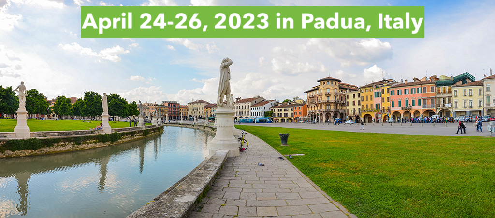
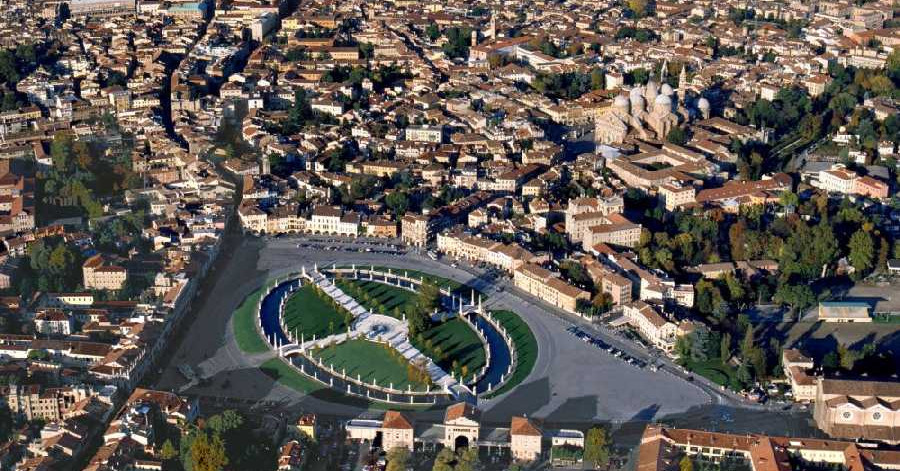

The **16th Annual International Biocuration Conference** provides a forum for curators, developers, and
users of clinical and life sciences data, knowledge, and models to discuss their
work, promote collaboration, and foster the community around this active and
growing area of research. Participants from academia, government, and industry
interested in the tools, methodology, and philosophy of curation in the clinical
and life sciences are encouraged to attend and submit an abstract for
consideration for an oral or poster presentation. This conference is organized in part with the
[International Society of Biocuration (ISB)](https://www.biocuration.org).

<a href="https://registrations.meetandwork.com/Login.asp?IDcommessa=MW23008" 
   style="padding: 1em 2.5em; background-color: #4e29aa; color: white; font-weight: bold; border: 1px #ddd; display: inline-block; text-align: center">
    Register Here
</a>

Following the virtual installments of the Annual International Biocuration Conference in
[2021](https://www.biocuration.org/14th-annual-biocuration-conference-virtual/)
and [2022](https://www.biocuration.org/15th-annual-biocuration-conference-virtual/) due to the
pandemic, we are pleased to announce that in 2023 we
will return to a fully in-person meeting in **Padua, Italy** from **Monday, April
24th lunchtime to Wednesday, April 26th, 2023** ([📅 ics](cal/biocuration2023.ics)).
Conference workshops will be held on the afternoon of Sunday, April 23rd and the morning
of Monday, April 24th.

## Registration

Registration can be completed [here](https://registrations.meetandwork.com/Login.asp?IDcommessa=MW23008).
You don't need to register in order to submit an abstract.

### Travel Fellowships

Travel fellowships are available from the International Society of Biocuration (ISB).
More information on eligibility and application can be found [here](https://www.biocuration.org/travel-fellowship).

### Abstract Submission

Abstracts can be submitted to be considered for oral presentations or
poster presentations through [EasyChair](https://easychair.org/conferences/?conf=biocuration2023).
You don't need to register ahead of time in order to submit an abstract.

Please see [here](abstracts.md) for additional information and guidelines on submission.

### Workshop Proposals

Workshop proposals can be submitted for consideration through [this form](https://forms.gle/iYUu2RN25TgUMW7x9) until
December 23rd, 2022.

### Biocuration Virtual Issue 2023 in *Database*

Abstracts accepted for poster and oral presentation at the conference may additionally be submitted for consideration as
part of the Biocuration Virtual Issue 2023 in [*Database*](https://academic.oup.com/database). See details 
[here](abstracts#virtual-issue).

## Important Dates

| Date                                                                                  | Event                                                                                                                                    |
|---------------------------------------------------------------------------------------|------------------------------------------------------------------------------------------------------------------------------------------|
| November 23rd, 2022                                                        | [Abstract submission](https://easychair.org/conferences/?conf=biocuration2023) opens                                                     |
| December 16th, 2022                                                        | [Conference registration](https://registrations.meetandwork.com/Login.asp?IDcommessa=MW23008) begins                                     |
| December 20th, 2022                                                        | [Travel grant application](https://www.biocuration.org/travel-fellowship) ends                                                           |
| December 23rd, 2022                                                        | [Workshop proposal submission](https://docs.google.com/forms/d/e/1FAIpQLSfTdoqDB-dWxJ-m8cWyOH-bY3ZsR1yU-7u6BQ2gUQKUndr0Dw/viewform) ends | 
| **January 3rd, 2023** ([📅 ics](cal/biocuration2023-abstracts.ics))        | [Abstract submission](https://easychair.org/conferences/?conf=biocuration2023) ends                                                      |
| January 18th, 2023                                                         | Abstract acceptance notification                                                                                                         |
| January 20th, 2023                                                         | Travel grant decisions sent                                                                                                              |
| **January 31st, 2023** ([📅 ics](cal/biocuration2023-early-bird.ics))      | Early Bird conference registration ends                                                                                                  |
| March 31st, 2023                                                           | Late poster submission ends                                                                                                              |
| April 14th, 2023                                                           | Conference booklet released                                                                                                              |
| **April 18th, 2023** ([📅 ics](cal/biocuration2023-registration-ends.ics)) | Conference registration ends                                                                                                             |
| April 24th, 2023                                                           | Conference starts                                                                                                                        |
| April 26th, 2023                                                           | Conference ends                                                                                                                          |

## Keynote Speakers

<dl>

<dt>
    <strong>{{ person.name }} - {{ person.affiliation }}</strong>
</dt>
<dd>
    
    <a href="https://bioregistry.io/orcid:{{ person.orcid }}">
        
        {{ person.orcid }}
    </a>
    
    <a href="https://twitter.com/{{ person.twitter }}" style="margin: 0 0.5rem;">
        
        @{{ person.twitter }}
    </a>
    
    <a href="https://bioregistry.io/wikidata:{{ person.wikidata }}?provider=scholia" style="margin: 0 0.5rem;">
        
        {{ person.wikidata }}
    </a>
    
{{ person.description }}

</dd>
 

</dl>
