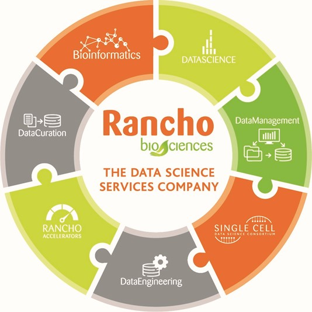

## Biocuration 2023 Sponsors

<table style="text-align:center;">
<tr>
<td>

</td>
<td>

</td>
</tr>
<tr>
<td>

</td>
<td>

</td>
</tr>
<tr>
<td>

</td>
<td></td>
</tr>
</table>

## How to Sponsor Biocuration 2023

The Annual International Biocuration Conference provides a forum for curators, developers, and
users of clinical and life sciences data, knowledge, and models to discuss their
work, promote collaboration, and foster the community around this active and
growing area of research. Participants from academia, government, and industry
interested in the tools, methodology, and philosophy of curation in the clinical
and life sciences are encouraged to attend and submit an abstract for
consideration for an oral or poster presentation. This conference is organized in part with the
[International Society of Biocuration](https://www.biocuration.org).
We expect ~250-300 delegates, including a number of high profile speakers.

Sponsors typically benefit through increased community visibility through
branding and physical presence both at the conference and through ISB social
media channels. This often leads to interesting collaborations, new
clients/contracts/projects, or the recruitment of young, international curators
with a variety of backgrounds who attend the event.

### Sponsorship Tiers

The ISB offers three sponsorship tiers for the 2023 Annual International Biocuration Conference:

1. Bronze Sponsorship: €500
    - Sponsorship acknowledged using Company logo and link in the online abstract book, link on the conference website.
      Company logo shown in slide acknowledgements, on the ISB’s website, Twitter, and LinkedIn accounts, and in one of
      the ISB regular newsletters.
2. Silver Sponsorship: €1,000
    - As above, for Bronze sponsorship, with the option to provide literature/swag to be included in the delegation pack
    - PLUS: 1 free registration
    - PLUS: 1 of the following:
        - Listed as sponsoring poster prizes
        - Listed as sponsoring oral presentation prizes
        - Listed as co-sponsoring morning coffee
        - Listed as co-sponsoring afternoon tea
3. Gold Sponsorship: €2,000
    - As above, for Bronze sponsorship, with the option to provide literature/swag to be included in the delegation pack
    - PLUS: 2 free registrations
    - PLUS: 1 of the following:
        - Listed as co-sponsoring the travel grants
        - Listed as co-sponsoring the evening social event
        - Exhibition stand
4. Platinum Sponsorship: €3,000 and above
    - Opportunity to negotiate the promotion and registration opportunities that align with the company’s requirements

### Contact

Please contact [biocuration2023@gmail.com](mailto:biocuration2023@gmail.com) for further information on how to support
the 16th Annual International Biocuration Conference.
